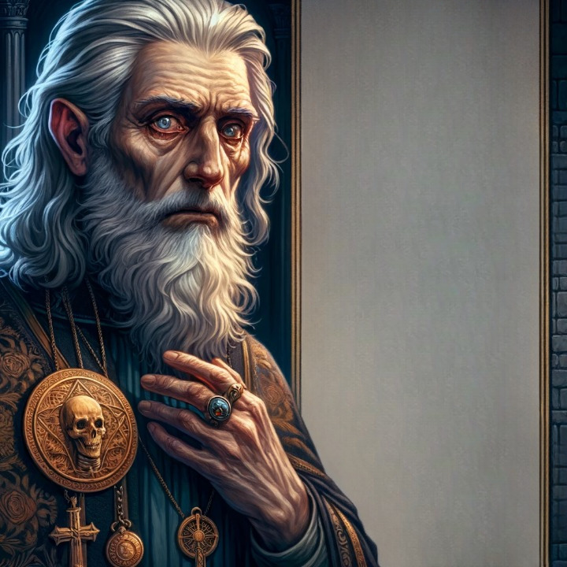

# Celarius de Criamon
<!-- tabs:start -->
# **Généralités**
  
## Identité  
**Joueur** Rafaël  
**Nom du personnage** Celarius  
**Nom de naissance** Eugène  
**Sexe** Masculin  
**Date de naissance** 1168  
**Age** 81 (en 1249)  
**Maison** Criamon  
**Confiance** 2  
**Crépuscule** 5 (7,5) en 1249
## Caractéristiques  
**Int** +3 (retors)  
**Per** +1 (perspicace)  
**For** -2 (chétif)  
**Ené** +3 (coriace)  
**Pré** –2 (vieillard inoffensif)  
**Com** +2 (manipulateur)  
**Dex** -2 (mains tremblantes)  
**Viv** +2 (nerveux)  
## Réputation  
**Maître sataniste** (Ordre d'Hermès) 3  
## Traits de caractère  
**Suspicieux** +2  
**Manipulateur** +3  
**Intellectuel** +1  
# **Vices & Vertus**
## Vertus  
**Deft Form (Imaginem)** +1  
**Enduring Constitution** +1  
**Gentle Gift** +1  
**Improved Characteristic** +1  
**Life-Linked Spontaneous Magic** +3  
**Puissant Ability (Parma Magica)** 0 (résultat du Crépuscule subi à l'été 1204)  
**Puissant Art (Imaginem)** +1  
**Sense Holiness / Unholiness (origine Divine)** +1  
**Unaging** +1  
**Puissant Medecine**[^1] +1
## Vices  
**Ability Block (Martial Abilities)** -1  
**Driven** -3 : obsession de la "théorie du complot". Il voit (et imagine parfois) "des plans dans des plans dans des plans dans des plans", que ce soit à l'échelle micro-sociale ou cosmique.  
**Incompatible Arts (InIg)** -1 (par l'effet du Crépusucle subi à l'été 1204, Celarius a appris à utiliser la magie MuAn)  
**Infamous Master** -1  
**Lesser Malediction** -1 : il entend les voix des morts en permanence. Il ne s'agit parfois que d'un chuchotement, qui peut s'élever jusqu'à un brouhaha à l'approche d'un cimetière, d'un ancien champ de bataille, etc. Le cas échéant, il doit faire un jet de Concentration pour parvenir à ne pas y prêter attention.  
**Restriction** -3 : incapacité à lancer le moindre sortilège dans l'obscurité complète (ex. la nuit sans bougie ou quand la lune est couverte par les nuages)  

[^1]: Vertu mineure accordée par Dame Aldona à l'Ete 1207
# **Compétences**
**Arts libéraux** (magie cérémonielle) 3  
**Attention** (attitude des gens) 2  
**Bagarre** (esquive) 2  
**Concentration** (ignorer le bruit, et en particulier les voix dans sa tête) 3  
**Connaissance de l'Eglise** (clergé séculier) 2  
**Connaissance de la Féérie** (auras) 1  
**Connaissance de la Magie** (créatures) 1(4)  
**Connaissance des gens** (secrets) 2  
**Connaissance de l'Infernal** (démons) 3 (1)  
**Connaissance de l'Ordre d'Hermès** (Maison Tremere) 3  
**Droit hermétique** (procédure) 2  
**Enigme** (l'au-delà) 3 (5)  
**Etiquette** (gens d'Eglise) 1  
**Finesse** (Imaginem) 4  
**Intrigue** (Ordre d'Hermès) 3  
**Langue d'Oc** (vocabulaire religieux) 5  
**Latin** (langage hermétique) 4  
**Médecine** (théorie des humeurs) 1 + 2  
**Mensonge** (histoires farfelues) 2  
**Parma Magica** (Mentem) 4 (15) + 2  
**Pénétration** (Rego) 3 (5)  
**Perception de la sainteté et de la malignité** (le mal) 2 (5)  
**Philosophie** (magie cérémonielle) 3  
**Survie** (ruines) 1  
**Théorie de la Magie** (Imaginem) 7
# **Magie**
## Arts  
**Creo** 16  
**Intellego** 14(13)  
**Muto** 9 (3)  
**Perdo** 14  
**Rego** 15  
**Animal** 2  
**Aquam** 0  
**Auram** 6  
**Corpus** 17(11)  
**Herbam** 0  
**Ignem** 0  
**Imaginem** 10(4) + 3  
**Mentem** 15(9)  
**Terram** 9(6)  
**Vim** 12(12)
## Sceau du Mage  
La mort. Parfois, c'est une odeur de pourriture et de corps en décomposition qui émane de ses illusions; parfois, c'est la forme d'un crâne; les sorts Terram ont tendance à attirer les vers de terre à la surface; les sorts Mentem ont tendance à laisser à la cible des idées morbides; etc.
## Sorts formels et rituels
Les sorts marqués d'un astérisque sont d'application constante en aventure.
### Auram  
**Conjuration de la Foudre** CrAu 35. Sceau du Mage : à la lumière de l’éclair, le visage des personnes présentes acquiert une blancheur spectracle et inquiétante  
### Corpus  
**Guérison du membre malade** CrCo 30  
**Faux de Thanatos** PeCo 30 (Base 20, Durée Instantanée, +2 Portée Voix, Cible Individuelle) (Maîtrise 1, Fast Casting). Inflige une blessure incapacitante à la Cible. Sceau du Mage : la Cible s'effondre comme si elle avait été cueillie par une faux invisible  
**Danse macabre** ReCo 15 (Base 2, +2 Portée Voix, +1 Durée Diamètre, +2 Cible Groupe). La jambe gauche des membres du Groupe Cible échappe totalement à leur contrôle, se pliant en deux, se tordant en tous sens puis se redressant sans crier gare pendant toute la durée du sort. Les Cibles doivent réussir un jet de Dextérité + Athlétisme difficulté 12 pour ne pas tomber, et sont en toute hypothèse trop occupées à garder leur équilibre pour pouvoir attaquer. Leur Total de Défense est par ailleurs diminué de moitié pendant toute la durée du sort. Celui-ci tire son nom du fait que les Cibles donnent de l'extérieur l'impression de se livrer à une danse grotesque, à la manière des ballets de squelettes que le Maître de Celarius organisait parfois pour le distraire dans les catacombes. Le Sceau de Celarius se manifeste de la manière suivante : les ossements des Cibles font un bruit atroce à chaque mouvement comme s'ils étaient sur le point de craquer, d'où le caractère macabre de la Danse.  
**Déplacement éclair** ReCo 15 (Maîtrise 1, Fast Casting)  
**Endurance of the Berseker** ReCo 15  
**Marche du Messie** ReCo 15 (Portée Personnelle, Durée Aube/Crépuscule, Cible Individuelle). Permet de s'élever ou de marcher dans les airs, ou évite de tomber si le sol de dérobe sous les pas du Lanceur. Sceau : brise sépulcrale.  
**Gift of Vigor** ReCo 20 (Portée Toucher) et 25 (Portée Voix)  
**Strings of the Unwilling Marionette** ReCo 25 (Maîtrise 1, Quiet Casting)  
**Bottes de Sept Lieues** ReCo 30 (*Seven-League Stride*, ArM5, p. 135). Sceau du Mage : la Cible disparaît dans un nuage de fumée spectrale (effet cosmétique gratuit) et, lorsque celle-ci se dissipe, on trouve sur le sol un petit tas de cendres…  
**Leap of Homecoming** ReCo 35. Sceau du Mage : la Cible disparaît dans un nuage de fumée spectrale (effet cosmétique gratuit) et, lorsque celle-ci se dissipe, on trouve sur le sol un petit tas de cendres…  
### Imaginem  
**Phantasm of the Human Form** CrIm 25  
**Révélation du Labyrinthe** InIm 20 (Base 2, Portée Toucher +1, Durée Concentration +1, Cible Structure +3). Ce sort permet au Lanceur de percevoir par la vue et par l’ouïe la totalité d’un édifice, en déplaçant à sa guise son attention d’un point à l’autre de celui-ci (comme pour le sort *Prying Eyes*, mais avec l'ouïe en plus). Pour rappel, les modificateurs de taille n’affectent pas les sorts Intelligo, de sorte que la taille de l’édifice est indifférente (ArM5, p. 113, 2e encadré, §2). Sceau du Mage : dans la vision de Celarius, le bâtiment semble abandonné, légèrement recouvert de poussière et de toiles d’araignées, et résonne d’échos lugubres  
**Eye of the Eagle** InIm 25  
**Discern Own Illusions** InIm 15  
**Grossière méprise** MuIm 4 (Portée Toucher, Durée Diamètre, Cible Individuelle) : modifie l'apparence et la voix de la Cible selon l'intention du lanceur. Sceau : la Cible présente une pâleur inhabituelle.  
**Aura of Ennobled Presence** MuIm 10  
**Disguise of the Transformed Image** MuIm 15  
**Déguisement du fugitif** MuIm 20 (Portée Toucher, Durée Lune, Cible Individuelle) : identique à *Disguise of the Transformed Image*, sous réserve de la durée. Sceau : la Cible présente un visage plus émacié que de coutume.  
**Image Phantom** MuIm 20  
**Veil of Invisibility** PeIm 20  
**Silence of the Smothered Sound** PeIm 20  
**Wizard's Sidestep** ReIm 10  
### Mentem  
**Mot d'ordre silencieux** (CrMe 4, Base 3, Durée Instantanée, Portée Toucher, Cible Individuelle). Permet de prononcer une courte phrase (comme "Méfie-toi", "A l'attaque", "Silence" ou "Non, c'est inacceptable") directement dans la tête de la Cible, sans être entendu d'oreilles indiscrètes. _  
Le Sceau de Celarius se manifeste par le fait que la voix entendue par la Cible a un timbre sépulcral.  
**Souffle de la haine** (CrMe 15, Base 4, Durée Diamètre +1, Portée Voix +2, Cible Individuelle). La Cible acquiert une haine aiguë d'un objet, d'une personne ou d'un lieu spécifique. Si l'objet de la haine se trouve dans la même pièce, il y a fort à parier que la Cible se lancera à son attaque. Si, au contraire, l'objet de la haine ne se trouve pas dans la pièce, la Cible est assez facilement manipulable de manière à lui faire révéler les faiblesses de l'objet de sa haine. Le Sceau de Celarius se manifeste par le fait que, lorsque l'objet de la haine suscitée magiquement est une personne, la Cible a des fantasmes morbides concernant cette personne qu'elle s'imagine poignardée, baignant dans une mare de sang, étranglée, etc.  
**Posing the Silent Question** (InMe 20). Sceau du Mage : la voix de la Cible résonne dans la tête du Lanceur comme le glas d'un église.  
**Le Voleur de Mémoire** (PeMe 20, Base 15, Portée Regard +1, Durée Instantanée, Cible Individuelle). This spell removes all memory of a single individual, location or event from a person's mind. The target will often be aware that they cannot remember the individual or event. For example, if made to forget being robbed, they will still know that their money is missing, and will be aware that they do not recall where it has gone. This spell was originally created to suppress the manifesting Gifts of untrained children or to remove their memories of home. The Quaesitores use it to tidy up after Hermetic criminals. Sceau du Mage : la Cible reste obsédée par des pensées morbides  
**Bénédiction de la félicité enfantine** (PeMe 25, Base 10, Portée Regard +1, Durée Aube/Crépuscule +2) (Maîtrise 1, Magical Resistance)  
**Aura de l'Autorité légitime** (ReMe 20, Base 5, Portée Regard +1, Durée Aube/Crépuscule +1). Sceau du Mage : la Cible acquiert des pensées morbides  
### Terram  
**Pit of the Gaping Earth** (PeTe 15). Comme le sort éponyme, mais avec un trou de 3 pas de diamètre sur 18 pieds [= 6 pas] de profondeur. Vice majeur : un escalier permet à la victime de sortir du trou. Restriction : ne fonctionne pas dans les forêts  
**Pit of the Gaping Rock** (PeTe 30) (Maîtrise 1, Fast Casting). Comme pour *Pit of the Gaping Earth*, mais avec un trou en pierre de 10 pas de diamètre sur 12 pas de profondeur  
**Vague de Terre** ReTe 20 (*Crest of the Earth Wave*, ArM5, p. 156). Sceau du Mage : la terre retournée grouille de vers de terre et d’ossements  
### Vim  
**The Enigma's Gift** CrVi 30 (Maîtrise 1, Magical Resistance)  
**Demon's Eternal Oblivion** PeVi 10  
**Demon's Eternal Oblivion** PeVi 20 (Maîtrise 2, Multiple Casting)  
**Unraveling the Fabric of Imaginem** PeVi 15  
**Opening the Intangible Tunnel** ReVi 20
## Talisman
### Description
Le Talisman de Celarius est un médaillon cerclé de fer, contenant le dessin d’une couronne taillée dans un os humain et incrustée de morceaux de corail rouge. Au verso du médaillon, le métal poli fait office de miroir. La symbolique est la suivante : côté pile, la couronne en os représente la souveraineté de la mort sur le vivant (représenté par le corail couleur sang). Côté face, le médaillon renvoie l’image de celui qui le regarde, signifiant par là : toi aussi, tu es soumis à la mort. A porter autour du cou, sans modération.
### Enchantements
* **Armée des Ténèbres** : CrIm(Co,Me) 45 (Base 3 (affecte trois sens), +1 (complexité), +1 Corpus (apparence de solidité), +1 Mentem (autonomie), +1 Durée Diamètre, +2 Portée Voix, +2 Cible Groupe, +1 Multiplicateur de taille (x 10), +5 (24 utilisations/jour), Effet Limité à 70 ans à partir de 1240). Permet au Lanceur d'invoquer une armée d'illusions, composée de 100 soldats en armes, qui se lancent à l'assaut de l'ennemi. L'armée possède un certain degré d'autonomie et est constituée d'illusions perceptibles à la vue, à l'ouïe et au toucher, et présente une apparence de solidité analogue à celle d'un corps humain. Sceau du Mage : les soldats sont de noir vêtus et ont un air sinistre; vus de près, et au moindre coup, ils se révèlent être une armée de squelettes en armes  
* **Rocher de Sisyphe** : ReTe25(30) (Base 3 (Control or move dirt in a very unnatural fashion), +1 (Stone), +1 (taille max. 10m3), +2 Portée Voix, Durée Instantanée, +1 Portée Partie, +1 Complément Perdo (pour séparer la pierre de la roche), +5 (24 utilisations/jour), Effet Limité à 70 ans à partir de 1229). Permet au Lanceur de découper un bloc de pierre de maximum 10m3 dans la roche et de projeter ce bloc dans la direction de son choix, après quoi le bloc retombe naturellement dans la direction du centre de la Terre. Sceau du Mage : la pierre qui se détache de la roche produit le bruit d'une pierre tombale.  
* **Protection contre les Fées** : Ward ReVi 30, Base 20 (protège contre les êtres féériques de niveau 35 ou inférieur), Portée Personnelle, Durée A/C +2, Cible Individuelle, Effet Permanent +4, Niveau Total 34, Effet Limité à 70 ans à partir de 1229  
* **Protection contre les Démons** : Ward ReVi 30, Base 20 (protège contre les démons de niveau 35 ou inférieur), Portée Personnelle, Durée A/C +2, Cible Individuelle, Effet Permanent +4, Niveau Total 34, Effet Limité à 70 ans à partir de 1229  
* **Détection de l’emprise mentale** : Effet InVi 25 (Base 5 Detect any active Magic, +2 pour détecter les sorts ReMe, Portée Personnelle, Durée A/C +2, Cible Individuelle), Effet Permanent +4, Niveau Total 29, Effet Limité à 70 ans à partir de 1229. L’effet “scanne” en permanence le porteur du Talisman pour détecter si celui-ci est en réalité sous l’emprise d’un sort ReMe  
* **Unraveling the Fabric of Mentem** : Effet PeVi 19 (Base x, Portée Personnelle, Durée Instantanée, Cible Individuelle), Usages illimités +10, Effet lié +3, Niveau Total 32, Effet Limité à 70 ans à partir de 1229. Contrecarre automatiquement les effets ReMe affectant le porteur du Talisman ayant un niveau 39 + dé de tension (pas de Désastre). Peut également être déclenché par un mot de commande.  
* **Défense contre l'Emprise féline** : Effet PeVi 29 (Base 24, Portée Toucher +1, Durée Instantanée, Cible Individuelle), Usages illimités +10, Effet lié +3 (lié à Détection de l'emprise mentale), Niveau Total 42, Effet Limité à 70 ans à partir de 1240. Contrecarre automatiquement les effets ReMe affectant le porteur du Talisman ayant un niveau 44 + dé de tension (pas de Désastre). Le sort peut en outre être lancé à la demande sur une Cible Portée Toucher. L'effet est calqué sur *Unraveling the Fabric of Mentem*, mais appliqué spécialement à la magie des chats magiques rencontrés dans *Small game*  
* **Don des Langues de Babel** : Effet Base 15 (Speak with any human), Portée Toucher +1, Duration A/C +2, Target Hearing +3, +3 (6 uses per day), Total 48.
Total investi dans le Talisman : 30 pions.
### Résonances
* Sorts relatifs aux **illusions +7** (miroir, cf Hermetic Projects, p. 26)  
* Sorts pour **blesser ou repousser les êtres féériques +7** (fer)  
* Sorts **contre les démons +10** (corail rouge)  
* Sorts pour **blesser le corps humain +4** (os humain)  
* Sorts pour **détruire l'esprit humain +3** (os humain)  
* Sorts visant à **contrôle les gens de +3** (couronne)  
* Sorts pour **gagner du respect ou de l'autorité +5** (couronne)  
* Sorts pour **affecter la respiration et la parole +4** (collier)
## Autres objets magiques  
Cristal enchanté avec 9 charges de Goût de l'Enigme CrVi 20(50) : comme Don de l'Enigme, mais inflige uniquement deux points de Crépuscule à la Cible, donc CrVi 20; +30 (+60 en Pénétration).
## Rituel de Longévité  
Hiver 1203 : TL CrCo = 3 (Int) + 4 (Th. M.) + 3 (Aura) + Cr (5) + Co (10) = 25, coût 7 pions de *vis* Vim, bonus de 5 aux Jets de Vieillissement, rituel consistant à broyer un crâne humain (*) en poussière et à disperser celles-ci aux quatre vents en récitant des incantations mystiques.
(*) Les *sodales* de Celarius ont eu le bon goût de ne pas l'interroger sur l'origine des "ingrédients" du rituel...
Hiver 1230 (par Athanor) : TL Athanor 58, donc bonus de 12 aux Jets de Vieillissements
## Crépuscule
Au cours de l'Ete 1204, Celarius réalise un <u>quadruple désastre</u> en tentant de résister à une attaque magique MuCo(An) des êtres féériques de la *regio* dans laquelle il a pénétré avec ses compagnons. Il choisit de se laisser emporter par le Crépuscule mais, à sa grande surprise, sent son énergie magique se reconcentrer sous une influence extérieure. Ce n'est que lorsqu'il quitte la *regio* que le Crépuscule s'abat sur lui, le faisant disparaître (physiquement) dans un flash de lumière. Il ressort du Crépuscule quelques secondes plus tard étant parvenu à comprendre l'expérience, mais affligé de 12 points de Crépuscule supplémentaires. Il en retire comme *cicatrice neutre* que, lorsqu'il est la cible d'un sort Corpus ou utilise celle-ci, il ressent une démangeaison à l'emplacement de ses (désormais évaporées) oreilles d'âne. De plus, il a acquis la vertu mineure ***Puissante Parma Magica*** et se voit également **débarassé de la composante MuAn de son vice mineur *Arts Incompatibles***.
# **Laboratoire**
## Caractéristiques  
**Size** 0 (-1)  
**Refinement** +1  
**General Quality** +1  
**Upkeep** +2  
**Safety** +1  
**Warping** 0  
**Health** 0  
**Aesthetics** 0  
**Longevity Ritual +2**
## Vertus  
Highly Organized (gratuit)
## Vices  
Néant
# **Equipement**
## Soleil de minuit
* Enchantement mineur d'une pièce de cuivre percée en son centre. Permet de faire à passer à travers une lanière de cuir permettant de porter la pièce autour du cou sous la forme d'un médaillon.  
* Effet : la pièce irradie une lumière semblable à celle émise par un jour nuageux. La lumière n'a pas de source apparente, mais illumine une zone de dix pas centrée autour de la pièce et qui se déplace avec celle-ci.  
* Niveau : Base 4, Cible Personnel, Durée Concentration (+1), Cible Individuelle, Nombre d'utilisations par jour Illimité (+10), Maintient automatiquement la Concentration (+5) = 20.  
* Coût : 2 pions Creo (soit Niveau / 10).  
* Pour déclencher l'effet : prononcer "*Fiat lux, et lux fuit*".  
* Pour mettre fin à l'effet : prononcer "*Nunc venit nox*" (maintenant vient la nuit)  
* <mark>Il reste à Scintillus à préciser comment son Sceau se manifeste</mark>
# **Background**
  
Le dit des trois morts et des trois vifs. *Livre d'heures*, XVe siècle. Source : Paris, [BnF](http://classes.bnf.fr/ema/grands/629.htm), département des Manuscrits, Latin 1376, fol. 1v.-2. Les dossiers pédagogiques de la Bibliothèque Nationale de France comportent l'explication suivante :  
> Trois jeunes gens trop attachés aux plaisirs de l’existence rencontrent trois morts à différents stades de la décomposition : comme la vie humaine, la mort peut elle aussi être divisée en trois étapes. "Nous fûmes ce que vous êtes, vous serez ce que nous sommes", leur disent ces derniers afin de les inciter à mener une vie plus morale.  
>  
> Cette histoire, conçue au début du XIIIe siècle, a introduit la mort dans la poésie littéraire. L’image est réactualisée par les pestes des XIVe et XVe siècles : elle est souvent figurée dans les livres d’heures de la fin du XIVe siècle et du siècle suivant.  
>  
> Pourquoi sont-ils trois ? Le chiffre trois, jugé exemplaire (la sainte Trinité, la Sainte Famille, etc., les Rois mages, et, à la fin du Moyen Âge, la partition enfer/purgatoire/paradis), a paru aux hommes du Moyen Âge le plus adapté pour diffuser un message de piété. C’est le chiffre de la communication.  
## Description  
Celarius a vieilli avant l'âge. Ses cheveux sont gris, et il donne l'apparence d'un vieillard chétif dont les mains tremblent aisément. En dépit des apparences, il est cependant particulièrement vigoureux, ayant été habitué aux privations dès son enfance difficile. En outre, il semble que son vieillissement se soit pratiquement arrêté, et qu'il puisse continuer éternellement sous sa forme rabougrie. Du reste, avec Celarius, les apparences sont souvent trompeuses. Ainsi, quand il commence à parler, son interlocuteur est souvent subjugué par sa voix mielleuse et persuasive. Passé maître dans l'Art Imaginem, il n'hésite pas, au demeurant, à changer fréquemment d'apparence, de sorte qu'on ne peut jamais être certain que l'image de vieillard qu'il donne soit fidèle à la réalité.
## Historique  
Celarius est le fils naturel du curé dans un petit village du Comté de Foix. Sa mère, fille aînée d'un marchand de la région, était dotée d'un caractère assez indépendant et avait séduit le curé afin qu'il lui apprenne à lire. La naissance de Celarius a fait scandale dans le village, mais plus encore le fait que sa mère abandonne son enfant pour partir ensuite à la ville, non sans avoir au préalable nommé celui-ci, par dérision, Eugène ("le bien né"). Le curé, embarrassé, a finalement pris ce fils sous son aile et l'a élevé à l'église, sans lui apprendre à lire ou à écrire, mais en lui faisant faire des tâches manuelles dans l'Eglise. Eugène, de son côté, a dû apprendre à se méfier des habitants du village, qui n'hésitaient pas à lui jeter des pierres dès qu'il avait le dos tourné. Habitué aux coups, Eugène s'endurcit (Energie +3 et *Enduring Constitution*). C'est ainsi qu'il a commencé à passer de plus en plus de temps dans le cimetière du village, où les pieux villageois n'osaient pas s'aventurer. Lui appréciait le calme des lieux. Il entendait parfois d'étranges murmures, mais attribuait inconsciemment ceux-ci au bruit du vent dans les arbres.
L'année de ses sept ans, la veille de la Toussaint (*All Hallow's Eve*), il était dans l'église en train de préparer le corps d'un villageois qui s'était rompu le cou et qui devait être enterré le lendemain, lorsqu'une rafale de vent a fermé les portes de l'église et soufflé toutes les bougies. Le curé, qui s'était assoupi dans ses appartements, n'a pas entendu le cri poussé par Eugène, et n'a trouvé celui-ci que le lendemain matin, allongé sur la pierre froide de l'église, une marque sur le bras. Eugène prétendra qu'alors qu'il s'occupait du cadavre, celui-ci s'était soudain redressé, l'avait attrapé par le bras et s'était adressé à lui avant qu'il s'évanouisse. Le curé se signa trois fois, s'écria que cet enfant avait beaucoup trop d'imagination et fit comme si de rien n'était... Il n'empêche... Par la suite, il s'avéra qu'Eugène savait des choses sur les villageois qu'il n'aurait jamais dû connaître; des secrets que les défunts avaient emportés dans leur tombe - comme le fait que le villageois s'était rompu le cou parce que son épouse l'avait poussé dans un accès de jalousie parce qu'il la trompait avec la fille du meunier, ou l'endroit ou telle petite fille emportée par la variole avait caché son trésor... Les gens commencèrent à se méfier de plus en plus d'Eugène et à l'accuser d'être possédé par le démon lorsqu'un jour, au milieu d'un orage, un étrange voyageur au profil d'oiseau de proie se présenta à la porte du logement du curé et déclara qu'il était venu trouver Eugène et que celui-ci vivrait désormais avec lui. Le curé, qui ne savait plus que faire de cet enfant, bredouilla néanmoins que ce n'était pas possible, qu'il ne voyait pas de quel droit il laisserait emmener Eugène par un étranger, mais à cet instant, un éclair déchira le ciel et vint frapper le bâton de pèlerin que détenait l'étrange voyageur, illuminant ses traits d'une lumière sinistre. Effrayé, le curé lâcha Eugène, qui s'approcha, fasciné, de l'étranger. Car, alors que celui-ci avait levé la main, les voix dans sa tête s'étaient soudain calmées, et il avait l'impression qu'il avait en réalité attendu cet instant toute sa vie.
Ainsi commença le long apprentissage d'Eugène, qui prit le nom hermétique de Celarius (de *celare* : cacher, dissimuler). Tout au long de ces années, Celarius s'aperçut qu'il vieillissait à peine, comme si, par le contact qu'il avait eu avec les morts, il tenait désormais l'âge et la maladie à distance (*Unaging*). Son maître, Septimus de Criamon, lui enseigna également à faire taire les voix dans sa tête et à maîtriser l'énergie magique émanant de lui, de manière à ne pas effrayer les vulgaires (*Don de Velours*). Septimus n'était rattaché à aucune Alliance en particulier, mais parcourait le pays en emmenant  Celarius avec lui dans tous ses déplacements. Toujours, ils s'arrêtaient dans des endroits étranges - ruines, anciens cimetières, nécropoles romaines abandonnées -, où ils passaient quelques jours, quelques mois ou quelques années, avant, à chaque fois, de repartir. Quelque fois, Septimus s'arrêtait aux portes d'un inquiétant bâtiment où habitaient d'autres Mages de l'Ordre auquel Septimus disait appartenir, et il s'enfermait de longues heures avec eux. Au fil des années, Celarius comprit que son maître jouait le rôle de professeur et de conseiller itinérant pour les Mages de l'Ordre d'Hermès, et qu'il suivait de près la politique de l'Ordre. Après la fin de son apprentissage, Celarius continua à accompagner son maître, qui quitta le Tribunal provençal pour le Tribunal romain. Là, son maître fut de plus en plus impliqué dans les intrigues des différentes coteries, ce qui finit par causer sa perte : il fut accusé de satanisme et une Marche des Magiciens fut déclarée contre lui. Afin de préserver son apprenti de tout soupçon, Septimus l'attaqua publiquement en l'accusant de l'avoir dénoncé et lui lança un terrible sortilège qui l'a fait vieillir prématurément et l'a plongé en plein Crépuscule, dans l'obscurité de la mort. Celarius ne s'en sortit que de justesse, et en conserve des graves séquelles : des dégâts physiques (scores négatifs en Force et Dextérité); les voix dans sa tête, qui s'étaient tues pendant de nombreuses années, ou qu'il avait appris à maîtriser, échappent, désormais, à son contrôle (*Lesser Malediction*); sa magie est depuis lors devenu totalement inefficace quand il se trouve dans le noir (*Restriction*); et, conséquence psychologique, il se trouve paralysé à l'idée de percer à jour les mystères de cette obscurité (*Incompatible Arts* Intelligo Ignem). Quoi qu'il en soit de ces terribles séquelles, le stratagème de Septimus fonctionna, puisque le Tribunal renonça à accuser Celarius de complicité de satanisme, même si des soupçons continuent à peser sur sa tête (*Infamous Master*). Quant à Septimus, il a disparu dans la nature et, même si un Quaesitor de Magvillus prétend l'avoir tué de ses propres mains, on ne peut jamais être sûr de rien avec un tel maître des illusions... Quant à Celarius, il nourrit maintenant une paranoïa aiguë à l'égard du reste de l'Ordre et du monde entier, étant persuadé que la chute de son maître n'est qu'une étape dans une terrible machination qui se trame; et il a fait vœu de mettre à jour les secrets qui l'entourent, persuadé qu'il ne s'agit que de pièces dans un plan plus vaste (*Driven*).
<!-- tabs:end -->
