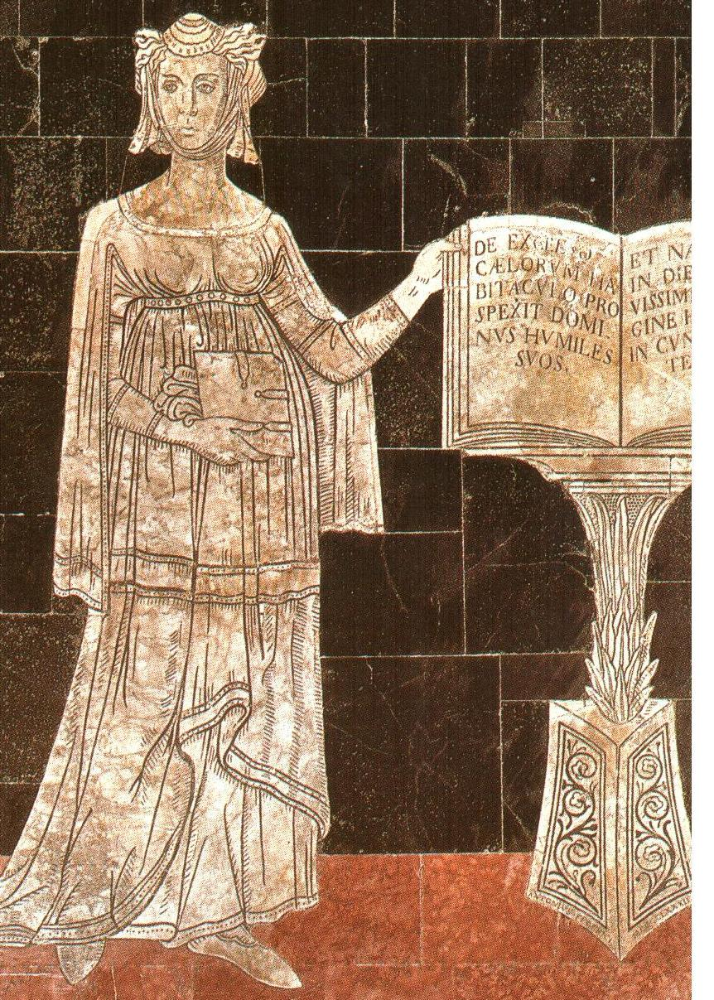

# Esperanza de Jerbiton
<!-- tabs:start -->
# **Généralités**

  
## Identité
**Joueur** Nicolas  
**Nom du personnage** Dame Esperanza de Saverdun  
**Nom de naissance** Dame Esperanza d'Asturie  
**Statut Social** Epouse de Pierre de Saverdun, vassal du Comte de Toulouse  
**Statut Hermétique** Maga Esperanza de Jerbiton, filia Priscilla de Jerbiton  
**Sexe** Féminin  
**Date de naissance** 1174  
**Age réel(apparent)** 75(65) à l'Hiver 1249  
**Maison** Jerbiton  
**Confiance** 4  
**Décrépitude** 1 (3)  
**Crépuscule** 5 (24)
## Caractéristiques  
**Int** +3 (esprit vif) *[1 pt de vieillissement]*  
**Per** +2 (observatrice) *[1 pt de vieillissement]*  
**For** -3 (faible poigne) *[1 pt de vieillissement]*  
**Ené** +2 (endurante) *[1 pt de vieillissement]*  
**Pré** +2 (élégante) *[1 pt de vieillissement]*  
**Com** 0  
**Dex** +1 (féline)  
**Viv** -1

## Traits de caractère  
**Ambitieuse** +3  
**Fière** +2  
**Téméraire** +1  
**Dépendance à la routine de labo *Addled*** +1[^1]
## Réputations  
Néant.
## Sceau de vote  
Un anneau en argent de belle facture, offert par sa *Mater* Priscilla de Jerbiton, sur lequel est gravée la maxime suivante : *Imperatoria Brevitas*.
## Descendance  
* Perceval Tolomae, fils de Pierre de Saverdun, né au printemps 1210, disparu à l'Automne 1217 (en enfer?)  
* Mélusine, fille de Ménard, née prématurément à l’été 1212, aveugle et résidant en couvent  
* Magnus Balthus, fils de Pierre II d’Aragon, né à l’été 1214, devenu l'apprenti de Martel de Tremere

[^1]: As soon she stops using this lab routine, she must recover from her excesses by making Stamina - Personality Trait rol against an Ease Factor of three times the number of consecutive Addled seasons [Covenants p. 108].

# **Vices & Vertus**

## Vertus  
**Art Puissant** *(Puissant Art)* +1 (Mentem) : bonus de +3 en Mentem.  
**Caractéristiques améliorée** *(Improved Characteristics)* +1 : +3 points supplémentaires à dépenser pour l'achat des Charactéristiques.  
**Connaissance dérivée** *(Secondary Insight)* +3 : en étudiant une Technique d’un livre, d’un professeur ou de la *vis* brute, le Mage gagne un point d’expérience dans quatre Formes de son choix; idem en étudiant une Forme dans deux Techniques au choix.  
**Contacts sociaux: Noblesse** *(Social Contacts: Nobility)* +1 : vaste réseau de connaissances au sein de la Noblesse.  
**Don de velours** *(Gentle Gift)* +1 : pas ne pénalité lors d'interaction avec des humains ou des animaux.  
**Education privilégiée** *(Privileged upbringing)* +1 : accès à des professeurs et à du temps libre d'étude durant la période d'éducation; + 50 xp à la création.  
**Le Don** *(The Gift)* 0.  
**Sort rapide** *(Fast caster)* +1 : +3 aux jets d’Initiative pour le lancer de sorts en combat.  
**Magie silencieuse** *(Quiet Magic)* +1 : aucun malus en lançant un sort à voix basse, et malus réduit à –5 en cas de sort lancé en silence. La portée des sorts ayant une Portée Voix est déterminée normalement, à savoir aussi loin que la voix porte.  
**Magie subtile** *(Subtle Magic)* +1 : aucun malus en lançant un sort sans gestes.  
**Faerie Magic** *(Magie Féerique)* +1 :  
**Snake Skin** *(Peau de serpent)* +1 : Vous avez le pouvoir de couvrir votre peau d'écailles, qui vous accordent un bonus à l'encaissement de 2 + niveau de la Compétence (acquise au niveau 1). La transformation prend un tour, de même que pour faire disparaître les écailles. Celles-ci ont une couleur verte avec des reflets pourpres.
## Vices  
**Ambitieuse** *(Ambitious)* –3 : acquérir une influence temporelle pour prouver sa valeur à ses frères.  
**Faiblesse** *(Weakness)* –1 : pour les bijoux.  
**Forme déficiente** *(Deficient Form)* -1 (Ignem) : les Totaux de Lancer et les Totaux de Laboratoire impliquant l'Ignem sont divisés par 2. Les totaux de Résistance Magique et les Totaux d'Etude ne sont pas affectés.  
**Magie imprévisible** *(Unpredictable Magic)* –1 : lancer un sort implique toujours un jet de tension, même si le sort est maîtrisé et même en cas de sort spontané sans dépenser de Niveau de Fatigue (auquel cas le jet vise uniquement à déterminer s’il y a un désastre).  
**Malédiction de Vénus** *(Curse of Venus)* -3 : tendance à attirer des personnes  non désirables, et vice versa.  
**Sensibilité au pouvoir Divin** *(Susceptibility to Divine Power)* -1 : pénalité double (- 6 x aura et dés de désastre x 2) dans une aura Divine.

# **Compétences**

## Compétences générales  
**Athlétisme** *(Athletics)* (courir) 1  
**Attention** *(Awareness)* (fouiller) 2  
**Bagarre** *(Brawl)* (esquive) 1  
**Charme** *(Charm)* (amour courtois) 2  
**Commandement** *(Leadership)* (intimidation) 1 (4)  
**Concentration** *(Concentration)* (sortilèges) 1 --> 1 x 15 min de concentration continue  
**Connaissance de l'Eglise** *(Church Lore)*  (politique) 2  
**Connaissance de la péninsule Ibérique** *(Area Lore)* (politique) 1 (9)  
**Connaissance de la Provence** *(Provence Lore)* (personnalités) 2  
**Connaissance des gens** *(Folk Ken)* (Noblesse) 2  
**Discrétion** (*Stealth*) (se déplacer silencieusement) 1  
**Dressage** *(Animal Handling)* (serpents) 1 (3)  
**Equitation** *(ride)* (tours) 1 --> +1 aux Totaux d'Attaque et de Défense en cas de combat à cheval  
**[Castillan ancien](https://fr.wikipedia.org/wiki/Castillan_ancien)** *(Medieval Spanish)* (poésie) 3 (16)
**Etiquette** *(Etiquette)* (Noblesse) 2  
**Intrigue** (*Intrigue*) (complots) 2  
**Mensonge** (*Guile*) (émotions) 1 (5)  
**Musique** (*Music*) (chant) 1  
**Langue d'Oc** (prose) 4  
**Natation** *(Swim)* (sous l’eau) 2  
**Connaissance de l'Afrique Mythique** *(Mythical Africa Lore)* (légendes) 1 (2)  
**Connaissance des Territoires du Nil** *(Lands of the Nile Lore)* (légendes) 1 (2)  
**Connaissance du Tribunal du Levant** (légendes) 1 (2)  
**Connaissance du Tribunal de Thèbes** (légendes) 1 (2)  
**Connaissance du Tribunal de Transylvanie** (légendes) 1 (2)  
**Connaissance du Tribunal Romain** (légendes) 1 (2)

## Compétences académiques  
**Arabe** *(Arabic)*  (contes) 5  
**Arts libéraux** *(Artes liberales)* (Magie rituelle) 2[^2]
**Latin** *(Latin)* (langage hermétique) 4 (4)

## Compétences mystiques  
**Code d'Hermès** *(Code of Hermes)* (relations avec les vulgaires) 2  
**Connaissance de l'Infernal** *(Infernal Lore)* (morts-vivants) 4 (3)  
**Connaissance de l'Ordre d'Hermès** *(Order of Hermes Lore)* (politique) 1 (5)  
**Connaissance de la Féerie** *(Faerie Lore)* (forêts féeriques) 1  
**Connaissance de la Magie** *(Magic Lore)* (traditions magiques) 1 (5)  
**Finesse** *(Finesse)* (Mentem) 2  
**Parma Magica** *(Parma Magica)* (Mentem) 6 (23)  
**Pénétration** *(Penetration)* (Mentem) 2 (5)  
**Théorie de la Magie** *(Magic Theory)* (Mentem) 7

## Compétences martiales  
Néant.

## Compétences surnaturelles  
**Peau de Serpent** *(Snake Skin)* (dégâts du feu) 1  

[^2]: Alphabets: Arabe et Latin

# **Magie**

  
*Brevitas imperatoria*, devise qui résume parfaitement la personnalité d'Esperanza.
## Arts  
**Creo** 15  
**Intellego** 15 (2)  
**Muto** 16 (2)  
**Perdo** 14 (1)  
**Rego** 15 (3)

**Animal** 11 (1)  
**Aquam** 5 (1)  
**Auram** 6 (5)  
**Corpus** 11 (9)  
**Herbam** 12 (2)  
**Ignem** 1  
**Imaginem** 9 (6)  
**Mentem** 22 (1) + 3  
**Terram** 5  
**Vim** 7 (5)

## Sceau du mage  
**L’Orient**. Les sorts *Herbam* se manifestent sous la forme de végétaux inhabituels ou inconnus en Europe médiévale mais communs au Proche et Moyen-Orient (figuiers, dattiers, ...). Les sorts *Imaginem* et *Mentem* se teintent de chants et musiques arabes, de visions d’enfance (Alexandrie, Le Caire, Jérusalem, ...). Les sorts *Auram* et *Imaginem* s'accompagnent d'odeurs d’épices, de fleur d'oranger, de bois de santal, ...

## Objets magiques  
* Dans sa bague en argent, une charge d'un effet ***Ward against Demons* ReVi 35** (Portée Toucher, Durée Diamètre, Cible Individuelle) offrant une protection contre les créatures de Force Infernale inférieure ou égale à 40.
## Sorts formels et rituels

### Animal  
* **The Wizard's Mount CrAn 35** [ArM5 p. 117]  
	* Creates a horse, which is normal in every way except that it is not disturbed by the Gift.  
	 * Base 15, Portée Toucher +1, Durée Aube/Crépuscule +2, Cible Individuelle.  
	 * Sceau du mage : le cheval est un magnifique [pur-sang arabe](http://fr.wikipedia.org/wiki/Arabe_(cheval)) à la robe noire comme la nuit.
* **Doublet of Impenetrable Silk MuAn20**  [ArM5 p.118]  
	 * Base 4, Portée Toucher +1, Durée Lune +3, Cible Individuelle.  
	 * Change an item made of animal material — silk, wool, or leather — so it cannot be cut or penetrated by weapons. A simple cloth doublet becomes the equivalent of armor with no Load and a +3 Soak bonus. Armor made of quilted material or any kind of leather improves its Protection by an additional +3. The magic does not make the armor better at absorbing shock, so this +3 bonus is the limit that can be bestowed without changing the material into something completely different. At the storyguide’s option, the bonus given by this spell may not apply against strictly blunt weapons like clubs and staves.  
	 * Sceau du mage : <mark>...</mark>
* **Serpentement vestimentaire MuAn20**  
	 * Base 5, Portée Toucher +1, Durée Aube/Crépuscule +2, Cible Individuelle.  
	 * Le vêtement d'origine animale (cuir, laine, soie, ...) ciblé se transforme en une multitude de serpenteaux.  
	 * Sceau du mage : lors de la transformation, les serpenteaux se comportent comme ceux d'un psylle (charmeur de serpent) en se balançant de droite à gauche.
### Auram  
* **Clouds of Rain and Thunder CrAu 25** [ArM5 p. 126]  
	 * Creates clouds that drop snow over an area about a mile across. The clouds gather over a few seconds at the beginning of the spell, and dissipate over the same sort of time when the caster stops concentrating. The spell does not affect temperature.  
	 * Base 2, Portée Vue +3, Durée Concentration +1, Cible Groupe +2.  
	 * Sceau du mage : <mark>...</mark>
* **The Incantation of Lightning CrAu 35** [ArM5 p. 126]  
	 * A lightening bolt shoots forth from your outstretched hand in the direction you are pointing doing +30 damage to a single target it hits. There must be nothing between you and the target. Those near the target must make Size stress rolls of 6+ to remain standing.  
	 * Base 5, Portée Voix +2, Durée Instantanée, Cible Individuelle, +4 unnatural.  
	 * Sceau du mage : <mark>...</mark>
	 *  Maîtrise : 1 (*Multiple Casting*)
## Corpus  
* **Taille de Géante MuCo 15**  
	 * Base 3, Portée Personnelle, Durée Diamètre +1, Cible Individuelle, Modificateur de taille +3.  
	 * <mark>...</mark>
	 * Sceau du mage : <mark>...</mark>

* **Curse of Circe MuCo(An) 30** [ArM5 p. 131]  
	 * Base 10, Portée Voix +2, Durée Aube/Crépuscule +2, Cible Individuelle.  
	 * Turns a person into a pig.  
	 * Sceau du mage : la cible présente une marque en forme de croissant de lune.

* **Wizard's Leap ReCo 15** [HoH:Societates p. 36]  
	 * Base 15, Portée Personnelle, Durée Instantanée, Cible Individuelle.  
	 * The caster instantly transports himself up to 50 paces in any direction, provided he can see his destination or has an Arcane Connection with it. His Talisman comes with him automatically but casting requisites are required to bring along any other clothing or equipment. This spell is very effective as a fast-cast defense to escape attacks or other mishaps, and can also be used for bypassing obstacles or launching surprise attacks.  
	 * Sceau du mage : Esperanza se téléporte dans un tourbillon de sable (en référence aux tempêtes du désert égyptien).  
	 * Maîtrise : 1 (*Fast Casting*)
 
### Herbam  
* **Piège de branches entrelacées *(Trap of the Entwining Vines)* CrHe 15** [ArM5 p.135]  
	 * Base 1, Portée Voix +2, Durée Aube/Crépuscule +2, Cible Groupe +2.  
	 * Causes strong, woody vines to grow rapidly from fertile earth. The vines cover a circle 2 paces across and reach 6 feet high. Anything caught within them is immobilized. To avoid the vines, the target must make a Quickness - Encumbrance stress roll of 9+. To break out requires a Strenght stress roll of 12+ (allowed once a round). Someone not trapped can cut a trapped person free in two rounds, assuming proper tools. The vines weaken and wither to dust at sunrise or sunset.  
	 * Sceau du mage : les vignes forment des arabesques et des motifs typiquement orientaux.

* ***Converse with Plant and Tree*** **InHe 25** [ArM5 p.136]  
	 * Base 15, Portée Toucher +1, Curée Concentration +1, Cible Individuelle  
	 * You can speak with a plant for one conversation. The level of conversation depends on the type of plants; longer-lived and more noble plants have more to say. A single question and response takes ten to thirty minutes, with slower-growing plants speaking more slowly. Typically, plants can talk about the soil and about other plants around them, but have limited awareness of more momentary events, such as the passing of animals or people, unless that passing has a direct bearing on the plant (for example, a person cut its trunk). News can spread quickly through a forest when it has to, called from tree to tree on the wind. Bystanders cannot understand your conversation.  
	 * Sceau du mage : <mark>...</mark>

* **Lance perforante *(Piercing Shaft of Wood)* Mu(Re)He 10** [ArM5 p.137]  
	 * Base 3, Portée Voix +2, Durée Instantanée, Cible Individuelle, requ. Rego +1.  
	 * Turns a piece of wood into a sleek, barbed, strong shaft that flies through the air at a target. Damage depends on the size of the item from which the shaft is formed: staff (upper size limit) +10, 2-foot branch +8, wand  +5. This spell cannot miss, but is resisted.  
	 * Sceau du mage : le bruit que fait la lance dans les airs ressemble à un cri de guerre arabe.

* ***(Stir the Slumbering Tree)* MuHe(Me) 25** [ArM5 p.137]  
	 * Base 4, Portée Toucher +1, Durée Aube/Crépuscule +2, Cible Individuelle, Size +2.  
	 * Raises any tree into a state of that of a human. Such a tree can see and hear what is going on around it, and at a normal human level of perception. Such a tree may share some mental attributes or personality traits with the caster. The tree can rearrange its branches over the course of several hours, though too slowly for people to observe the movement from second to second. Most trees in magical areas are already awake.  
	 * Sceau du mage : <mark>...</mark>

* **Seigneur des Forêts *(Lord of the Trees)* ReHe 25** [ArM5 p.139]  
	 * Base 4, Portée Voix +2, Durée Concentration +1, Cible Individuelle, Taille +2.  
	 * Causes a tree to move its branches and bend its trunk in any way you mentally direct. A large tree striking with branches has Initiative +5, Attack +7, and Damage +10. Normal weapons are practically useless against large trees.  
	 * Sceau du Mage : à l'issue du sort, l'arbre ciblé reprend sa position initiale en effectuant des arabesques avec ses branches.

### Imaginem  
* **Image déguisée *(Disguise of the Transformed Image)* MuIm 15** [ArM5 p.146]  
	 * Base 4, Portée Toucher +1, Durée Aube/Crépuscule +2, Cible Individuelle.  
	 * Makes someone look, sound, feel and smell different, though at least passably human.  
	 * Sceau du mage : à l'expiration du sort, la cible dégage une agréable odeur de rose.

* **Invisibilité du magicien figé *(Invisibility of the Standing Wizard)* PeIm 15** [ArM5 p.146]  
	 * Base 4, Portée Toucher +1, Durée Aube/Crépuscule +2, Cible Individuelle.  
	 * The target becomes invisible, but the spell is broken if he moves (aside from breathing and shifting slightly in place). He still casts a shadow.  
	 * Sceau du mage : à l'expiration du sort, l'ombre de la cible effectue pendant quelques instants une danse du ventre.

* **Voile d'invisibilité *(Veil of Invisibility)* PeIm 20** [ArM5 p. 146]  
	 * Base 4, Portée Toucher +1, Durée Aube/Crépuscule +2, Cible Individuelle, +1 changing image.  
	 * The target becomes completely undetectable to normal sight, regardless of what he does, but still cast a shadow.  
	 * Sceau du mage : à l'expiration du sort, l'ombre de la cible effectue pendant quelques instants une danse du ventre.

### Mentem  
* **Paroles silencieuses *(Words of the Unbroken Silence)* CrMe 20** [ArM5 p. 148]  
	 * Base 3, Portée Vue +3, Durée Aube/Crépuscule +2, Cible Individuelle.  
	 * Let you say words directly to the mind of a target. The target can recognise your voice and know that the message is of supernatural origin.  
	 * Sceau du Mage : les paroles d'Esperanza semblent être portées par le vent du désert.

* **Souvenir d'un rêve lointain *(Memory of the Distant Dream)* CrMe 20** [ArM5 p. 148]  
	 * Base 5, Portée Regard +1, Durée Aube/Crépuscule +2, Cible Individuelle.  
	 * Inserts a full and complete memory into a person's mind. If the target gives the memory some thought and concentration, and makes an Intelligence roll of 9+, the memory is revealed as false. When the duration expires, the memory vanishes, although the subject may remember remembering it.  
	 * Minor Side Effect : si la Cible est une femme, son instinct maternel sera particulièrement développé pendant toute la durée du sort si elle a déjà des enfants, sinon, elle aura un grand désir de maternité; quant aux hommes, ils se montreront d'un tempérament particulièrement protecteur.  
	 * Sceau du Mage : dans la mémoire ainsi créée s'insèrent des images d'enfance d'Esperanza à Alexandrie.

* **Souffle glacé du mensonge *(Frosty Breath of the Spoken Lie)* InMe 20** [ArM5 p. 149]  
	 * Base 10, Portée Regard +1, Durée Concentration +1, Cible Individuelle.  
	 * For as long as you maintain this spell, the target exhales a misty breath with each spoken lie. Small bits of ice form on the person's lips if the lie is particularly severe. In winter, when breath is visible anyway, lies produce a greater than normal amount of mist (the mist actually billows out). A target who makes a Communication + Guile stress roll of 15+ can determine wheter any given statement will be taken by the spell as a lie. The spell can be defeated through extensive and judicious application of Creo Auram and Perdo Auram spells, and a demon is able to manipulate it in any way it wishes, as demons are the embodment of deception and are never caught in a lie if they do not wish to be.  
	 * Sceau du mage : le souffle glacé exhale un parfum d'épices orientales.  
	 * Maîtrise : 1 (*Magic Resistance*)

* **Question silencieuse *(Posing the Silent Question)* InMe 20** [ArM5 p. 149]  
	 * Base 15, Portée Regard +1, Durée Instantanée, Cible Individuelle.  
	 * You can ask one silent mental question of the target, then detect the answer. The truth of the answer is limited by the knowledge of the target. Questions to the effect of "What would you do if...?" often receive inaccurate replies. You are likely to get what the target thinks he would do, not necessarily what he would really do. The target of this spell does not notice the questioning unless he or she makes a Magic Resistance roll.  
	 * Sceau du mage : un [Oeil Oudjat](http://fr.wikipedia.org/wiki/%C5%92il_Oudjat) apparaît fugitivement sur le front de la cible.  
	 * Maîtrise : 1 (*Magic Resistance*)

* ***(Thoughts Within Babble)* InMe 25** [ArM5 p. 149]  
	 * Base 5, Portée Personnel, Durée Concentration +1, Cible Hearing +3.  
	 * You can understand the speech of those within the target area. Perception or Communication stress rolls are needed for difficult exchanges. You also understand people who misuse  a language that you do speak, you know what they meant to say, as well as hearing what they actually said.  
	 * Sceau du mage : les voix semblent portées par le vent du désert.

* ***(Peering into the Mortal Mind)* InMe 30** [ArM5 p. 149]  
	 * Base 25, Portée Regard +1, Durée Instantanée, Cible Individuelle.  
	 * You can thoroughly probe and understand the contents of the mind of  the target, including his or her immediate and long-term motives, personal strengths and weaknesses, and other pertinent information.  
	 * Sceau du mage : un [Oeil Oudjat](http://fr.wikipedia.org/wiki/%C5%92il_Oudjat) apparaît fugitivement sur le front de la cible.  
	 *  Maîtrise : 1 (*Magical Resistance*)

* <mark>...</mark> **InMe 40**  
	 * Base 15 (Read a person's surface thoughts), R: Touch +1, D: Conc +1, T: Str +3.  
	 * Major Side Effect : Tant que dure le sort, les nuages s'amoncellent autour de la Structure ciblée, finissant par déclencher un orage de grande envergure.  
	 * Sceau du mage : <mark>...</mark>

* **Perte d'un souvenir ponctuel *(Loss But a Moment's Memory)* PeMe 15** [ArM5 p. 151]  
	 * Base 10, Portée Regard +1, Durée Instantanée, Cible Individuelle.  
	 * Removes up to five continuous minutes from a target's memory, leaving a blank. You target the loss of memory to a specific event or time. With an Intelligence stress roll of 9+, the target realizes that memories of a certain period are missing.  This Ease Factor can change, depending on how important the missing memory is  and what sort of circumstances surrounded the event. Careful introspection over a period of time can allow reconstruction of much of memory, but some details are lost forever.  
	 * Sceau du mage : la Cible entends "oublie" en arabe résonner dans sa tête.

* **Le Voleur de Mémoire (*The Thief of Memory*)[^3] PeMe 20**  
	 * Base 15, Portée Regard +1, Durée Instantanée, Cible Individuelle.  
	 * This spell removes all memory of a single individual, location or event from a person's mind. The target will often be aware that they cannot remember the individual or event. For example, if made to forget being robbed, they will still know that their money is missing, and will be aware that they do not recall where it has gone. This spell was originally created to suppress the manifesting Gifts of untrained children or to remove their memories of home. The Quaesitores use it to tidy up after Hermetic criminals.  
	 * Sceau du mage : la cible éprouve une démangeaison à l'arrière de son crâne (en référence à [l'excérébration](http://fr.wikipedia.org/wiki/Momification#L.27exc.C3.A9r.C3.A9bration), une des étapes de la momification dans l'Egypte antique).

* **Le Voleur de Mémoire (*The Thief of Memory*) PeMe 35**  
	 * Base 15, Portée Toucher +1, Durée Instantanée, Cible Structure +3.  
	 * Variante du sort éponyme. 

* **Bénédiction de la félicité infantine (*Blessing of Childlike Bliss*) PeMe 25**  [ArM5 p. 151]  
	 * Base 10, Portée Regard +1, Durée Aube/Crépuscule +2, Cible Individuelle.  
	 * Reduces an adult mind to a child's level. The target solves problems, reasons and expresses emotions as would a three-year-old. Magi affected cannot cast spells. At first, anyway, the target is likely to be happy at having lost a world of cares and troubles that are no longer imaginable.  
	 * Sceau du mage : la cible a tendance à babiller en arabe pour la durée du sort.

* **Appel du sommeil *(The Call to Slumber)* ReMe 10** [ArM5 p.151]  
	 * Base 4, Portée Voix +2, Durée Instantanée, Cible Individuelle.  
	 * The target becomes sleepy and falls asleep within a few seconds.  
	 * Sceau du mage : la cible s'endort en entendant une berceuse arabe. 

* **Appel du sommeil *(The Call to Slumber)* ReMe 20**  
	 * Base 4, Portée Toucher +1, Durée Instantanée, Cible Structure +3.  
	 * Variante du sort éponyme.

* **Aura de l'autorité légitime *(Aura of Rightful Authority)* ReMe 20** [ArM5 p.151]  
	 * Base 5, Portée Regard +1, Durée Aube/Crépuscule +2, Cible Individuelle.  
	 * The target of the spell is strongly inclined to obey you, as if you were his natural superior.  
	 * Sceau du mage : Esperanza apparaît brièvement à la cible comme parée des attributs d'un pharaon.

* **Aura de l'autorité légitime *(Aura of Rightful Authority)* ReMe 35**  
	 * Base 5, Portée Toucher +1, Durée Aube/Crépuscule +2, Cible Structure +3.  
	 * Variante du sort éponyme. 

* <mark>...</mark> *(Coerce the Spirits of the Night)* ReMe 25** [ArM5 p.152]  
	 * Base 5, Portée Voix +2, Durée Aube/Crépuscule +2, Cible Individuelle.  
	 * Makes a ghost obey you as long as you can coerce it with threats, such as a threat to defile its grave or to banish it to Hell. The more lurid and dramatic the threat, the more cooperative the ghost is. If the spell penetrates the ghost's Magic Resistance, roll Communication + Leadership to see how effective your threats are. The storyguide should always give a bonus  or penalty that depends on the potency of the threat, and any roll other than a botch will compel at least minimal obedience.  
	 * Sceau du mage : <mark>...</mark>

* **Visions des Terreurs Infernales *(Visions of the Infernal Terrors)* ReMe 30** [ArM5 p.152] 
	* Base 10, Portée Vue +3, Durée Diamètre +1, Cible Individuelle.  
	* Causes everything the target sees to look and sound terrifying. The world looks basically the same, save that everything is hideously transformed somehow. The target must roll a stress die, adding his Stamina and adding or subtracting an appropriate Personality Trait to see what the effects are. The nature of the Personality Trait used determines how it affects the Stamina roll. A Trait like Brave makes you resistant to fear, while one Cowardly reduces the result of your roll.  
	* Sceau du mage : <mark>...</mark>
	* Maîtrise : 1 (*Magical Resistance*)

| ~ Roll    | ~ Result                                       |
| --------- | ---------------------------------------------- |
| 0 or less | Scared to death (literally)                    |
| 1-5       | Incapacited with fear, permanent -1 to Stamina |
| 6-9       | Incapacited with fear                          |
| 10-15     | Flee, fight at -6 if cornered or obstructed    |
| 16+       | Carry on, -3 on all rolls                      |

* <mark>...</mark> *(Enslave the Mortal Mind)* ReMe 40** [ArM5 p.152]  
	 * Base 25, Portée Vue +2, Durée Aube/Crépuscule +2, Cible Individuelle.  
	 * <mark>...</mark>
	 * Sceau du mage :<mark>...</mark> 
	 * Maîtrise : 1 (*Magical Resistance*)
 
### Vim  
* **Magie Voilée *(Shroud Magic)*MuVi 25** [sort canonique ArM5 p.160]  
	 * Base 20, Portée Toucher +1, Durée Instantanée, Cible Individuelle.  
	 * This spell allows a magus to suppress or alter the sigil in a spell that is currently being cast. The spell to be shrouded can be up to double the Shroud's level.  
	 * Sceau du mage : <mark>...</mark>

* **Anéantissement des êtres féeriques *(Faerie's Eternal Oblivion)* PeVi 10** (similaire à *Demon's Eternal Oblivion* [ArM5 p.160])  
	 * Base 4, Portée Voix +2, Durée Instantanée, Cible Individuelle.  
	 * Weakens and possibly destroys a Faerie. If the spell penetrates the Faerie's Magic Resistance, the Faerie loses 10 points of Might Score.  
	 * Sceau du mage : un Djinn de lumière apparaît et frappe la cible d'un coup de cimeterre.
## Crépuscule

### 1er Crépuscule  
Au printemps 1214, alors qu'elle est enceinte de son troisième enfant, Esperanza se lance en Magie spontanée cérémonielle un sort CrVi 15 lui infligeant 3 points de Crépuscule. Elle se laisse emporter par le Crépuscule, parvient à comprendre l'expérience, et accumule 5 points de Crépuscule supplémentaires pour un total de 8. Elle en retire une vertu mineure et une cicatrice neutre (cf. ci-dessous) ainsi qu'une vision ayant trait à ses enfants. A son retour du Crépuscule, le foetus se porte bien.  

**Vertu mineure** : **Peau de Serpent (*Snake Skin*)**. Vous avez le pouvoir de couvrir votre peau d'écailles, qui vous accordent un bonus à l'encaissement de 2 + niveau de la Compétence (acquise au niveau 1). La transformation prend un tour, de même que pour faire disparaître les écailles. Celles-ci ont une couleur verte avec des reflets pourpres.

**Cicatrice neutre** : comme les serpents, Esperanza n'a plus besoin de cligner des yeux. Ses interlocuteurs n'en prennent d'ordinaire pas conscience, à moins de l'observer attentivement, mais ce regard fixe les met néanmoins inconsciemment mal à l'aise.

[^3]: Adaptation d'un sort de la 4ème édition publié dans le supplément *Sanctuary of Ice - The Geater Alps Tribunal*, Atlas Games, 2003, p. 49.

# **Laboratoire**

## Description  
Le Sanctum d’Esperanza est séparé en 2 parties distinctes par une large tenture de velours pourpre tendue entre les murs. La première partie, celle par laquelle on pénètre dans le sanctum, ressemble de prime abord à un boudoir. On y retrouve une petite table de travail sur laquelle repose du matériel d’écriture, ainsi que des coussins bariolés posés à même le sol autour du lit au pied duquel repose un grand coffre, formant ainsi comme un petit salon. Les murs sont recouverts de cartes géographiques et astronomiques tandis qu’une agéable odeur d’encens flotte en permanence dans l’air. Au dos de la port d'entrée est suspendue l'épée à deux mains portant les armes de Saverdun. On peut observer gravé sur la porte d'entrée un [Oeil Oudjat](http://fr.wikipedia.org/wiki/%C5%92il_Oudjat) indiquant qu'il s'agit du Sanctum d'Esperanza. Suite à son Crépuscule du Printemps 1214, Esperanza a modifié cette marque: désormais, un serpent est enroulé autour de l'oeil.

La deuxième partie du sanctum, masquée par la tenture pourpre, est le laboratoire propement dit. Il y règne une pénombre diffuse lorsque la tenture est fermée et la fenêtre occultée. Une grande table recouverte de matériel alchimique et de divers parchemins occupe le mileu de la pièce, et un petit chaudron se trouve à côté. Les murs sont couverts d'étagères garnies de bocaux et autres récipients, remplis principalement d’herbes et de plantes.  

## Caractéristiques  
**Taille**(*Size*) 0 (0)  
**Perfectionnement**(*Refinement*) 0  
**Qualité Générale**(*General Quality*) 0  
**Entretien**(*Upkeep*) 0  
**Sûreté** (*Safety*)[^4] -1 
**Crépuscule**(*Warping*) 0  
**Qualité Sanitaire**(*Health*) 0  
**Esthétique**(*Aesthetics*) 0

## Vertus  
**Person** 0 (*Free Outfitting Virtue*) : -1 Safety; +1 Mentem. La personne en question est Perceval, le fils d'Esperanza et de Pierre de Saverdun.

## Vices  
Néant.

## Traits de Personalité  
Néant.

## Routines de laboratoire

| Saison         | Addled | Overtime | Double Overtime | Triple Overtime | Crépuscule |
| -------------- | ------ | -------- | --------------- | --------------- | ---------- |
| Hiver 1209     | 1/2    |          |                 |                 | nihil      |
| Ete 1210       | 2/2    |          |                 |                 | + 1 point  |
| Automne 1211   | 1/2    |          |                 |                 | nihil      |
| Automne 1213   | 2/2    | 1/4      |                 |                 | + 1 point  |
| Hiver 1216     | 1/2    |          |                 | 1               | 1 point    |
| Ete 1217       | 2/2    |          |                 |                 | + 1 point  |
| Ete 1218       | 1/2    | 2/4      |                 |                 | nihil      |
| Automne 1218   | 2/2    | 3/4      |                 |                 | + 1 point  |
| Printemps 1219 | 1/2    |          | 1/3             |                 | nihil      |
| Automne 1225   |        | 4/4      |                 |                 | +1 point   |
| Printemps 1228 |        | 1/4      |                 |                 | nihil      |
| Ete 1230       | 2/2    |          |                 |                 | +1 point   |
| Hiver 1230     |        |          |                 | 1               | +1 point   |

## Matériel/Equipement

- Textes de laboratoire (cf. [Bibliothèque](../alliance/biblio.md)).
- Pions de *vis*: Intellego, Animal, Mentem et Infernaux (cf. [Ressources](../alliance/ressource.md)).
- Un sachet d'herbes rapporté de Vezay, préparé par les sages femmes vivant dans la forêt, ayant pour effet de causer la stérilité chez les hommes une fois placé sous le lit de ceux-ci.
- Une épée à 2 mains magnifiquement ouvragée et ciselée aux armes de Saverdun (cf. [Ressources](../alliance/ressource.md)).
- Un anneau magique: Ring of the Flying Sun ReCo 30 (cf. [Ressources](../alliance/ressource.md)).
- Une fiole de substance (poison?) infernale confisquée au Dr. Mark.
- Une couronne d'or massif.
- Une fiole de sang de son fils Perceval (renouvelée chaque solstice d'Hiver).
- Un parchemin reprenant l'horoscope de naissance de son fils Perceval.
- Une dizaine de picots d'un porc-épic féerique.
- De robes en soie colorée investies d'un effet féerique semblable à "Aura de Noble Prestance"(*Aura of Ennobled Presence*) MuIm 10 [ArM5 p. 146] : The target appears more forceful, authoritative, and believable. Numerous subtle changes in appearance bring about this change, including a slight supernatural illumination of the face, a more erect posture, and a louder and smoother voice.  The character gets a +3 on rolls to influence, lead, or convince others. 
- Une fiole contenant un poison animal de force infernale > 30.
- Une Connection des Arcanes avec Magvillus sous la forme d'un caillou provenant des jardins.
- Une bague magique en or ornée d'un saphir, autrefois propriété de Pierre de Saverdun.

[^4]: The Safety score is subtracted from the number of botch dice on all lab activities. For each season of work in an unsafe lab, roll a simple die. If the result is less than or equal to the absolute value of the Safety there is a chance of suffering a lab botch. If that happens, roll the usual number of botch dice (including the extra dice for having a negative Safety). In the event of a botch, a lab accident is suffered -- roll on the Disaster sub-chart of the Experimentation: Extraordinary Results chart (see ArM5, page 109). Add the absolute value of the Safety Score to the risk modifier, but do not let it exceed +3. [cf. Covenants p.111]

# **Equipement**

## Armes

### Dague, corps à corps (*Dagger*, *Brawl*)  
**INITIATIVE** = Viv + Arme - Encombrement = 0 + 0 - 0 = **0**  
**ATTAQUE** = Dex + Compétence + Arme = +1 + 1 + 2 =**+4**  
**DEFENSE** = Viv + Compétence + Arme = 0 + 1 + 0 = **+1**  
**DEGATS** = For + Arme = -3 + 3 = **0**  
**Portée**: N/A  
**Charge**: 0  
**Force min**: -3

### Poings, corps à corps (*Fist, Brawl*)  
**INITIATIVE** = Viv + Arme - Encombrement = 0 + 0 - 0 = **0**  
**ATTAQUE** = Dex + Compétence + Arme = +1 + 1 + 0 =**+2**  
**DEFENSE** = Viv + Compétence + Arme = 0 + 1 + 0 = **+1**  
**DEGATS** = For + Arme = -3 + 0 = **-2**  
**Portée**: N/A  
**Charge**: 0  
**Force min**: N/A

## Armure  
Tous les vêtements d'Esperanza sont doublés de soie et enchantés en durée Lune avec le sort *Doublet of Impenetrable Skin* MuAn 20. 

**ENCAISSEMENT** = Ené + Armure + Bonus familier (corde de bronze) = 2 + 3 (cf. sort *Doublet of Impenetrable Skin*) + 2 = **+7**

Si sa vertu *Peau de serpent* est activée:

**ENCAISSEMENT** = Ené + Armure + Bonus familier (corde de bronze) + Peau de serpent = 2 + 3 (cf. sort *Doublet of Impenetrable Skin*) + 2 + 3 = **+10** (+1 de bonus supplémentaire contre les dégâts du feu) 

## Equipement  
* une dague (0)

**Charge totale** 0  
**Encombrement** 0

# **Background**
*"Corruption and envy and lust for power. Cruelty and coldness. A vicious probing curiosity. Pure, poisonous, toxic malice. You have never from your earliest years shown a shred of compassion or sympathy or kindness without calculating how it would return to your advantage. You have tortured and killed without regret or hesitation; you have betrayed and intrigued  and gloried in your treachery. You are a cess-pit of moral filth."*  
(Metatron speaking of Mrs. Coulter in *The Amber Spyglass* by Philip Pullman, Scholastic Uk Ltd, 2007, 522 p.)  

Isabelle de Castille. Source : [Wikimedia Commons](http://commons.wikimedia.org/wiki/Image:Isabella_by_Bigarny02.jpg).
## Description  
Esperanza est une belle femme aux cheveux noirs comme la nuit et au teint chocolaté. De taille moyenne et assez mince, elle se déplace d'une démarche féline et assurée[^5]. Un qualificatif s'impose lorsqu'on l'aperçoit : élégance. Ses origines nobles lui donnent un port altiers (*Fière*) mais aussi une certaine propension à dénigrer les personnes de plus basse extraction, surtout lorsqu'elles l'exaspèrent. Elle n'hésite pas à aller droit au but et agit souvent d'une manière expéditive quitte à se mettre en danger (*Téméraire*), bien que le charme et la subtilité ne lui fassent pas défaut. Ajoutons qu'elle raffole des sarcasmes et ne s'en prive pas pour rabaisser ceux et celles qu'elle ne porte pas dans son cœur. 

Elle n'aspire qu'à une chose : acquérir une influence temporelle conséquente, tant parmi les hommes qu'au sein de l'Ordre d'Hermès (*Ambitieuse*). Pour ce faire elle exploitera les plus faibles et écartera les plus forts, quitte à employer des méthodes peu orthodoxes ou à fleurter avec le Code Hermétique. Elle a dans cette optique accepté à l'hiver 1205 la proposition de mariage d'un seigneur local, Pierre de Saverdun, afin d'asseoir sa position dans la société médiévale. Celui ci s'étant révélé doté du Don, Esperanza l'a également pris en charge comme apprenti à sa demande. A l'issue du Tribunal de 1207, Esperanza céda cependant son apprenti à Jérôme de Bonisagus, celui-ci ayant fait usage de son privilège de Bonisagus.

[^5]: Esperanza est en partie inspirée du personnage de Méjaï de la bande dessinée *Le Scorpion* de Marini et Desberg parue chez Dargaud
## Historique  
Esperanza est née à Alexandrie en 1174, de père espagnol et de mère égyptienne.

Son père, Don Carlos, est un grand gaillard imposant issu de la noblesse d’Asturie, versé dans la diplomatie avec le Sud de la France pour le compte du souverain d’Espagne. Son épouse lui donna deux fils, Rodrigue et Juan, mais elle succomba à une fièvre maligne lors d’un hiver particulièrement rigoureux. Eperdu de chagrin, Don Carlos entreprit un pélerinage en Terre Sainte afin de laver ses péchés responsables selon lui du trépas de sa femme. Son navire faisant escale à Alexandrie, il y rencontra la mère d’Esperanza et tomba instantanément sous son charme. Elle donna sous peu naissance à une fille : Esperanza. Après cinq ans passés en Orient, Don Carlos décida de rentrer en Espagne avec mère et fille. De son enfance en Orient, au vu des richesses dans lesquelles elle fut baignée, Esperanza conserva un attrait particulier pour les bijoux (*Faiblesse : bijoux*). 

De retour en Asturie, Rodrigue et Juan réservèrent un accueil glacial à Esperanza et à sa mère. Ils voyaient d’un très mauvais oeil cette mésalliance avec une roturière, de confession islamique qui plus est. Très rapidement, des rumeurs de sorcellerie commencèrent à courir parmis les servants sur la mère d’Esperanza. En vérité, elle était une adepte de la *Magie Defixio* [cf. Ancient Magic, chap. 3], à savoir une forme de magie non hermétique qui permet d’utiliser des sorts sur une cible sans Connection des Arcanes, mais au travers de *defixiones*, de petits objets magiques à l’image de la cible. Esperanza commenca également à manifester des pouvoirs occultes (*Le Don* et *Magie Imprévisible*). 

Rodrigue et Juan décidèrent alors de supprimer la mère d'Esperanza. Une nuit, alors que Don Carlos était absent, ils boutèrent le feu à sa chambre, mais ignoraient qu'elle avait prise sa fille à ses côtés, celle ci ayant fait un horrible cauchemar (Esperanza avait-elle pressenti la malheur qui se tramait ?). Ne voyant aucune issue, la mère d’Esperanza enveloppa son enfant dans un linge humide et s’élanca à travers les flammes. Elle ne survécut pas à ses brûlures, mais Esperanza fut saine et sauve, bien que traumatisée par l’expérience (*Forme Déficiente : Ignem*). Elle maudit Dieu, rejeta son éducation et sa foi catholique (*Sensibilité au Pouvoir Divin*). 

Le père d’Esperanza fut dévasté par la perte de sa deuxième femme, et l’emprise de ses deux fils sur la gestion familiale augmenta d’autant plus. Afin de sauvegarder l’honneur de la famille, il fut décidé lors de son septième anniversaire d’envoyer Esperanza loin d’Asturie, dans un lieu où elle recevrait une éducation de qualité (*Education Privilégiée*) tout en apprenant à contrôler son Don. La famille d’Esperanza ayant entendu parler de Bellaquin au travers de ses contacts diplomatiques avec la Provence,  elle y fut prise en charge par Priscilla de Jerbiton, qui voyait en Esperanza un moyen d’étendre son réseau d’influence au sein de la Noblesse. Esperanza n’eut d’autre choix que d’accepter, mais se fit la promesse de prouver sa valeur à ses frères en acquérant une influence temporelle conséquente(*Ambitieuse*).

A Bellaquin, Esperanza se spécialisa dans la Magie Mentem (*Art Puissant : Mentem*) et appris à dissimuler ses pouvoirs (*Don de Velours*, *Magie Silencieuse* et *Magie Subtile*). Elle développa également son réseau de connaissances (*Contacts sociaux : Noblesse*). Après avoir relevé le Gant, elle espérait être plus impliquée dans la politique de l’Ordre, mais Priscilla, désirant conserver sa mainmise sur son ancienne apprentie, la tenait à l’écart des intrigues. Après trois ans de vaine attente, Esperanza prit la décision de quitter Bellaquin pour fonder une nouvelle Alliance avec de jeunes Mages rencontrés au Tribunal de 1200, à savoir Dubinaro de Bonisagus (pour la renommée qu’il pourrait apporter à l’Alliance au travers de ses découvertes), Scintillus de Flambeau (pour son pouvoir offensif, et peut-être l’aider à conjurer sa déficience en Ignem) et Sigfeín de Bjornaer (pour ses affinités avec la Féerie).

<!-- tabs:end -->
