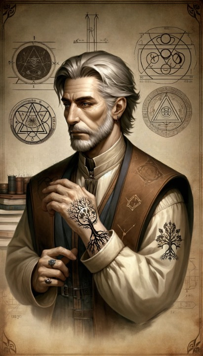

# Faustus ex Miscellaneis
<!-- tabs:start -->
# **Généralités**
]  
## Identité  
**Joueur** Gauthier  
**Nom du personnage** Faustus (Tossanus et un peu Proclus)
**Nom de naissance** <mark>...</mark>
**Sexe** Masculin  
**Date de naissance** 1180  
**Age** 67 (50 en apparence)  
**Maison** ex Miscellaneis  
**Confiance** 3  
**Crépuscule** 4 (8)

## Caractéristiques  
**Int** +3 (analytique)  
**Per** +2 (à l'affût) (*+3 en corbeau*)  
**For** 0 (humain lambda) (*-8 en corbeau*)  
**Ené** +3 (rageur)  
**Pré** –2 (effacé) (*-1 en corbeau*)  
**Com** -2 (méfiant)  
**Dex** 0 (*+2 en corbeau*)  
**Viv** +1 (*+5 en corbeau*) (1 vieillissement)

## Réputation

## Traits de caractère

# **Vices & Vertus**
## Vertus  
**Magie élémentale** : +3 : lorsque le Mage gagne minimum un point d’expérience en Aquam, Auram, Ignem ou Terram, il gagne automatiquement un (et un seul) point d’expérience dans les trois autres Arts. En outre, pour un sort utilisant l’un de ces quatre Arts, aucun malus relatif à l’utilisation d’une autre Forme comme Complément ne s’applique.  
**Sort rapide** (*Fast caster*) +1 : +3 aux jets d’Initiative  
**Affinité** (*Puissant Art*) +1 (Muto) : bonus de +3.  
**Affinité Muto** (*affinity with Art*) +1 : bonus de 50%  
**Book learner** +1 : lorsque le mage étudie des livres, il peut les considérer comme s'ils étaient de 3 qualités au dessus de leur niveau.  
**Caractéristique améliorée** (*Improved characteristic*) +1 : +3 points supplémentaires à dépenser pour l'achat des Caractéristiques.  
**Bonus d’étude** (*Study Bonus*) +1 : Bonus reçus à l’étude de sort quand le mage est entouré du ou des éléments qu’il étudie.  
**Réflexes éclairs** (*lightning reflexes*) +1 : En cas de totale surprise, dé de tension + rapidité : si +3 alors je peux choisir de réagir. En combat, je gagne +9 en initiative. 

## Vices  
**Amnésique**  -3  
**Ambition au sein de l’ordre d’Hermès** -3  
**Magie imprévisible** (*Unpredictable Magic*) –1 : lancer un sort implique toujours un jet de tension, même si le sort est maîtrisé et même en cas de sort spontané sans dépenser de Niveau de Fatigue (auquel cas le jet vise uniquement à déterminer s’il y a un désastre).  
**Cleptomane** -1 : Le mage a la sale manie de subtiliser babioles et breloques amusantes pour se constituer une collection.  
**Circonstances délétères** (*Deleterious Circumstances*) -1 : Le mage voit ses pouvoirs diminués de moitié dès qu’il se trouve près d’une potence.  

# **Compétences**
## Générales

**Athlétisme** (en vol) : 2  
**Attention** (alerte) : 2 
**Bagarre** (esquive) : 2  
**Concentration** (méditation) : 3 (15)  
**Connaissance des gens** : 2  
**Connaissance de la région de Provence** : 2  
**Connaissance de la Magie** : 1  
**Connaissance de l’ordre d’Hermès** (passé) : 3  
**Doigts agiles** (cleptomanie) : 2  
**Discrétion** (cleptomanie) : 2  
**Étiquette** : 1  
**Langue d’Oc** : 5  
**Latin** (latin hermétique) : 4  
**Natation** (sous l'eau) : 2  
**Survie** (en forêt) : 2

## Académiques

**Arabe** : 4 (2) (3+1 réminiscence vie passée)  
**Arts libéraux** (magie cérémonielle) : 1

## Arcanes

**Finesse** : 3  
**Philosophie** (Magie rituelle) : 1  
**Parma Magica** (Ignem) : 6 (10)  
**Pénétration** (Perdo) : 6  
**Théorie de la Magie** (Invention de sorts) : 6

# **Magie**
## Arts  
### Techniques

**Creo** : 14 (9)  
**Intellego** : 5  
**Muto** : 18 (1) +3  
**Perdo** : 14 (10)  
**Rego** : 15 (4)

### Formes
 
**Animal** : 12 (3)  
**Aquam** : 10 (5)  
**Auram** : 11 (10)  
**Corpus** : 14 (12)  
**Herbam** : 7  
**Ignem** : 10 (5)  
**Imaginem** : 3 (2)  
**Mentem** : 16 (5)  
**Terram** : 10 (5)  
**Vim** : 8

## Sceau du Mage  
En tant qu’expert du Muto, chacun des sorts que le mage lance évoque l’idée de transformation, de métamorphose. La terre pourra avoir l’apparence ou le son de l’eau, le feu pourra être suivi d’un vent glacé, la pluie pourra changer de couleur….

## Sorts formels et rituels  
**Vague de terre** (*Crest of the Earth Wave p.156*) **ReTe 20** 
Base 3, Portée Voix +2, Part +1, Taille +2.  
Une vague de terre prend naissance aux pieds du mage, d’abord étroite, elle atteint 5 pieds de haut et 30 pas de large dès qu’elle s’éloigne de 5 pas du mage. Pour sauter au dessus de la vague, il faut réussir un jet de Dextérité +12. Si non, la vague frappe le combattant, lui causant +10 dégâts.  
Sceau du mage : La vague, malgré sa composition uniquement terrestre, produit un bruit de raz-de-marée.

**Funérailles précoces MuTe 25**  maîtrise 1 *fast casting*  
Base 4, Portée Voix +2, Concentration +1, Part +1, Flexibilité vitesse +1.

**Funérailles précoces MuTe 30**  maîtrise 1 *fast casting*  
Base 4, Portée Voix +2, Concentration +1, Part +1, Pierre +1, Flexibilité vitesse +1.  
La terre deviendra sable mouvant sous le combattant, l’entraînant en elle à la vitesse que le mage choisit. Ce sort est aussi bien un sort de combat à exécuter rapidement, qu’une menace à mettre en œuvre lentement pour faire parler son adversaire.  
Sceau du mage : La surface du sol touché par le sort semble mijoter comme un bouillon, produisant quelques bulles de terre qui éclatent en gros « pop ».

**Beast of Minuscule Proportions MuAn 20**  
**Major Beast of Minuscule Proportions MuAn 40** (base 5, +3 Vue, +2 Aube/crépuscule, +2 taille)

**Jambes à son cou MuCo 20** 
Base 3, Portée Voix +2, Groupe +2, Diamètre +1.  
Les jambes des mages s’allongent. Les joueurs font un jet dextérité + athlétisme diff. 9 et s’ils le réussissent, ils obtiennent un +3 en athlétisme.  
Sceau du mage : Les pas produisent un son de galop de cheval. 

**Larme du Vésuve MuTe (Ig) 35** 
Base 4, Pierre +1, Portée Voix +2, Part +1, Diamètre +1, Taille +2.  
Un flanc de montagne devient coulée de lave.  
Sceau du mage : L’extrémité de la coulée de lave semble être de l’eau scintillante.

**Muraille de Pierre** (*Wall of Protecting Stone p.153*) **CrTe 25** 
Base 3, Portée Voix +2, Aube/Crépuscule +2, Taille +2.  
Crée un mur de pierre long de 25 pas, haut de 4 pas et large de 1 pas.  
Sceau du mage : Les pierres du mur reflètent la couleur des feuilles mortes.

**Pilum de Feu** (*Pilum of Fire p.140*) **CrIg 20** maîtrise cibles multiples 1  
Base 10, Portée Voix +2.  
Le mage lance de sa main un Pilum de feu qui cause +15 dégâts.  
Sceau du mage : Le Pilum de feu change de couleur.

**Plume Noire** (*Cloak of black feathers p.131*) **MuCo (An) 30** maîtrise *fastcasting* 1  
Base 20, Aube/Crépuscule +2.  
Le mage devient corbeau à l’aide de sa cape de plume.  
Sceau du mage : L’envol du mage produit le son du vent dans un tunnel.

**Renforcement de la magie MuVi (Co) 30**  
Base 20, +2 Voix  
Le sort augmente la portée d'une magnitude d'un sort Corpus d'un niveau inférieur.

**Respiration du Poisson** (*Lungs of the fish p.122*) **MuAq (Au) 20** 
Base 2, Portée Toucher +1, Aube/Crépuscule +2, Part +1.  
Change l’eau en air.  
Sceau du mage : Les bulles produites par la respiration sous-marine du mage laissent échapper en éclatant un parfum de prairie.

**Torrent impétueux** (*Mighty torrent of Water p.121*) **CrAq 20** 
Base 10, Portée Voix +2.  
Un jet d’eau de 3 pieds de diamètre surgit d’entre les bras du mage et cause +10 dégâts. Le combattant doit faire un jet Tension + Force diff. 9 ou bien être emporté par le jet d’eau.  
Sceau du mage : Le jet d’eau produit de la vapeur donnant l’illusion que l’eau est chaude.

**Aura de présence exaltée** (p.220//) **MuIm 10**  
Base 3, +1 Toucher, +2 Soleil.  
Le mage semble plus puissant, digne de foi et crédible. Petits détails dans l'apparence changent : illumination du visage, posture plus droite, voix plus forte et fluide.  
Bonus de +3 aux jets pour influencer, commander ou convaincre autrui.  
Sceau du mage : L'interlocuteur semble reconnaître dans le visage du mage une vague connaissance, les traits de quelqu'un en qui il a confiance.

**Vie évaporée  MuAq Au 20**  
Base 4, +2 Voix, +1 Diamètre, +1 Partie.  

**Vie évaporée MuAq Au 25** maîtrise 1 (5) : *incantation statique*.  
Base 4, +3 Vue,  +1 Diamètre, +1 Partie.  
Transforme les fluides en air. La cible subit +15 dégâts et doit boire dans les minutes qui suivent ou mourir. Compléments au lancer : animal ou corpus.  
Sceau du mage : la peau de la cible prend une teinte de paysage désertique. 

**Don de la robustesse de l'ours MuCo 30**  
Base 15, +1 Toucher, +2 Soleil.  
Votre peau devient résistante aux dégâts physiques. Vous gagnez +3 à votre Encaissement. Votre peau est dure et insensible, tout jet impliquant du doigté (comme crocheter une serrure) est effectué avec un malus de -1.  
Sceau du mage : le peau de la cible semble recouverte d'un duvet aux reflets métalliques.

**Crocs de la mère terre MuTe 35**  
Base 3, +2 Voix, +2 Soleil, +2 Groupe, +2 Effet visuel.  
Vingt piliers de marbre blanc d'une hauteur de 4 mètres, surgissent du sol, formant un cercle de 2 mètres de diamètre. Au sommet, les piliers sont aussi tranchants qu'une lance. Au sol, où ils se touchent, ils font 50 cm d'épaisseur. Lorsque les piliers s'élèvent, ils peuvent emprisonner quelqu'un, former un mur ou simplement empaler l'ennemi. Escalader ces piliers nécessite 3 jets de tension d'athlétisme difficulté +12 et le sommet se brise lorsqu'on y arrive, faisant chuter la victime. Empaler une cible cause +25 de Dégâts, potentiellement plus les tours suivants si la victime s'agite ou est incroyablement lourde. A la fin du sort, les piliers tombent en poussière.  
Sceau du mage : Les piliers semblent faits de nuages et de feu.

**Volutes de fumée nauséabonde CrAu 10**  
Base 3, +2 Voix, +1 Diamètre.  
Une fumée épaisse, jaune et sentant le souffre s'élève du point désigné, se diffusant naturellement. Bien qu'elle se dissipe, la fumée reste assez épaisse pour bloquer la vision dans un rayon de trois mètres. Pour chaque tour passé à respirer la fumée, un jet de tension d'Energie à 3+ doit être réussi, sous peine de perdre un niveau de Fatigue. Si un personnage tombe Inconscient, les jets ratés suivants occasionneront une Blessure légère à chaque fois. Le sort agit également sur l'environnement : les petites plantes fanent avant de mourir et la pousse des arbres est altérée. Une légère odeur de souffre persistera sur tout ce qui a été exposé à la fumée.  
Sceau du mage : des silhouettes semblent évoluer dans la fumée.

**Manteau de brume MuCo (Au) 35** maîtrise 3: *fastcasting, incantation statique, incantation silencieuse*  
Base 30, +1 Diamètre.  
Base 30, +1 Concentration  
Vous vous transformez en une brume épaisse et compacte de taille humaine. Vous pouvez flotter à vitesse de marche et pouvez voir et entendre ce qui se passe autour de vous. Vous pouvez aussi passer par des fissures dans les murs, mais pas traverser d'objet solide. Vous pouvez reprendre forme normale à volonté, ce qui met fin au sort. En tant que brume, vous êtes soumis aux forces du vent. Pour lancer le sort, vous devez inspirer une petite quantité de brume et la garder dans votre bouche jusqu'à ce que vous vouliez mettre un terme au sort.  
Sceau du mage : La brume émet une fine odeur de forêt.

**Don de l'énigme diminué CrVi 25**  
Portée voix  
La cible gagne 3 points de Distorsion et doit vérifier s'il entre dans le Crépuscule.

**Conjuration de la Foudre CrAu35**  
Base 5, +2 Voix, +4 non naturel  
Des éclairs jaillissent de vos bras écartés dans la direction choisie, infligeant +30 de dégâts à la cible touchée. Rien ne doit se trouver entre vous et la cible. Quiconque se trouvant à proximité doit effectuer un jet de tension à 6+ sur la Taille pour rester debout.
 
## Rituel de Longévité 

 Bonus : +12 

## Crépuscule

En 1242, Faustus entre dans le crépuscule suite à un sort CrVi 25 lancé par un mage dans une regio féerique à Constantinople. Il prend 5 points de crépuscule. En ressort assez vite armé du sort subit : CrVi 25 Don de l'énigme amoindri. Ainsi qu'orné d'une cicatrice bénéfique qui a l'avantage de transformer le choc de deux objets métalliques en musique.

# **Laboratoire**
## Caractéristiques  
**Size** 0  
**Refinement** +1  
**General Quality** 0  
**Upkeep** 0  
**Safety** +1  
**Warping** 0  
**Health** 0  
**Aesthetics** 0

## Vertus  
**Highly Organized (gratuit)**  
**Sphère armillaire élémentaire (+1)** +1 Aq, +1 Au, +1 Ig, +1 Te

## Vices  
Néant

# **Equipement**

La liste des babioles dérobées par Faustus est trop longue pour en dresser la liste !

# **Background**
## Description

## Historique  
### A l'origine
La vie de Faustus paraît s'écrire en deux chapitres, deux parties indissociables l'une de l'autre mais dont la première se compose aujourd'hui de pages blanches. Frappé d'amnésie, Faustus transporte avec lui le fardeau de ne plus savoir qui il est. Intégré par défaut à la Maison Ex Miscellaneis ne se souvenant plus de sa Maison d'origine, il promène ses questions partout où il passe.  
Seuls indices sur son passé, il porte marqué sur sa peau à l'intérieur de son poignet gauche un symbole étrange représentant **deux arbres se mêlant dans la lumière et dans la nuit** ; il est hanté par un prénom : "**Tossanus**" ; enfin, une image lui apparaît souvent en rêve, celle d'une **gigantesque montagne dont le sommet est caché par des nuages menaçants**.

C'est poussé par son désir de retrouver ses souvenirs qu'il revient dans la Région de Provence afin de rencontrer une Mage dont la maîtrise de l'Esprit et de ses méandres est, dit-on, sans pareille : Maga Esperanza. Peut-être sera-t-elle la clé de sa délivrance... 

Il rejoint l'Alliance de Villa Manlia au Printemps 1226. 

### Quête du passé de Faustus 
- En interrogeant la broche d'Anan le Karaïte, Faustus apprend que suite à une *condamnation* il a dû choisir entre la mort par pendaison et l'amnésie. Dilemme épineux proposé, semble-t-il, par une femme qu'une autre vision de la broche permit d'identifier comme **Maga Murion**, prima de la maison Bonisagus. 
- Il semble avoir déjà été dans le temple de Mercure de Doisseteppe. Souvenir étoffé par la vision que subit Sigfein au Printemps 1230 lors de la création d'un sort Imaginem. Selon les dires de Magus Sigfein, Faustus aurait été présent lors de la cérémonie de Relevé du Gant, en décembre 1199, **sous une autre apparence**, la vraie sans doute ! Des recherches dans les registres tenus par Doisseteppe permettent d'identifier deux jeunes mages qui pourraient vraisemblablement être le jeune Faustus. Il s'agit de **Proclus de Bonisagus** (dont le pater est feu Elzear de Bonisagus) ainsi que de **Tarryl de Tremere** (dont le pater est Athalus de Tremere). D'aucun d'eux, nous ne trouvons trace depuis 1199 (si ce n'est lors du Tribunal de 1207, où les registres indiquent que Tarryl aurait été soit présent, soit représenté - cf. représentativité chez les Tremere)
 - *Au printemps 1230, nous dépêchons un message à Esteban, à Durenmar, lui demandant d'identifier dans les écrits du jeune Proclus ses arts de prédilections, afin de les croiser avec ceux de Faustus et d'identifier les correspondances. Les dates de ces écrits pourront aussi aiguiller notre enquête.*
- Athanor de Bonisagus, qui le rencontre au Tribunal de l'Hiver 1226, pense l'avoir déjà rencontré.
- Le greffier d'Harco semble le reconnaître.
- Lors d'une aventure dans le Royaume Intellego, Faustus est témoin d'une scène du passé : la prestation de serment de Proclus de Bonisagus. On y apprendra que **Proclus est un élémentaliste spécialiste Muto**. 
- Suite à une demande faite à Esteban, nous apprenons que Proclus aurait écrit un manuscrit concernant les **paramètres des sorts Muto** (Cible, portée, durée). Ce manuscrit est réservé dans la partie strictement interdite au public et Reinhart sous-entend qu'à trop poser de questions, Esteban risque de s'attirer des ennuis. 
- Nous retrouvons le tractatus de Proclus dans un in-folio daté de plus dans trente ans, précieusement gardé par le quaesitor Juan dans le sanctum secret de feu Magus Sirianus. Le tractatus traite de la découverte qu'aurait faite Proclus du changement de l'eau en air de manière permanente.  Cela n'est pas sans rappeler l'assassinat d'A. à Durenmar, suite à la transformation permanente du beurre en beurre salé.  La découverte de Proclus est-elle la raison de son châtiment? Sirianus est-il mort d'avoir accepté qu'un inconnu se faisant passer pour Faustus mette la main sur le tractatus?  
- A la suite de l'aventure à l'Alliance d'Ad Vim per Veritatem, Faustus reçoit l'autobiographie de Currito de Jerbiton. Ce livre, abondamment glosé par Proclus en son temps, suit, en filigranes, les pérégrinations de Consilia, épouse de Currito, qui fut à l'origine de l'harmonisation de l'art Vim à toutes les Royaumes (divin, infernal, féerique et magique). Proclus semble, à travers ses annotations, tenter de retracer le parcours de Consilia dont l'Ordre a perdu la trace.
- Alors qu'il affronte la Consilia infernale,  celle-ci se moque de lui en lui révélant qu'il a trahi Tossanus, son ami de toujours, mais que celui-ci, loin d'être mort, a soif de revanche. Elle prédit à Faustus qu'avant de mourir, il plongera ses yeux dans ceux de Tossanus.
- Au cours de l'aventure qui nous mena à l'Université Invisible, Faustus rencontre Maga Miranda qu'il se surprit à appeler Mira. C'est dans cette alliance que Proclus et Tossanus vécurent un moment. Il semblerait que Proclus ait eu une liaison avec Miranda. Relation qui se finit brutalement quand **Proclus et Tossanus volèrent des manuscrits de l'alliance (dont les recherches qu'ils faisaient à trois, avec Miranda, sur la permanence de l'art Muto ; vol imputé à Tossanus)**.  
 - Dans le sanctum de Miranda, Faustus "emprunte" le livre "Histoire de l'Arménie" par l'évêque Faustus de Byzance. Il s'agit d'une version abrégée, traduite en latin du manuscrit original en grec. Cette version a été écrite par Miranda. A l'intérieur, une dédicace signée Proclus mais dont Faustus reconnaît sa propre écriture. La dédicace est un mot d'excuse pour son départ de l'Université Invisible.  
- A la lecture de l'ouvrage, Faustus est intrigué par un passage qui évoque le lieu où aurait échoué **l'Arche de Noé**. Lieu où se serait rendu l'évêque Faustus de Byzance.
- A Constantinople, Faustus rencontre Magus Arthus de Criamon. Ouvrage St Nérius, mage pieux (de Criamon) qui a pu combiner sa foi avec son don. Ce mage s'est intéressé au mythe du déluge. Il en aurait fait une description qui cerne de façon précise le lieu de l'Arche de Noé : "L'énigme des enfants du Seigneur". Il y cite des extraits du Livre d'Enoch.  

<!-- tabs:end -->
