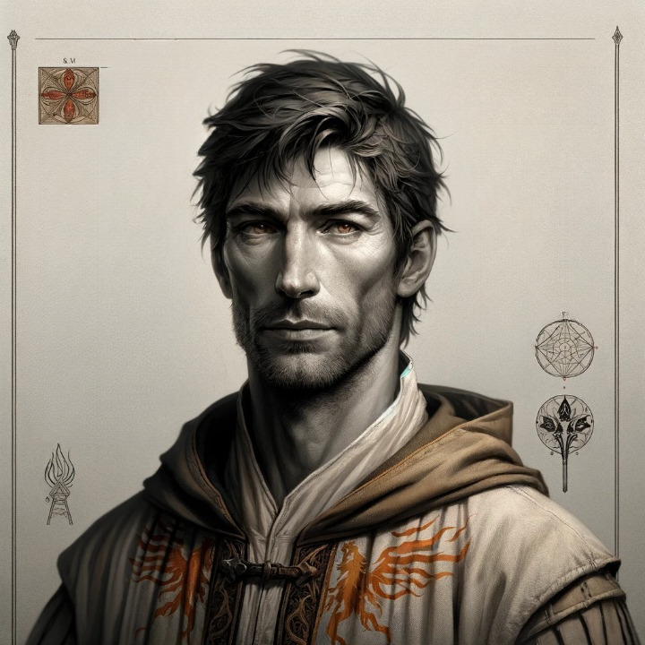

# Scintillus de Flambeau
<!-- tabs:start -->

# **Généralités**
  

## Identité
**Joueur** Michaël  
**Nom du personnage** Scintillus  
**Nom de naissance** <mark>...</mark> 
**Sexe** Masculin  
**Date de naissance** 1175  
**Age** 59  
**Maison** Flambeau  
**Confiance** 3  
**Crépuscule** 2(7)  
## Caractéristiques  
**Int** +3 (pragmatique)  
**Per** +1 (inquiet)  
**For** -1  
**Ené** +2  
**Pré** –2 (balafré)  
**Com** -2 (laconique)  
**Dex** +2 (athlète)  
**Viv** +1 (bons réflexes)  
## Traits de caractère  
<mark>A préciser</mark> 
## Réputation  
Aucune pour le moment  

# **Vices & Vertus**
## Vertus  
**Affinité** (*Puissant Art*) 0 (Ignem) : bonus de +3  
**Immunité majeure** (*Greater Immunity*) +3 : immunité totale au feu, qu'il soit d'origine naturelle ou surnaturelle (acquise au cours de son premier Crépuscule)  
**Forme de prédilection** (*Deft Form*) +1 (Ignem) : pas de pénalités au Total de Lancer de sorts Ignem avec des gestes et/ou voix non standards.  
**Jeunesse surnaturelle** (*Unaging*) +1 : un jet sur la table de Vieillesse ne peut aboutir à une diminution des Caractéristiques (uniquement au gain de points de Décripitude). De même, en cas de Crise, la seule conséquence négative possible est le décès en cas d'échec du jet d'Energie. Aucune conséquence négative lorsque 4 points de Décrépitude sont atteints. Le joueur choisit librement l'âge apparent du personnage.  
**Lien magie formelle - force vitale** (*Life Boost*) +1 : avant de lancer un sort formel, le Mage peut décider de dépenser un ou plusieurs niveaux de Fatigue pour augmenter à chaque fois de 5 son Total de Lancer. Si le Mage dépense plus de niveaux de Fatigue qu'il n'en possède, il subit un Dommage égal à +5 multiplié par le nombre de niveau de Fatigue dépensé au-delà de ceux qu'il possède  
**Magie formelle flexibe** (*Flexible Formulaic Magic*) +3 : le Mage peut augmenter ou diminuer de maximum 5 niveaux les sorts formels qu'il lance pour en affecter soit la Durée, soit la Portée, soit la Cible  
**Parent doué** (*Skilled Parens*) +1  
**Sort rapide** (*Fast caster*) +1 : +3 aux jets d’Initiative  
**Puissant Médecine**[^1] (*Puissant Medecine*) +1 : bonus de +2 aux jets de Médecine.

## Vices  
**Effet secondaire gênant** (*Warped Magic*) -1 : le lancer d'un sort est accompagné d'un réchauffement des objets à la ronde, en fonction de l'intensité du sort  
**Magie anarchique** (*Careless Sorcerer*) -1 : doubler le nombre de dés de Désastre en cas de lancer d'un sort  
**Magie disjointe** (*Disjointed Magic*) -1 : aucun bonus au Total de Laboratoire du fait de la connaissance d'un sort similaire ou du fait d'un enchantement déjà instillé dans un objet.  
**Mauvaise mémoire** (*Poor Memory*) -1 (noms de lieux)  
**Obsession** (*Driven*) -3 : "défendre la veuve et l'orphelin" (voir background)  
**Résistance Magique limitée** (*Limited Magic Resistance*) -1 (Aquam) : le score en Aquam ne joue pas en cas de Résistance Magique

[^1]: Vertu mineure accordée par Dame Aldona à l'Ete 1207.

# **Compétences**
**Arts libéraux** (*Artes liberales*) 1 (écriture)  
**Athlétisme** (*Athletics*) 1 (2)  
**Attention** (*Awareness*) 2  
**Bagarre** (*Brawl*) 2 (esquive)  
**Chirurgie** (*Chirurgy*) 1  
**Concentration** 2 (4)  
**Connaissance de la région de Provence** (*Area Lore*) 3 (légendes)  
**Discrétion** (*Stealth*) 3 (2)  
**Finesse** 3 (1) (précision/ciblage)  
**Langue d’oc** 5  
**Latin** 4  
**Parma Magica** 5 (mentem)  
**Pénétration** 4 (2) (ignem)  
**Survie** (*Survival*) 3  
**Théorie de la Magie** (*Magic Theory*) 7 (invention de sorts)  
**Connaissance de la féerie** (*Faerie Lore*) 2  
**Connaissance de l'Ordre d'Hermès** 3 (*Quaesitores*)  
**Philosophie** 2 (4)  
**Droit Hermetique** 1  
**Stratégie Militaire** 1 (5)  
**Equitation** 1  
**connaissance des gens** 3 (8)  
**Médecine** 1+2  
**Connaissance de l'infernal** 2 (rituels)  
**Intrigue** 1  
**Connaissance du divin** 1  
**Connaissance de la magie** 1

# **Magie**
  
Le phénix, l'oiseau de feu. Détail du bestiaire d'Aberdeen. Source : [Wikimedia Commons](http://commons.wikimedia.org/wiki/Image:Phoenix_detail_from_Aberdeen_Bestiary.jpg).
## Arts  
**Creo** 15 (4)  
**Intellego** 13 (5)  
**Muto** 5  
**Perdo** 13 (6)  
**Rego** 14 (6)  
**Animal** 0  
**Aquam** 0  
**Auram** 7 (3)  
**Corpus** 10 (7)  
**Herbam** 1  
**Ignem** 13 + 3 (0)  
**Imaginem** 3  
**Mentem** 10  
**Terram** 8(5)  
**Vim** 12

## Sorts formels et rituels  
**Endurance du berseker** (*Endurance of the Berseker*) ReCo 15 : immunise temporairement le lanceur contre les pénalités découlant de la perte de Niveaux de Fatigue ou de Santé, passés ou futurs. Le sort cesse au cas où le lanceur atteint le Niveau Inconscient. Le sort ne peut être lancé consécutivement qu'un nombre de fois égal à la Taille de la Cible + 2.  
**Endurance sans fin** ReCo 20 : immunise temporairement le lanceur contre les pénalités découlant de la perte de Niveaux de Fatigue ou de Santé, passés ou futurs. Le sort cesse au cas où le lanceur atteint le Niveau Inconscient. Le sort ne peut être lancé consécutivement qu'un nombre de fois égal à la Taille de la Cible + 2.  
**Chaleur de la forge ardentre** (*Heat of the Searing Forge*) CrIg 10 : chauffe une pièce de métal de sorte qu'elle devienne trop chaude au toucher. Un casque ou un poitrail en métal infligent +5 de Dégâts au premier tour, +3 au second et +1 au troisième. De plus petits objets causent moins de dommages. La plupart des armures comportent des pièces en cuir qui confèrent un bonus de +3 à l'Encaissement à la cible.  
**Lame de la flamme virulente** (*Blade of the Virulent Flame*) CrIg 15 : la lame d'une arme s'enflamme, doublant ses dégâts ou les augmentant de +5 (le plus haut des deux) et est susceptible de bouter le feu. La lame chauffant pendant environ une demi-heure commence à fondre, à moins de reposer pendant une demi-heure.  
**Eclair de flammes écarlates** (*Flash of the Scarlet Flames*) CrIg 15 : fait exploser un flash de lumière dans les airs. La cible doit réussir un jet d'Energie de 9+ ou être aveuglée pour une minute avant de recommencer le jet  
**Pilum de feu** (*Pilum of Fire*) CrIg 20 : fait jaillir une lance de feu infligeant +15 de Dégâts à la cible (matrise : 1 (multiple casting))  
**Arc de rubans flamboyants** (*Arc of Fiery Ribbons*) CrIg 25 : fait jaillir dans un arc de 60° des rubans de feu infligeant +10 de Dégâts à toute personne se trouvant à portée de voix.  
**Manteau de feu** (*Coat of Flames*) Cr(Re)Ig 25 : la Cible est enveloppée d'un manteau de feu et subit +5 de Dégâts par tour  
**Protection contre la chaleur et les flammes** (*Ward Against Heat and Flames*) ReIg 25 : tient à un mètre de distance tout feu infligeant au maximum +15 de Dégâts  
**Fiat lux et lux facta est** (*similaire à Lamp without flame avec durée Aube/Crépuscule*) CrIg 15 : Crée une lumière aussi intense que la lumière d'un jour nuageux dans un périmètre de 10 pas.  
**Shadows of the fires past**  InIg 15 : Permet de voir les endroits ou il y a eu un feu  il y a moins d'un mois et d'avoir une notion intuitive de quand le feu était présent.  
**Tales of the ashes**  InIg 5 : Permet de savoir ce que les cendres étaient avant de bruler et comment et quand cet objet a été brulé.  
**Aegis du foyer**  
**Endurance sans fin**  
**Boule de feu abyssale** CrIg 35 (matrise : 1 (multiple casting))  
**Gift of vigor**  
**Danse macabre**  
**Wind of mundane silence** PeVi 25  
**unravelling the essence of mentem** PeVi 20 (maitrise : 1 (fast casting))  
**Gather the essence of the beast** ReVi 15  
**Demon's Eternal Oblivion** PeVi 20  
**Pluie du volcan** CrIg 30 (base 10 + 2 (voix) + 2 (groupe))  
**Wizard's side step** ReIm 15 (base 2 + 2 (Aube/crépuscule) + 1 (changing image) + 1 (moved image matches changes) +1 (portée toucher))  
**Small silence of the smothered sound** PeIm 15 (base 3 + 2 (voix) + 1 (2 minute) + 1 (changing image)) (maitrise : 1 (fast casting))  
**Séducteur malheureux des flammes** ReIg 30  
**Vision of heat's light** InIg 20  
**Earth Shock** ReTe 30  
**Tunnel intangible** ReVi 25  
**Long Prying Eyes** InIm 10 (durée A/C)  
**Blessing of the child like bless** PeMe 25 (maitrise : 1 (fast casting))  
**Wizard Icy Grip** PeIg 30  
**Intangible Prying Eyes** InIm 10 (base 2 + 1 (touché) + 1 (concentration) + 2 (pièce))  
**Posing a silent question** InMe 20 (maitrise : 2 (Quiet casting²))  
**Git of the bear's fortitude** MuCo 25  
**Perron du roi de la montagne** CrTe 30  
**Pit of the gapping earth** PeTe 15

## Crépuscule

A l'hiver 1203, Scintillus est emporté par son premier Crépuscule à l'occasion d'une attaque magique qui prend la forme d'un feu vert crépitant qui lui enserre le corps et qui, au moindre de ses mouvements, le submerge d'énergies magiques incontrôlables. Scintillus décide malgré tout de passer outre et de s'abandonner aux forces du Crépuscule dans l'espoir d'avoir le temps de lancer un Pilum de Feu pour sauver son *sodalis* Dubinaro. Scintillus parvient à comprendre et à intégrer les énergies du Crépuscule dont il ressort presque immédiatement non sans avoir acquis 13 points de Crépuscule. Il en garde comme *cicatrice neutre* le fait que, chaque fois qu'il éprouve une crainte immédiate pour la vie d'autrui - que ce soit pour un ami, un Servant, la veuve, l'orphelin ou autre -, ses doigts, voire tout son corps en fonction de l'intensité de ses émotions, sont parcourus d'un **feu magique vert vif**[^2]. En outre, il en conserve comme *conséquence bénéfique* une **immunité majeure au feu**, le rendant totalement immunisé contre toute forme de feu, qu'il soit d'origine magique ou naturelle.

[^2]: Ceci n'est pas étranger au fonctionnement de la magie du Con Dar dans *Wizard's First Rule* de Terry Goodkind.

# **Laboratoire**

## Caractéristiques  
**Rafinement** 1  
**Taille** 0  
## Vices et vertus  
Néant
# **Background**
## Description  
<mark>A compléter</mark>

## Historique  
Fils d'une famille paysanne dans une petite seigneurie au pied des Pyrennées. Sa famille, ou du moins une partie d'entre elle, est massacrée par le seigneur des lieux qui accuse son père d'avoir tenté de dissimuler une partie des récoltes pour frauder l'impôt. Obligé de s'enfuir du village, survit tant bien que mal en se cachant dans les Pyrennées. Recueilli, à moitié mort de froid, par un vieux Mage de Val Negra un peu à côté de ses pompes mais qui prend pitié de ce jeune garçon doué du Don. Celui-ci garde de cette expérience traumatique une aversion pour l'exercice arbitraire de l'autorité à l'encontre des faibles.  

<!-- tabs:end -->