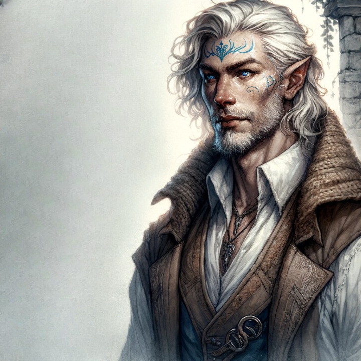

# Sigfein de Bjornaer aka Myrrdin de Diedne
<!-- tabs:start -->
# **Généralités**
  
## Identité  
**Joueur** Renaud  
**Nom du personnage** Sigfeín (en réalité Myrddin)  
**Nom de naissance** Thorbjörn  
**Sexe** Masculin  
**Date de naissance** 1178  
**Age** 51 (âge apparent)  
**Maison** Bjornaer (en réalité Diedne)  
**Confiance** 4  
**Crépuscule** 4 (16)  
**Cicatrices** :  
* traces noires, qui ne partent qu'après lavage, là où Sigfeín touche la peau d'un autre humain  
* impression de chute lente des objets qu'il laisse tomber  
* lorsque Sigfeín fait l'objet d'un effet Mentem, il est brièvement entouré d'un halo de lumière blanchâtre dont l'intensité est proportionnelle à la magnitude de l'effet  
* l'image de Criamon apparaît fugacement en superposition lors du lancer de sorts Vim  

## Caractéristiques  
**Int** +3 (créatif)  
**Per** +1 (oeil perçant)  
**For** +4 (+2 de base, +2 Peau de pierre) (pectoraux massifs)  
**Ené** +4 (+2 de base, +2 Peau de pierre) (vigoureux)  
**Pré** –3 (effacé)  
**Com** +1 (sens de l'humour)  
**Dex** -1 (+1 de base, -2 Peau de pierre) <mark>(félin)</mark>
**Viv** 0 (+2 de base, -2 Peau de pierre) <mark>(énergique)</mark>

## Traits de caractère  
<mark>A compléter</mark>

## Réputation
Aucune pour le moment  

# **Vices & Vertus**
## Vertus  
**Affinité mineure** (Intellego)  
**Affinité** (*Puissant Art*) +1 (Perdo) : bonus de +3  
**Animal de cœur** (*Heartbeast*) 0 (loup blanc) : transformation automatique sauf si quelqu’un s’y oppose. Ne porte pas sur l’équipement. Impossibilité d’avoir un familier  
**Caractéristique améliorée** (*Improved characteristic*) +1 (Int)  
**Magie de Diedne** (*Diedne Magic*) +3 : en cas de sort spontané, diviser par deux le total de lancer ne coûte aucun Niveau de Fatigue; s’il est néanmoins dépensé, l’Art applicable le plus bas est doublé  
**Sang féérique puissant** (*Strong Faerie Blood*) +3 (nymphe des airs) : jets de vieillissement ne commencent qu’à 50 ans et bonus de –3; yeux féériques de couleur violette (don de Double Vue et vision dans le noir ou la pénombre); ailettes dans le dos; + 2 de bonus pour les jets impliquant une action dans les airs  
**Source de *vis* personnelle** (*Personal vis source*) +1 (Corpus)  
**Imposition des mains mineure**[^1] (*Lesser Purifying Touch*) +1 <mark>...</mark> : Vous pouvez guérir <mark>...</mark> d'un simple toucher moyennant la dépense d'un niveau de fatigue. 

## Vices  
**Accoutumance à la Magie** (*Magic addiction*) –3 : après un jet de tension pour le lancer d’un sort, qu’il soit ou non réussi, faire un jet de Int + Concentration contre la moitié du niveau du sort (ou le niveau visé en cas de désastre). En cas d’échec, il faut soit lancer un sort formel d’un niveau au moins égal à celui du sort précédent, soit un sort spontané en dépensant un Niveau de Fatigue. Un nouveau jet d’Int + Concentration est requis avec un bonus de +3 pour chaque jet après le premier.  
**Aucun sens de l’orientation** (*No sense of direction*) –1  
**Enfance solitaire** (*Covenant upbringing*) –1 : mal à l’aise avec les structures politiques et sociales médiévales  
**Haine** (*Hatred*) –1 : ennemis de la Maison Diedne  
**Magie bizarre** (*Weird magic*) –1 : lancer d’un dé de désastre supplémentaire en cas de 0 sur un jet de tension; en cas de désastre, le résultat est plutôt étrange ou bizarre que dangereux  
**Terrible secret** (*Dark Secret*) 0 : membre de la Maison Diedne  
**Vis driven** : attirance forte pour toute forme de *vis*  
**Susceptibilité au crépuscule** (*Twilight-Prone*)  
**Visions (origine magique)** (*Visions*) –1 : à la discrétion du Conteur  
**Vulnérabilité aux Puissances infernales** (*Susceptibility to Infernal Powers*) –1 : Résistance Magique divisée par deux contre la dimension infernale; dans une aura infernale, jet d’Ené contre le niveau de l’aura ou nausées (–1 à tous les jets)  

[^1]: Vertu mineure accordée par Dame Aldona à l'Ete 1207.

# **Compétences**

## Compétences générales  
**Athlétisme** 1 (5)  
**Attention** 2 (5)  
**Bagarre** 2 (esquive)  
**Concentration** 2 (maîtrise de son accoutumance à la magie)  
**Connaissance de la région de Shannon** (*Aera Lore*) 1  
**Connaissance des gens** 2 (10)  
**Discrétion** (*Stealth*) 1 (4)  
**Enseignement** 0 (2)  
**Finesse** 2  
**Ruse** (*Guile*) 2 (3)  
**Survie** (*Survival*) 1

## Compétences académiques  
**Arts libéraux** (Magie cérémonielle) 1  
**Connaissance de l'Eglise** (procédure) 1  
**Connaissance du Divin** 1  
**Connaissance de la Féerie** (créatures) 2  
**Connaissance de la Magie** (créatures) 2 (1)  
**Connaissance de l'Infernal** (satanistes) 1  
**Connaissance de l'ordre d'Hermès** (objets magiques) 2  
**Droit hermétique** (Code périphérique) 1 (5)  
**Gaélique** 3  
**Langue d'oc** 4  
**Latin** 5  
**Médecine** (fièvre) 1  
**Philosophie** (Magie cérémonielle) 2  
**Théologie** 2 (5)

## Compétences mystiques  
**Animal de cœur** (*Heartbeast*) 1 (4)  
**Enigme** (Crépuscule) 4  
**Parma Magica** (Corpus) 6 (5)  
**Pénétration** (Perdo) 3  
**Théorie de la Magie** (Corpus) 6 (21)

## Aptitudes surnaturelles  
**Double vue** (*Second sight*) 1

# **Magie**
## Arts  
**Creo** 15  
**Intellego** 19 (3)  
**Muto** 10 (6)  
**Perdo** 15 (1) + 3  
**Rego** 14 (1)  
**Animal** 11 (3)  
**Aquam** 5  
**Auram** 6  
**Corpus** 16 (2)  
**Herbam** 5  
**Ignem** <mark>[5]</mark>
**Imaginem** 6  
**Mentem** 10 (5)  
**Terram** 8  
**Vim** 14 (1)  

## Sceau du mage  
Le Chêne. Tout ce que sa magie affecte revêt une apparence imposante, parfois noueuse, et tout bois impliqué dans le sort se présente sous cette forme. Occasionnellement, une tache ressemblant à un gland peut apparaître sur l'objet concerné.  
## Talisman  
### Apparence  
Le talisman se présente sous la forme d'un bâton noueux d'environ deux mètres de long en chêne se terminant en tête de loup et gravé de runes à la gloire et la majesté de la nature sous le règne animal.  
Ces runes sont faites d'argent (le fer étant honni par les êtres féériques) et les yeux du loup enchâssés de deux beaux morceaux d'ambre ronds.  
### Capacité  
10 pions de Vis Vim (investis à l'Automne 1224), dont x sont formatés  
### Pouvoirs  
* Contrôler des choses à distance (+ 4)  
* Détruire des choses à distance (+ 4)  
* *Corpus* (+ 3)  
* Contrôler les mouvements (+ 3)  
* *Intellego* (+ 2)  
### Sorts investis  
* *Magic's oblivion* base 10, + 6 (50 utilisations par jour) + 26 (+ 52 de Pénétration) (limité à 70 ans);  
* Contrôle des êtres féériques  base 5, + 2 Portée Voix, +2 Durée Aube/Crépuscule, + 3 (6 utilisations par jour) et +11 (+22 de Pénétration) (limité à 70 ans)

## Sorts formels et rituels

### Animal  
* **Souffrance des animaux** (*Agony of the Beast*) PeAn 15 : la cible se jette de droit à gauche, hurle de douleur et ne peut rien faire sans un jet d’Ené + Taille, difficulté 9+, par round

### Auram  
* ***Jupiter's Resounding Blow*** (CrAu 10)  
	 * Sceau du Mage :  <mark>...</mark>
* ***Circling Winds of Protection*** (CrAu 20)  
	 * Sceau du Mage : <mark>...</mark>
* ***Clouds of Rain and Thunder*** (CrAu 25)  
	 * Base 3, +3 Portée Vue, +1 Durée Concentration, +2 Cible Groupe;  
	 * Sceau du Mage : des objets en bois se mêlent à la tempête.  
* **Conjuration de la foudre** (CrAu 35)  
	 * Sceau du Mage: la foudre donne l'apparence de heurter un arbre

### Corpus  
* **Purification de la plaie suppurante** (*Purification of the Festering Wounds)* CrCo 20 : la cible reçoit un bonus de +9 aux jets de récupération d’une maladie ou d’une blessure  
* **Guérison du membre malade** (*Restoration of the Blighted Limb*) CrCo 30 (Durée Instantanée, Portée Toucher, Cible Individuelle, Rituel : base 25, +1 Toucher) : guérit les dommages causés à un  membre, sauf si celui-ci a été détruit ou amputé, incluant les effets du poison, de la maladie, des sorts nocifs, du vieillissement prématuré ou de malformations congénitales. Dans le cas d'une blessure simple due au feu, au froid, à une arme ou à un accident, le sort restaure un niveau de santé et donne une bonus de +3 aux jets de rétablissement ultérieurs (sort similaire à *Restoration of the Defiled Body* CrCo 25 mais avec effet sur un seul membre au lieu du corps en entier)  
	 * Sceau : la cible ressent une impression de force vitale réinvestissant la partie du corps affectée  
* **Localisation certaine** (*The Inexorable Search*) InCo 20 : permet de repérer une personne sur une carte moyennant un Lien Mystique avec la cible  
* ***Eye of the Sage*** InCo 25, Req. Im (Durée Concentration, Portée Arcane, Cible Individuelle) : permet de voir une personne et ce qui se trouve à un pas alentour (y compris ce qu'elle lit)  
	 * Sceau : l'image est entourée de branches de chêne  
* **Main d’étrangleur** (*Grip of the Choking Hand*) PeCo 25 : la cible perd un Niveau de Fatigue par round jusqu’à tomber inconsciente  
* **Curse of the Flying Wound** PeCo 25 (Durée Instantanée, Portée Voix, Cible Individuelle : base 15, + 2 Voix) : infliger une blessure grave à un individu à portée de voix  
	 * Maîtrise 2 : Multiple Casting et Fast Casting  
* **Endurance du Berserker** (similaire à Endurance of the Berserkers mais avec durée Concentration) ReCo 15  
	 * Sceau : fugace vision mentale d'un chêne millénaire  
* **Désarmement d'un groupe** (similaire à *Spasms of the Uncontrolled Hand* mais avec une cible Groupe et une durée Instantanée) ReCo 10 (Durée Instantanée, Portée Voix, Cible Groupe : Base 2, + 2 Voix, + 2 Groupe)  
	 * Sceau : les cibles ressentent un coup de branche sur leur bras  
* **Gift of Vigor** ReCo 25  
	 * Sceau : la cible ressent un coup d'une branche  
* **Déplacement éclair** ReCo 15  
	 * Sceau : un arbre fantomatique apparaît fugacement à l'endroit où se situait le Mage  
* **The Leap of Homecoming** ReCo 35  
	 * Sceau : la cible voyage perchée sur une branche

### Herbam

* **Seigneur des Forêts** (*Lord of the Trees*) ReHe 25  
	 * Sceau du Mage: La cible semble être un chêne

### Ignem  
* ***Wizard's Icy Grip*** (PeIg 30)  
	 * Sceau du Mage : <mark>...</mark>

### Imaginem  
* **Yeux espions** (*Prying Eyes*) InIm 5 : permet de voir dans une pièce dont on touche l’un des murs  
* **Conjuration de l'image distante** (*Summoning the Distant Image*) InIm 25 : permet de voir et d'entendre ce qui se passe dans un endroit dont on a une connexion des Arcanes (Base 2, +3 Portée Arcane, +2 Durée Concentration, + 2 Cible Pièce)  
* **Chambre d'Invisibilité** PeIm 25 (Base 4, +1 Toucher, +2 Aube/Crépuscule, +2 Groupe)

### Mentem  
* **Le Château endormi** (*The Sleeping Castle*) ReMe 20 (Base 4, +1 Toucher, +3 Structure)  
	 * Sceau du Mage : un berceau en bois (de chêne) apparaît fugacement dans l'esprit des personnes affectées  
* **Le Voleur de Mémoire** (PeMe 20)  
	 * Sceau du Mage : la cible perçoit l'image confuse d'une forêt impénétrable  
* **Bénédiction de la Félicité Infantile** (PeMe25)  
	 * Sceau du Mage : la cible ressent un coup de bâton sur le crâne

### Terram  
* ***Greater Touch of Midas*** CrTe 25 (Base 15, +1 Portée Toucher, +1 Taille, Rituel)  
	 * Ce rituel crée instantanément 800 livres d'or  
	 * Sceau : des nervures apparaissent dans la sphère d'or créée  
* **Perron du Roi de la Montagne** CrTe 30 (Base 3, +3 Portée Vue, +2 Durée Spéciale, Cible Individuelle, +2 Taille)  
	 * Sceau : les marches ont la texture du bois (de chêne)  
* **Conjuration de la Tour Mystique** CrTe 35  
	 * Sceau : la Tour comporte des nervures 

### Vim  
* **The Enigma's Gift** CrVi 10 (Base 5, +1 Touch)  
	 * La cible aperçoit un chêne mystique  
* **The Enigma's Gift** CrVi 30 (Base 20, +2 Voice)  
	 * Le sort inflige 4 points de crépuscule à sa cible  
	 * *Minor side benefit* : si le sort passe la Résistance Magique de la Cible, l'éclair de magie qui émane des mains de Sigfein et vient frapper la Cible se propage à toutes les personnes ou choses faisant l'objet d'un effet magique actif émanant de cette Cible et les illumine brièvement (moins d'un Tour), sans cependant affecter ceux-ci  
	 * Une forêt de chênes touffus apparaît dans l'esprit de la cible  
* ***Unravelling the Presence of the Realms*** InVi 25  
	 * Base 10, Portée Toucher +1, Durée Instantanée, Cible Individuelle, +2 Technique et Forme.  
	 * Détecte les traces de magie puissante ou les effets récents de magie faible de n'importe quel Dimension Mystique  
	 * Sceau du Mage: des nervures de chêne apparaissent fugacement  
* **Défaire l'essence de la Magie (*Unravelling the Essence of Magic*)** InVi 20;  
	 * Base 5, Portée Toucher +1, Durée Instantanée, Cible Individuelle, +2 Technique et Forme.  
	 * Permet, au contact d'un effet magique, d'en déterminer la puissance approximative ainsi que les Arts utilisés. Fonctionne sur toute magie hermétique active.  
	 * Sceau du Mage : apparition fugitive d'un gland éthéré.  
* **Magie Voilée (*Shroud Magic*)** MuVi 25  
	 * Sceau du Mage : un balai travestit le sceau du sort dissimulé  
* ***Mystic's Oblivion*** (PeVi 25): fait perdre 25 points de Force Mystique à tout être surnaturel (de n'importe quelle dimension)  
	 * Sceau du Mage : la cible ressent un arbre (un chêne, si elle le reconnaît) tombant sur elle  
* **Anéantissement des démons** (*Demon’s Eternal Oblivion*) PeVi 10 : fait perdre 10 points de Force Infernale à la cible  
* **Dénouer la trame de Mentem** (*Unraveling the Fabric of Mentem*) PeVi 24 : annule les effets d’un sort Mentem dont le niveau est inférieur ou égal à 34 + jet de tension (sans désastre)  
* **Essence de la Prophétie** ReVi 15 (Base 10, Durée Instantanée, Portée Toucher, Cible Individuelle) : permet de recueillir "l'essence" de l'un des trois ingrédients mystiques du rituel nécessaire à l'accomplissement de la prophétie de Manlius  
	 * Sceau du Mage : l'essence est recueillie sous la forme d'un gland  
* ***Circular ward against the Faeries*** ReVi 5  
	 * Sceau du Mage : les êtres féériques arrêtés ressentent l'effet d'une barrière en bois (de chêne, s'ils reconnaissent la texture)

## Crépuscule

### 1er Crépuscule  
**xp en Intellego**, pas de cicatrice.  
### 2ème Crépuscule  
Vice Majeur: **Susceptibilité au Crépuscule** (*Twilight-Prone*).  
**Cicatrice négative**: traces noires, qui ne partent qu'après lavage, là où Sigfeín touche la peau d'un autre humain.  
### 3ème Crépuscule  
A l’Hiver 1207, Sigfeín fait un simple désastre alors qu’il combat Myralys de Jerbiton en Certamen InVi, ce qui a pour effet de le propulser dans son 3ème Crépuscule. Il parvient à comprendre l’expérience et en retire une **Affinité mineure (Intellego)** ainsi qu’une **Cicatrice neutre**: impression de chute lente des objets qu'il laisse tomber.  
### 4ème Crépuscule  
A l'Ete/Automne 1210, Sigfeín de Bjornaer a à nouveau fait l'expérience du Crépuscule suite à un simple désastre en Résistance Magique à un effet Mentem. Il a ainsi acquis un total de 8 points de Crépuscule et est parvenu à comprendre l'expérience.  
Il en retire:  
* la vertu hermétique mineure **Enigme** (*The Enigma*), qui lui confère la compétence Enigme (*Enigmatic Wisdom*) au niveau 1;  
* 2 xp en Enigme;  
* une **Cicatrice positive**: lorsque Sigfeín fait l'objet d'un effet Mentem, il est brièvement entouré d'un halo de lumière blanchâtre dont l'intensité est proportionnelle à la magnitude de l'effet.  
Il est à noter que cela est assez particulier, car en principe on ne peut apprendre la compétence Enigme qu'au travers d'une initiation à ce Mystère avant de quitter sa maison pour rejoindre la Maison Criamon.  
### 5ème Crépuscule  
A l'Eté 1218, Sigfeín de Bjornaer fait une nouvelle expérience du Crépuscule. Il acquiert 2 points de Crépuscule et a compris l'expérience.  
Il en retire:  
* le sort The Enigma's Gift CrVi 10 (Base 5, +1 Touch)  
* une cicatrice neutre : l'image de Criamon apparaissant fugacement en superposition lors du lancer de sorts Vim  
### 6ème Crépuscule  
A l'Eté 1233, Sigfein de Bjornaer est plongé dans le Crépuscule alors qu'il tente de conjurer un mur de pierre. Il acquiert 13 points de Crépuscule et ne parvient pas à comprendre l'expérience.  
Il en retire le Vice Majeur *Peau de pierre* : la peau de Sigfein acquiert une teinte grisâtre, et son corps pèse désormais le même poids que s'il était entièrement fait de roc. En termes de jeu, il subit un malus de -2 en Dextérité et -2 en Vivacité, mais bénéficie d'un bonus de de +2 en Force et +2 en Energie.

# **Laboratoire**

## Caractéristiques

* Taille (occupée) : 0 (-1)  
* Raffinement : 1  
* Qualité générale : 2  
* Coût : 0 (+5)  
* Sécurité : 2  
* Crépuscule : 0  
* Santé : 0  
* Esthétique : 2

## Vertus

* Construction supérieure : + 1 Esthétique et + 1 Sécurité  
* Ingrédients inestimables : + 2 Qualité générale et + 2 Rituels de Longévité  
* Outils supérieurs : + 1 Objets et + 1 Sécurité 

## Vices

Aucun 

## Spécialisations 

* Objets : + 1  
* Rituels de Longévité : + 2  
* Vim: + 1

## Traits de personnalité

Aucun

## Routines de laboratoire  
Hiver 1211 : Overtime --> néant  
Printemps 1212 : Overtime --> néant  
Printemps 1213 : Overtime --> néant  
Hiver 1213 : Overtime --> +1 point de Crépuscule

# **Equipement**

## Armure

## Equipement 

* Bottes du Roi Aldarin (+1 Vivacité moins un dé de désastre, double la vitesse de progression). Détruites par l'effet d'un incendie provoqué par la Magie d'Odin
# **Background**
  
Miniature du XIIIe siècle représentant Merlin l'Enchanteur, dictant les aventures du roi Arthur au poète Blaise. Source : [Wikimedia Commons](http://commons.wikimedia.org/wiki/Image:Merlin_(illustration_from_middle_ages).jpg ].  
## Description  
## Historique  
Magus Sigfeín est né en l'an 1007 de notre Seigneur, dans le Tribunal de Stonehenge, des amours d'un Mage de la Maison Diedne et d'une nymphe des airs qui lui donnèrent le nom de Myrddin. Alors que celui-ci menait une enfance paisible, l'Ordre d'Hermès auquel appartenait son père était plongé dans la grande confusion des événements qui seront connus plus tard sous le nom de Guerre du Schisme. Alors qu'il n'avait que 5 ans, Myrddin fut témoin du massacre de son père par un groupe de Mages de la Maison Tremere venus éradiquer les derniers survivants de la Maison Diedne, accusée de satanisme. Myrddin n'en réchappa que parce que sa mère l'emporta avec elle à travers un portail menant à la mythique Arcadie, le Royaume des Fées.
 
En dépit du traumatisme qu'il avait subi, commencèrent alors pour le jeune Myrddin des jours heureux qui se perdent dans les brumes de sa mémoire. C'est qu'en Arcadie, le Temps n'a aucun sens et les jours succédaient aux jours tandis que Myrddin demeurait éternellement un petit garçon ayant pour compagnons de jeux les êtres les plus merveilleux dont on puisse rêver. Un beau jour, les fées escortèrent auprès de la mère de Myrddin un voyageur âgé qui prétendait avoir parcouru le monde pendant de nombreuses années avant d'avoir trouvé l'entrée de ce monde étrange. Il se présenta comme Sigfried de Bjornaer, Mage de l'Ordre d'Hermès, et ami du défunt père de Myrddin qui, sachant bien que les fées risquaient de garder son fils auprès d'elles pour l'éternité, avait fait promettre à Sigfried, afin qu'il s'acquitte de la dette de vie qu'il avait contractée, de partir à la recherche de son fils lorsque la Guerre du Schisme serait terminée afin de lui enseigner l'Art de la Magie. 
 
C'est ainsi que Myrddin quitta l'Arcadie dont l'accès lui demeure depuis lors condamné. Sigfried l'amena dans son *sanctum*, dans les régions désertiques du grand Nord de l'Europe, au-delà même des frontières du Tribunal du Rhin, où la religion chrétienne était encore à peine implantée et où l'Ordre d'Hermès avait chargé Sigfried de fonder un avant-poste afin d'évaluer la menace que représentaient les mystérieux sorciers prétendant appartenir à l'Ordre d'Odin. C'était l'an 1183 A.D. et Myrddin n'avait que cinq ans, tant dans son corps que dans son esprit, car les souvenirs des jours heureux qu'il avait passés en Arcadie commençaient déjà à s'effacer.
 
Pendant quinze années, Sigfried enseigna à Myrddin les arcanes du savoir hermétiques, jusqu'à ce qu'ayant relevé le Gant, il prît le nom de Sigfeín de Bjornaer. Sigfried l'initia également aux Mystères Extérieurs de la Maison Bjornaer et, l'un sous la forme d'un grand cerf, l'autre d'un loup blanc, ils parcouraient la plaine pendant de nombreux jours. Enfin, profitant de l'isolement de leur *sanctum* du reste de l'Ordre, et déférant au serment qu'il avait prêté au père de Sigfeín, Sigfried lui montra également comment puiser dans les énergies naturelles que même les adversaires de la Maison Diedne ont appris à redouter.

Lorsque Sigfeín fut arrivé à la fin de son apprentissage, Sigfried reçut une délégation du Tribunal du Rhin venue s'enquérir des progrès réalisés pour le compte de l'Ordre. Parmi les membres de la délégation figurait un ancien Mage de la Maison Tremere qui s'étonna que Sigfeín eût pour animal de cœur un loup blanc et se rappela que son *pater* avait en son temps affronté au cours de la Guerre du Schisme un puissant démoniste qui combattait sous cette forme - un Mage de la défunte Maison Diedne dont, si sa mémoire était bonne, Sigfried avait autrefois été fort proche... Craignant pour son *filius* qui, peu habitué aux rapports avec d'autres Mages, risquait par imprudence de trahir ses origines, Sigfried lui conseilla de partir le plus loin possible et de s'installer dans un Tribunal où il ne risquait pas d'être reconnu. Et c'est ainsi qu'en 1200, Magus Sigfeín de Bjornaer s'installa dans le Tribunal de Provence où il participa à la fondation de la Noble Alliance de Printemps de Villa Manlia...  
<!-- tabs:end -->
