# Tribunal de Provence  

## Arvigna & sa *regio* féerique  
Vallée entourée de bois sur un versant et de champs sur l'autre, traversée par une rivière, avec un château en son centre. La forêt recèle un passage vers une regio féerique.

* **Arthur**: jeune écuyer exubérant du chevalier Ambroise l'Eclair;  
* **Eloïse d'Arvigna**: fille de Mélisende, autrefois courtisée par le chevalier Ambroise l'Eclair jusqu'à la morsure ayant entraîné la condition de loup-garou de ce dernier;  
* **Geoffroy d'Arvigna** : fils aîné de Mélisende, actuel seigneur d'Arvigna;  
* **Guillaume d'Arvigna**: fils cadet de Mélisende, se destine à la prêtrise;  
* **Mélisende d'Arvigna**: veuve du seigneur d'Arvigna, soeur de Thanatos de Tytalus;  
* **Villard**: chevalier, compagnon de chasse d'Ambroise;  
* **Cerf Blanc**: majestueux cerf au pelage comme la neige et aux sabots de nacre, puissant gardien de la regio féerique;  
* **Dame Pétunia**: nymphe florale de la regio féerique, fervente adepte des massages;  
* **Prince Boronovilimocopor**: <mark>[...]</mark>;  
* **Seigneur Cyrielle** : <mark>[...]</mark> 
* **Seigneur Perceval**: actuel seigneur de la regio féerique suite à l'intervention des PJ dans le conflit qui l'opposait au Seigneur Cyrielle;  
* ~~**Seigneur Théobald~~** : ancien seigneur de la regio avant qu'on ne lui coupe la tête.

## Auch et ses environs (Saint-Pons)  
* **Albert**: cousin de Marie la lavandière, fermier et propriétaire du domaine sur lequel se situe le bassin de Saint-Pons;  
* **Clovis de Saint-Pons**: Seigneur d'Auch, résidant à Saint-Pons, assez âgé, "miraculeusement" guéri de son affliction congénitale par le pieux mage Margentius;  
* **Henri**: vieil avocat officiant à Auch;  
* **Père Bernard**: curé de Saint-Pons.

## Aurillac et ses environs  
* **Desmissel** : Seigneur (du petit peuple) de la Forêt féerique située à proximité d'Aurillac. Les mages de Villa Manlia bénéficient de sa bienveillance;  
* **Robert d'Aurillac** : Seigneur des terres entourant Aurillac, village voisin de l'Alliance de Villa Manlia avec lequel celle-ci entretient des relations de bon voisinage; jeté au cachot suite à la prise de son château par Dirk Vanderhaegen;  
* **Dirk Vanderhaegen** : Seigneur des Flandres ayant pris la place de Robert d'Aurillac;  
* **Alicia ex Miscellanea** : mère de Dirk Vanderhaegen, ayant fui le Tribunal de Normandie suite à son exclusion de l'Ordre d'Hermès pour interférence avec les vulgaires, maîtrise une magie non-hermétique axée sur la séduction.  
* **Germaine**: Plantureuse tenancière de l'auberge "La truie farcie".

## Bellaquin  

  

Priscilla de Jerbiton, accompagnée de sa servante Silvia et de son apprentie, future Esperanza de Jerbiton. Miniature réalisée il y a bien longtemps, à une époque où Priscilla était encore svelte et  n'avait pas encore acquis autant de... majesté. Source : Allégorie : Dame France priant, manuscrit de 1484, [BnF](http://visualiseur.bnf.fr/Visualiseur?Destination=Mandragore&O=07841610&E=1&I=44021&M=imageseule), Français 5054, fol. 35v

Alliance détruite par l'armée des croisés, avec le concours - magique - déterminant de Pierre de Saverdun et de l'infâme Jérôme de Bonisagus.  
* **Priscilla de Jerbiton**: l'extavangante *mater* d’Esperanza, une Mage toujours habillée de vêtements amples et de couleurs chatoyantes, à la voix forte et expressive, qui traite la plupart des gens comme ses domestiques. Membre, aux côtés de Tolomae et d'Henri Lebarre, du *triumvirat* dirigeant Bellaquin. Fort impliquée dans les intrigues de la région, elle a tenté de convaincre le dernier Tribunal de 1207 – sans succès – que l’Ordre d’Hermès devait s’allier avec la noblesse cathare pour résister à la Croisade. Proche du comte Raymond VI de Toulouse. Passée maître des Arts Rego, Imaginem et Mentem.  
* **~~Tolomae de Jerbiton~~** : le « sage » de l’Alliance. Généralement vêtu d’une longue toge blanche, doté d’un visage entre deux âges et d’un regard perçant. C’est un érudit, qui s’est spécialisé dans l’étude de toutes sortes de domaines pointus, et notamment les relations entre les quatre dimensions (magique, féerique, divine et infernale). Spécialiste des Arts Intellego et Corpus. Tué par Pierre de Saverdun au Printemps 1210 lors de l'assaut final des croisés sur Bellaquin;  
* **~~Henri Lebarre de Jerbiton~~** : sans doute le moins doué du triumvirat sur le plan magique, il est en revanche apprécié pour l’aisance de ses relations avec les vulgaires. On le méprend aisément pour un noble de la région – ce qu’il est d’ailleurs –, engoncé dans son armure et passant ses journées à chasser et à guerroyer. C’est lui qui représente l’Alliance dans le cadre des ses relations féodo-vassaliques (Bellaquin est vassale du comte de Toulouse, suzeraine de deux seigneurs locaux et exerce également le ban à l’égard de deux ou trois villages des environs). Adepte du Terram. Tué d'une flèche dans la gorge par l'armée des croisés au Printemps 1210;  
* **Augusta de Jerbiton** : la « rivale » traditionnelle de Priscilla. Augusta n’est jamais parvenue à s’emparer du pouvoir à Bellaquin, peut-être par manque d’intelligence politique, peut-être en raison de son caractère emporté, mais elle fédère généralement derrière elle ce qu’on peut qualifier de  « parti d’opposition ». Sur la question cathare, elle était partisane d’une politique nettement moins belliqueuse envers l’Eglise, s’efforçant d’entretenir avec les prélats locaux d’assez bonnes relations;  
* **~~Noxeris (alias Netaraxus) ex Miscellaneis~~** : un Mage assez secret qui a rejoint l’Alliance sur l’invitation de Tolomae. Malgré sa longue appartenance à l’Alliance dont il est membre depuis une cinquantaine d’années, il se tient à l’écart des intrigues pour lesquelles il ne dissimule pas son mépris et l’on sait au fond très peu de choses de lui. Certains murmurent qu’il pratique des formes de magie interdite, d’autres l’accusent à mots couverts de nécromancie. Jusqu’à présent, Tolomae a toujours pris sa défense, sans que l’on sache vraiment pour quelle raison. Littéralement explosé par Tertullia lors du siège de Bellaquin au Printemps 1210, celle ci l'ayant frappé dans le dos du sort *Conjuration de la Foudre*;  
* **~~Tertullia de Jerbiton~~** : une Mage discrète et réservée. On dit qu’elle s’intéresse à la philosophie des premiers chrétiens; en tout cas, elle est réputée pour son ascétisme, touchant à peine à la nourriture, veillant des nuits entières dans son *sanctum* et ne se désaltérant qu’à l’eau de la Fontaine aux Mille Echos, dans la cour de l’Alliance. Spécialiste de l’Auram et de l’Imaginem. Tuée d'une flèche tirée par Ronald lors du siège de Bellaquin au Printemps 1210 alors qu'elle affrontait Tolomae sur les remparts;  
* **Perfectus de Verditius** : *pater* de Manita. Il a rejoint Bellaquin il y a une vingtaine d’années pour en étudier les nombreux artefacts. C’est un homme petit, chauve et myope comme une taupe, contraint de recourir à toutes sortes d’objets enchantés pour avancer dans les couloirs de l’Alliance sans se cogner aux objets et aux gens. Il ne regarde jamais ses interlocuteurs en face quand il leur parle de sa voix monotone et pédante à la fois. Maître de l’orfèvrerie et des Arts Creo, Muto et Terram, il aurait pu être une grande source d’inspiration pour Manita. Tout au long de son apprentissage, celle-ci a espéré et cru qu’après qu’elle aurait relevé le gant, il accepterait enfin de la traiter en égale et de lui transmettre une partie de ses connaissances, plutôt que de l’utiliser comme une sorte de Servante de luxe; mais, trois ans après être devenue Mage à part entière, elle doit bien se rendre à l’évidence et constater que son *pater*, avec ses manies, son obsession du détail et son regard fuyant, n’a plus rien à lui apprendre depuis longtemps;  
* **Artephius de Tremere**  
* **Davnavolus de Bonisagus**  
* **Teslil de Jerbiton**  
* **Manita de Verditius**

Préalablement au siège de Bellaquin, les Mages Augusta de Jerbiton, Perfectus de Verditius, Artephius de Tremere, Davnavolus de Bonisagus et Teslil de Jerbiton ont fui dans le Tribunal de Normandie pour y fonder une nouvelle Alliance. Suite à la chute de Bellaquin, Manita de Verditius a rejoint Villa Manlia, tandis que Priscilla est entrée au service du Comte de Toulouse en vue de défaire l'armée des croisés.

## Blanc Mesnil  
Alliance établie dans un ancien monastère fortifié, édifié au-dessus d'un réseau de cavernes produisant des pions Terram et Aquam, désormais largement condamné à la demande du Bougon, être féerique qui y a élu domicile.

* **~~Elzéhar de Bonisagus~~** : Primus de Blanc Mesnil, membre fondateur de l'Alliance;  
* **Clarembeau de Jerbiton** : membre fondateur de l'Alliance;  
* **Ulfius de Flambeau** : membre fondateur de l'Alliance, en différend avec Méraugis, qui l'accusait de lui voler ses connaissances, avant le suicide de ce dernier;  
* **~~Méraugis de Verditius~~** : quatrième membre fondateur de l'Alliance, aux prises avec Ulfius qu'il avait fait déférer - sans succès - au Conseil des Mages pour l'avoir retrouvé dans son *sanctum*, avant de se suicider, victime des sortilèges du Bougon;  
* **Ferraud de Bonisagus** : ancien apprenti d'Elzéhar;  
* **Severian de Bonisagus**  
* **Urbain de Bonisagus**  
* **Jocelyn de Criamon**  
* **Galescin de Merinita**  
* **Thorold d'Ex Miscellaneis** : geignard toujours à la recherche de *vis*, qui s'affirme spolié par les distributions opérées par Elzéhar;  
* **~~Dodiniel~~** : apprenti de Severian, qui le traite très durement, voire injustement d'après plusieurs autres Mages. Il semble qu'Abaddon de Tytalus ait, d'une manière ou d'une autre, récupéré ses cendres et les ait versées dans une urne funéraire placée dans la Chambre des Illusions, ce qui lui permet de donner au fantôme de Dodiniel l'illusion qu'il est encore en vie.  
* **Gormond** : apprenti - peu assidu - d'Urbain. 

## Castra Solis  
Nouvelle Domus Magna Flambeau, sise dans le Tribunal de Provence, suite à la déchéance de Val Negra. Refondée sur les lieux mêmes de Val Negra.

* **Balthus de Flambeau** : Mage imposant à la barbe noire et à la voix gutturale, ancien amant de Priscilla de Jerbiton, conseiller militaire de Pierre II d'Aragon;  
* **Selima de Flambeau** : sensuelle épouse de Balthus, ancienne sorcière ayant intégré l'Ordre d'Hermès après une féroce résistance, rivale amoureuse de Priscilla, qu'elle a failli vaincre lors d'une Guerre des Magiciens;  
* **Ulfius de Flambeau** : ancien membre fondateur de l'Alliance de Blanc Mesnil.  
* **Kaeso de Flambeau** : Mage impétueux qui n'hésite pas à rappeler les membres de sa Maison à leurs devoirs  
* **Deleor de Flambeau** : tué au cours de la Guerre des Magiciens lancée contre Villa Manlia en 1237  
* **Althalys de Tytalus** : ex-Prima par alternance de Grisfaucon; soeur d'Althalus;  
* **~~Exercitus de Tytalus~~**;  
* **Thanatos de Tytalus** : albinos s'habillant entièrement de velours noir, Magister du Dr Mark, frère de Mélisende d'Arvigna;  
* **~~Calpurnia de Tytalus~~** : petite rouquine boulotte juvénile, au caractère sanguin, adepte de la magie Cr(Re)An(Ig). En raison de ses compétences et de son tempérament, considérée comme l'une des leurs par de nombreux Mages de la Maison Flambeau.
* **Myralys de Jerbiton** : rencontrée à Saint-Pons où elle a échoué à s'approprier le bassin miraculeux pour le compte de l'Alliance de Grisfaucon du fait de l'intervention des mages de Villa Manlia, devenue membre de Grisfaucon depuis le Tribunal de 1207. Elle l'a quittée pour Castra Solis avec Althalys. En fuite depuis l'hiver 1254 à la suite de sa condamnation par le Tribunal à payer 100 pions de *vis* d'amende pour avoir magiquement espionné Althalys de Tytalus au profit d'Althalus de Tremere.  
## Doïsseteppe  
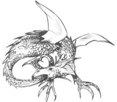

Blason de Doïsseteppe. Source : *Les Alliances*, Paris, Descartes, 1994, p. 61

Puissante Alliance du Tribunal de Provence où se tient tous les 7 ans le Tribunal. La hiérarchie est organisée autour d'un *Pontifex Maximus*, de 6 *flamines* (prêtres supérieurs) et d'un ensemble de *secondares* (prêtres inférieurs).

* **~~Oxioun de Tytalus~~** : Primus de Doïsseteppe et son *Pontifex Maximus*, ainsi que *Praeco* du Tribunal de Provence. Porte un bracelet de couleur noire et un autre de couleur sang. Parti dans le Crépuscule final à l'hiver 1254.  
* **Remmel** : chef de la *turbula* d'Oxioun de Tytalus, porteur de 7 étoiles gagnées lors des *ludi Magni*;  
* ~~**Protantus de Guernicus**~~ : *Princeps Quaesitor* (Doyen des Quaesitores) du Tribunal. Mort d'un *cultellus* planté dans le coeur à l'hiver 1254.  
* **Paulus** : jeune enfant au service de Davinia. Porte un bracelet de couleur nacre et un autre de couleur sang;  
* **Quaesitor Dikaïos de Guernicus**: à l'occasion d'une visite rendue à l'alliance de Villa Manlia, il a chargé les mages de celle-ci d'une mission officieuse de bons offices consistant à résoudre les questions issues des tractations menées par Ereditus de Jerbiton, ancien *primus* de *Mare Immobile* emporté par le crépuscule dans d'étranges circonstances. Il a notablement échoué, malgré d'importants et durables efforts consentis à cet effet, à démontrer la corruption d'Oxioun, mage de la maison Tytalus. Interrogé à propos de ce douloureux épisode par l'un des mages de l'Alliance de Villa Manlia, ignorants de la question, sur la suggestion de Jérôme, ce Quaesitor a quitté celle-ci en colère. Désormais au service de Sempronia de Guernicus du Tribunal Romain.  
* **Martin**: le serviteur de Dikaïos;  
* **Quaesitor Hectorus de Guernicus**: rencontré à Saint-Pons, chargé par l'Ordre d'Hermès de mener une enquête sur le mage Margentius.  
* ~~**Erat Caecus**~~ : célèbre hoplite aveugle de la maison Flambeau. Parti dans le Crépuscule final.  
* **Cherubino de Jerbiton** : Membre du Conseil intérieur. Porte un bracelet de couleur nacre et un autre de couleur verte.   
* **Cassandra de Guernicus** : *Princeps Quaesitor* depuis l'hiver 1254. 
* **Alézaïs de Merinita** : Praeco du Tribunal de Provence depuis l'hiver 1254

| 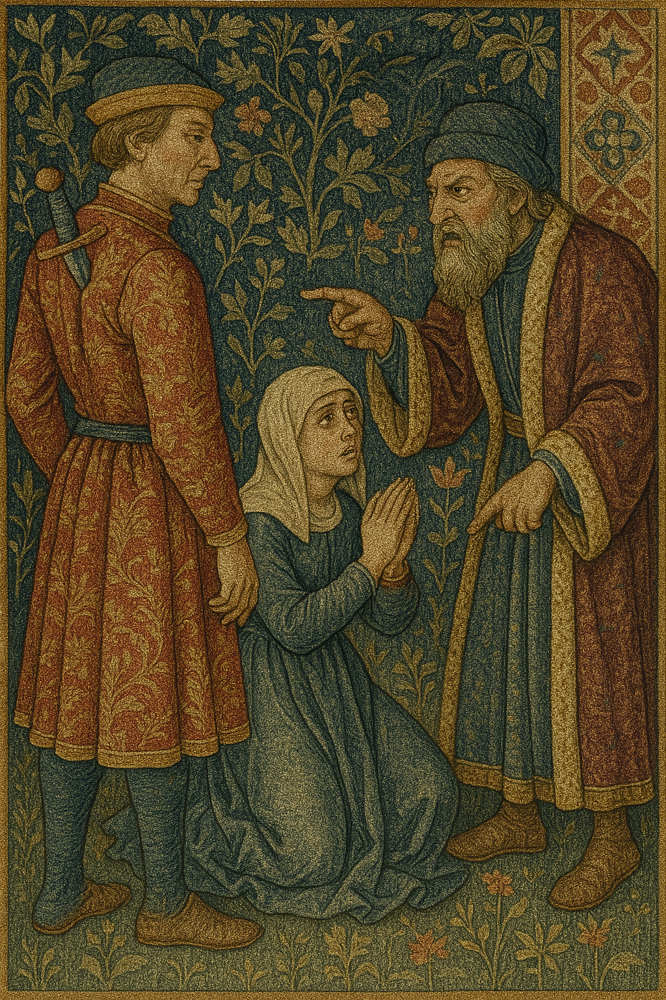                                        | 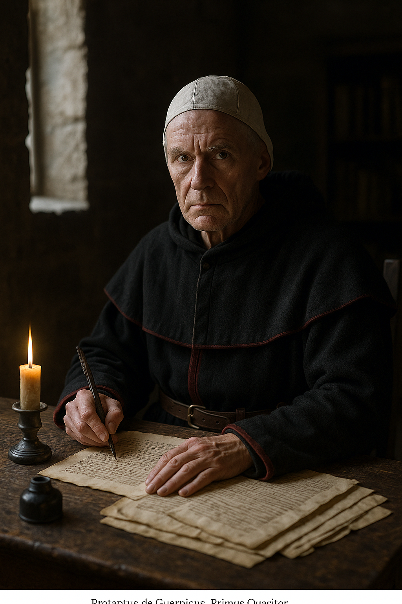 | 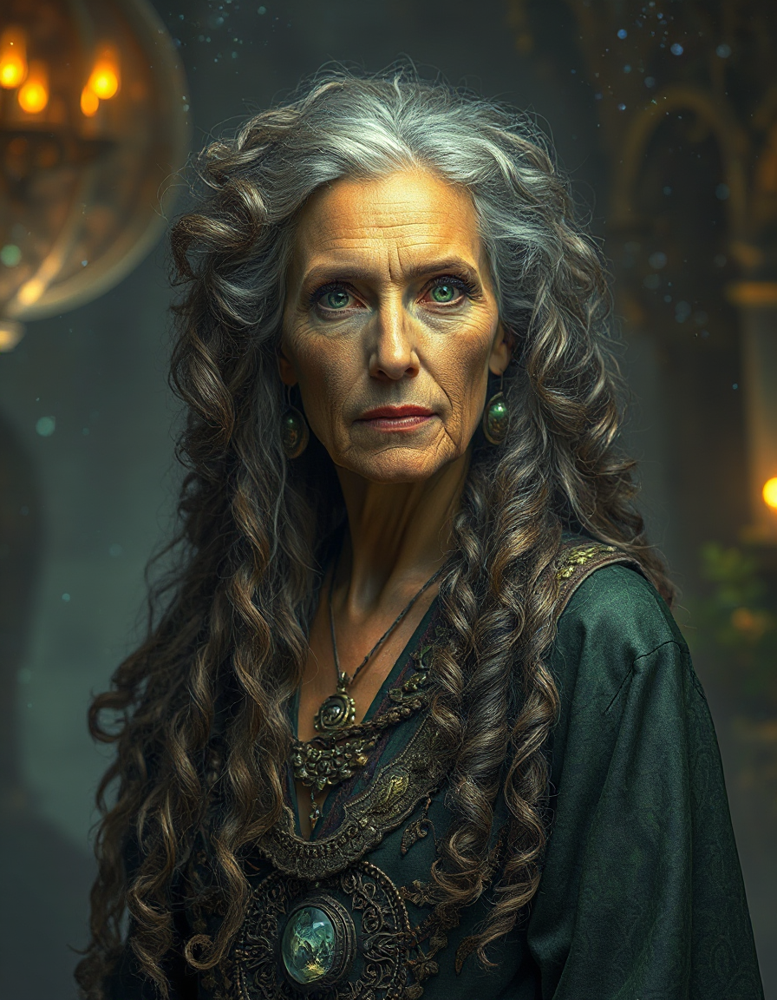   |
| ----------------------------------------------------------------- | ------------------------- | ------------------------- |
| Oxioun de Tytalus face à Anan le Karaïte et sa petite-fille Sarah | Protantus de Guernicus    | Alézaïs de Merinita       |
| 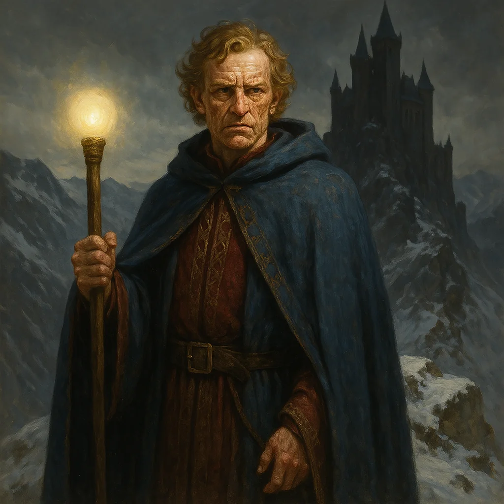                                         | 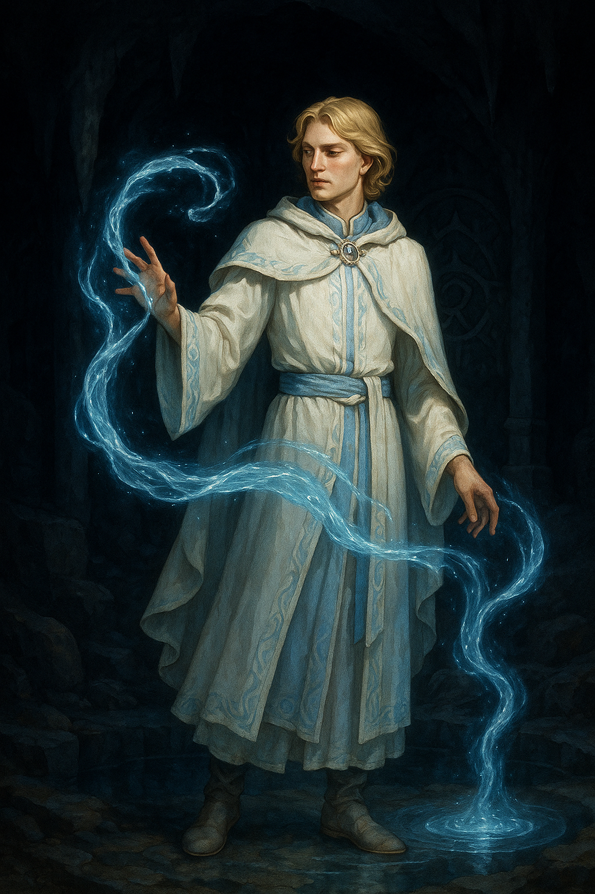    | 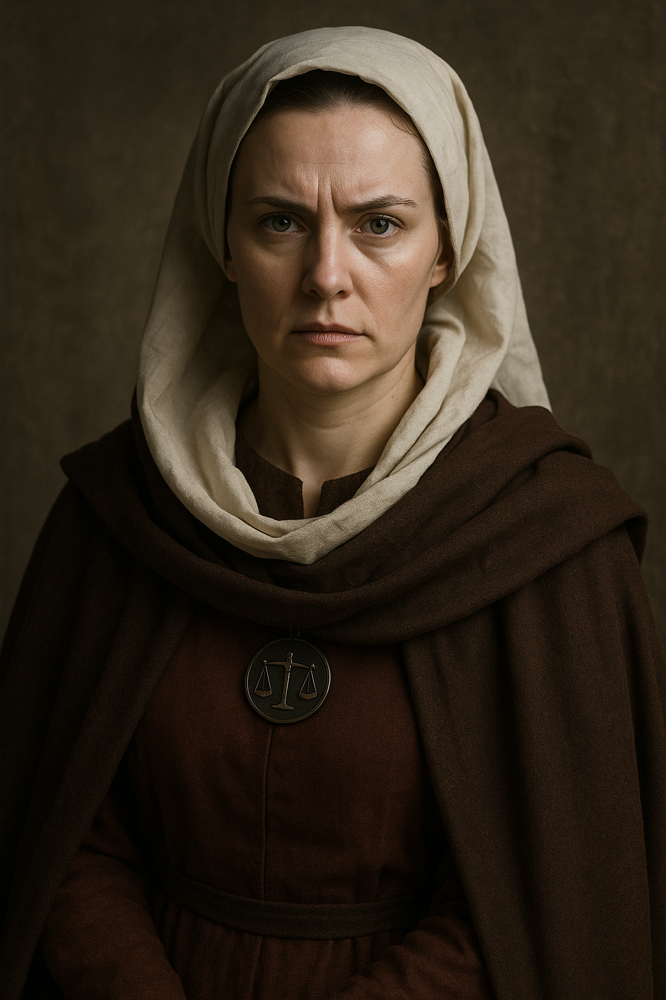 |
| Cherubino de Jerbiton                                             | Paulus ex Miscelleaneis   | Cassandra de Guernicus    |
|                                                                   | 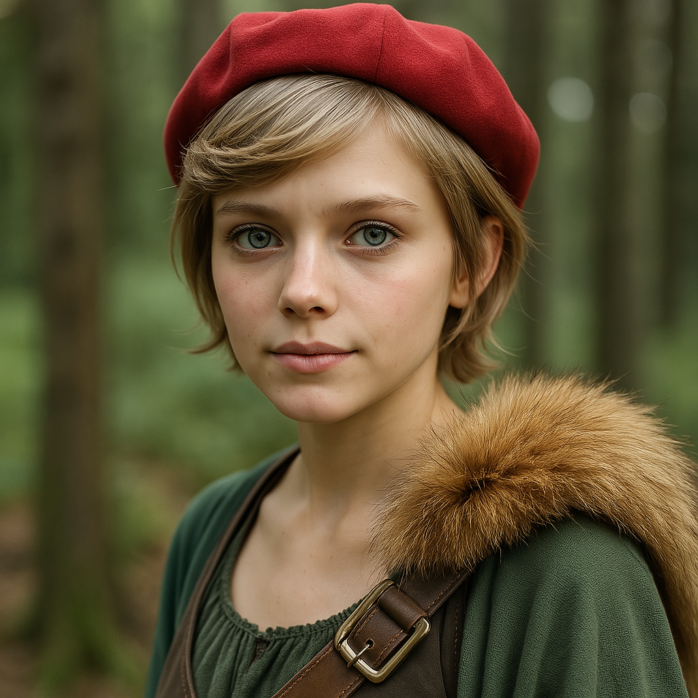   |                           |
|                                                                   | Eleanor de Mercere        |                           |

## Eglise en général  
* **Arnaud-Amaury**: abbé de Cîteaux, légat du pape;  
* **Diègue†**: évêque d'Osma, mort de vieillesse en 1207;  
* **Dominique de Guzman**: sous-prieur d'Osma (futur Saint Dominique). Voici son apparence :  
> (...) taille moyenne, corps mince, visage beau et légèrement coloré, cheveux et barbe légèrement roux, de beaux yeux. De son front et de ses cils, une sorte de splendeur rayonnait qui attirait la révérence et l'affection de tous. Il restait toujours souriant et joyeux, à moins qu'il ne fût ému de compassion par quelque affliction du prochain. Il avait les mains longues et belles; une grande voix, belle et sonore. Il ne fut jamais chauve et sa couronne de cheveux était complète, parsemée de rares fils blancs[[footnote]]Description de soeur Cécile, moniale de Saint-Sixte, communauté fondée en 1221, traduite par M.-H. Vicaire, *Saint Dominique. La vie apostolique*, Paris, Ed. du Cerf, 1965, p. 124, reproduit par P. Epinoux, "Une réponse à l'hérésie : Dominique et les dominicains", *Le Pays cathare. Les religions médiévales et leurs expressions méridionales*, s.l., Seuil (coll. Points Histoire), 2000, pp. 111-112.[[/footnote]].  
* **Pierre de Castelneau†**: légat du pape, assassiné aux environs de Saint-Gilles le 14 janvier 1208;  
* **Raoul de Fontfroide†**: légat du pape, décédé à l'Eté 1207.

## Foix  
* **Enguerrand de Laurac**: Sénéchal du Comte et oncle du défunt Philippe, les mages de Villa Manlia peuvent compter sur son immense gratitude, pour avoir assuré le bon déroulement du débat théologique qui s'est tenu à Pamiers au cours de l'hiver 1203 et avoir évité une condamnation de la doctrine des Bons Chrétiens. (Note du Conteur : l'adjectif "immense" n'engage que Sigfeín - n'oublions pas que les Mages se sont révélés incapables d'assurer la sécurité de son neveu chéri!);  
* **Raimond-Roger**: Comte de Foix, favorable aux Bons Chrétiens. 

## Grisfaucon  
Alliance du Tribunal de Provence à l'origine composée pour moitié de Tremere et pour moitié de Tytali. Elle était caractérisée par deux Primi qui gouvernaient en alternance une année sur deux.

* **Althalus[^1]  de Tremere** : ancien Primus de Grisfaucon; frère d'Althalys. Exilé en 1254 dans le Tribunal de Transylvanie après avec perdu ses sceaux dans un *certamen* avec Julian.  
* **Tyrox de Tremere**;  
* **Desdemona de Tremere** : une Mage à la beauté stupéfiante

Remarque : depuis sa création, les Tremere de Grisfaucon ont pris le contrôle de Lariandre, et les Tytali ont quitté Grisfaucon pour rejoindre Castra Solis.

Autre personnage anciennement lié à Grisfaucon :

* **Docteur Mark** : ancien docteur personnel du comte Clovis de Saint-Pons, il s'est révélé être doté du Don et est devenu l'apprenti de Thanatos de Tytalus. Mais celui-ci l'a considéré comme un raté et l'a exilé.

## Lariandre et ses environs  

  
La Sorcière des Marais.

Alliance de Printemps située au coeur de la forêt féerique de Sadrissel, dépendant administrativement de sa maison mère Albison du Tribunal de Normandie.

* **Julian de Tremere**: voix autrefois prépondérante de Lariandre, jeune, empressé et bavard, blond, avec des lunettes, plutôt chétif, et cérémonieux.  
* **Perniciel de Tremere**: plutôt réservé, froid et méfiant;  
* **Valfraine de Tremere**: le rat de bibliothèque, distrait, maladroit, qui se pète toujours la gueule du haut des arbres, aurait vaincu Priscilla de Jerbiton en *certamen*, seul de l'Alliance à avoir incontestablement récupéré son sceau après avoir battu Murbella en *certamen* au Tribunal de l'hiver 1207, parti pour Coeris en 1212, nommé *Primus* de Lariandre à son retour;  
* **Dominic et Restaralin de Tremere**: jeunes jumeaux, espiègles et farfelus, complètement contaminés par l’hystérie féérique;  
* **Magnolia de Merinita**: autrefois bien disposée envers les mages de Villa Manlia, auxquels elle prêtait volontiers son concours, elle a depuis lors trahi leur confiance en se faisant l'instrument des machinations de Murbella ayant eu pour effet le vol suivi de la destruction de deux livres des Mages de Villa Manlia, ce qui s'explique par sa psychologie fragile (elle craint d'être expulsée de l'Alliance si elle déplaît aux Tremere). Spécialiste Herbam, intarissable quand il s’agir de parler de la forêt et de ses merveilles, livrant parfois des secrets sans comprendre leur importance. Pas du tout le genre des Tremere, mais ceux-ci la respectent. A passé 120 ans dans une *regio* féerique de la forêt de Sadrissel dont elle est ressortie... vieillie, mais plus sage.

<u>Forêt de Sadrissel</u> :  
* **Roi Aldarin**: roi de la Forêt de Sadrissel, membre de la Cour de Lumière;  
* **Sorcière des Marais**: régnant sur les sombres et dangereux marais situés dans la Forêt de Sadrissel, au Nord de l'Alliance de Lariandre, et membre de la Cour d'Ombre, elle est l'ennemie jurée du Roi Aldarin, auquel elle livre une guerre sans merci depuis la nuit des temps;  
* **Amelia**: jeune fée fille du Roi Aldarin, habitant une clairière dans la Forêt de Sadrissel, où elle fait en temps normal croître de petites fleurs jaunes gorgées de *vis Herbam*. Noyée dans le chagrin de ne plus recevoir de visites d'un chevalier humain égaré dans la Forêt dont elle s'est éprise, elle a un temps délaissé cette tâche mais l'intervention efficace de nos mages a permis au chevalier de continuer ses visites, et tout est rentré dans l'ordre.

<u>Abbaye de Saint Serant, sise près de la forêt de Sadrissel</u> :  
* **frère Antoine**: fils de marchand, fut temporairement prieur avant de céder sa place au frère Jean;  
* **sous-prieur Benoît**;  
* **prieur Jean**: issu d'une noble famille (alliée de Foulques), successeur du frère Antoine à la charge de prieur.

## Lavelanet  
Issue du scénario *Tongues of Viper*.

* **Seigneur Bérenger de Lavelanet**  
* **Guilhabert** : le sénéchal  
* **Jacques de Bray** : le voyant  
* **Père Gaston**  
* **Dame Claire Beauchamps**

## Luzac  
Petite châtellenie, en guerre endémique avec le seigneur voisin Huguon.
 
* **Geoffroi**: Seigneur de Luzac, dont la femme Blanche est décédée en mettant au monde Manon, disparue à 16 ans dans d'étranges circonstances. Eprouve de la gratitude pour les mages de Villa Manlia, qui ont permis d'élucider la question huit années après;  
* **Héloïse**: fille cadette de Geoffroi, également bien disposée envers les mages de Villa Manlia. Etait également affectée par le fantôme de sa grande soeur disparue;  
* **Manon†**: fille aînée du seigneur Geoffroi;  
* **Luc**: fils de Geoffroi, parti en croisade; depuis lors, son père est sans nouvelles de lui ou de son sort;  
* **Anna**: la gouvernante de Manon;  
* **Arnaut†**: le magister de Luzac, commanditaire de l'assassinat de Manon aux fins de celer le fruit de l'union extra maritale qu'il entretenait avec elle. Pendu par le seigneur après l'exposition de son crime au grand jour.
## Mare Immobile et ses environs
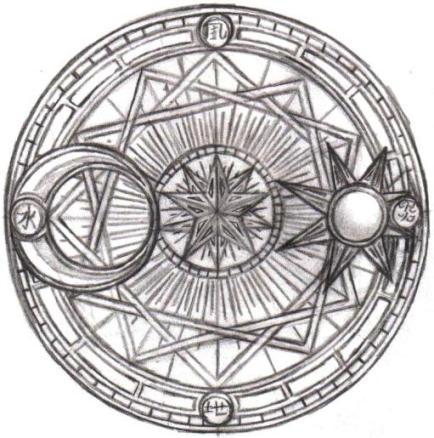

Blason de Mare Immobile

Cette Alliance tire son nom d’un lac de montagne au milieu duquel elle est bâtie : un lac immense, dont l’eau est en permanence parfaitement immobile, d’un noir profond, impossible pour le regard de crever la surface. Les Servants de l’Alliance y circulent parfois en barque, mais avec de grandes précautions, car ce qui circule sur la surface n’y reste jamais longtemps. Alliance d’été, comptant environ dix Mages, prenant la forme d’un château fortifié dont le toit en tuiles noires rappelle la couleur du lac. Aura Magique de 4.

* **[[jerome|Jérôme de Bonisagus]]**: Mage de *Mare Immobile* ayant effectué son apprentissage en même temps que Dubinaro auprès du même *Magister*, et qui sous ses dehors affables et humbles (toujours habillé d'une simple tunique monacale et ayant choisi de conserver son nom de baptême après avoir relevé le Gant, s'estimant indigne du port d'un nom hermétique), se révèle particulièrement sournois. Lors des évènements entourant le débat théologique qui s'est déroulé à Pamiers, les mages de Villa Manlia ont appris que Jérôme s'est allié aux pouvoirs infernaux. Il est en réalité en possession de, et étudie la *summa Wittockiana*, puissant ouvrage de magie démoniaque que Dubinaro fut suspecté d'avoir dérobé dans le *sanctum* de leur *Magister* Athanor avec la complicité de Claudia, la maîtresse de Dubinaro (voir son [historique](http://villamanlia.wikidot.com/dubinaro)). Devenu très puissant, Jérôme dispose notamment de la faculté de contrôler à distance des êtres humains, grâce à un sceau représentant un pentacle griffu gravé dans le corps des victimes, comme les personnages l'ont découvert au cours du scénario [La Dialectique des Armes](http://villamanlia.wikidot.com/dialectique). La confrontation l'a révélé, en ce compris aux yeux de son ancien *frater*, pour ce qu'il est: un mage rongé par la haine et la jalousie à l'encontre de Dubinaro, dont il a juré la perte, prêt à tout pour parvenir aux fins que lui dictent son ambition dévorante et ses rêves de grandeur. Lors du [Dernier Tribunal de 1207](http://villamanlia.wikidot.com/derniertrib), les personnages se sont révélés incapables de convaincre l'Ordre de la culpabilité de Jérôme, et ont au contraire été condamnés sur plainte de ce dernier pour mise en danger de l'Ordre. Depuis lors, les personnages soupçonnent Jérôme d'être mêlé à la [Mort du Légat](http://villamanlia.wikidot.com/mortlegat) du pape, Pierre de Castelneau, qui se trouve à l'origine de la Croisade lancée contre le Tribunal de Provence et qui menace directement la survie de Villa Manlia, ainsi qu'au [Siège de Bellaquin](http://villamanlia.wikidot.com/siegebellaquin) ayant entraîné la chute de cette puissante Alliance.  
* **Athanor de Bonisagus**: *Magister* de Dubinaro;  
* **Sorellus de Verditius**: ancien *Primus inter pares* (premier d'entre ses pairs) du Conseil des Mages de *Mare Immobile*, remplacé par Viridia de Verditius suite à la révélation de la traîtrise de Jérôme;  
* **Magda**, devenue **Viridia de Verditius** : jeune apprentie de Sorellus à *Mare Immobile*, qui a maintenu son affection à Dubinaro malgré la disgrâce dans laquelle celui-ci était tombé. Elle exerce désormais le rôle de **Prima de Mare Immobile**  
* **Elena de Bonisagus†** : assassinée aux alentours de 1214 par Jérôme de Bonisagus dans un auberge près de Mare Immobile;  
* **Aurelius**: vieux bibliothécaire;  
* **Abbé Samson**: dirige le monastère de Saint-Edmond, moins hostile à la magie que ne le sont généralement les membres de l'Eglise. Ayant obtenu de la part d'Ereditus de Jerbiton une pierre magique destinée à protéger l'enceinte du monastère, en échange de divers ouvrages et objets liturgiques, il a néanmoins restitué celle-ci sur l'insistance des mages de Villa Manlia moyennant remise des objets cédés;  
* **Prieur Jean**: prieur (second après l'abbé) du monastère de Saint-Edmond. Fervent catholique, il se montre très rétif à la pratique de la magie.

|    Jérôme de Bonisagus. En réalité, portrait du prédicateur [Jérôme Savonarole](http://fr.wikipedia.org/wiki/Savonarole) par Fra Bartolomeo, dans sa cellule au couvent San Marco, 1498. Source : [Wikicommons](http://fr.wikipedia.org/wiki/Fichier:Savonarola.jpg). | 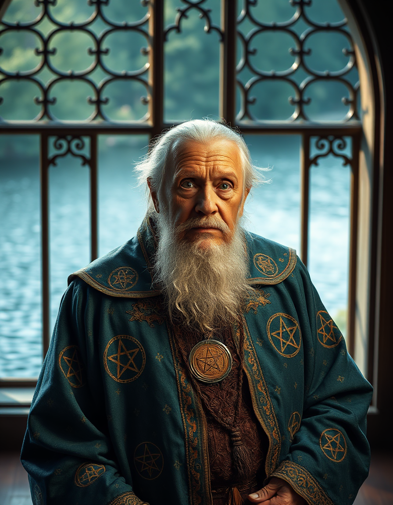 |
| ------------------------------------------------------------------------------------------------------------------------------------------------------------------------------------------------------------------------------------------------------------------------------------------------------------------------------------------------------------------------- | ----------------------- |
| Jérôme de Bonisagus                                                                                                                                                                                                                                                                                                                                                       | Athanor de Bonisagus    |

## Pamiers et ses environs  
* **Abbé Alain**: abbé de l’abbaye Saint-Antonin près de Pamiers, initiateur du débat théologique qui se tint à Pamiers à l'hiver 1203;  
* **Thibault Tanneur**: premier consul de la ville.

## Saint-Gilles-du-Gard  
* **Rémi Phraseur** : le gérant bavard et prétentieux de l'échoppe de Villa Manlia

## Sapientia Aetatum  
Alliance d'Hiver presque tombée dans l'oubli - quoique pas totalement puisque Grisfaucon semble entretenir avec elle un courant d'échange de pions Muto -, établie dans le quartier juif de la ville de Saint-Gilles-du-Gard, connue pour être propriétaire d'une des plus riches sources de *vis* Muto de la région. Semble en passe de redevenir une Alliance d'Ete grâce au sang neuf des Mages Karaïtes.

* **Ambrosius de Jerbiton** : Ancien *Pontifex* de l'Alliance, qu'il a quitté à l'Hiver 1209 après avoir été libéré par les Mages de Villa Manlia de la *regio* magique dans laquelle il était prisonnier. Il décide alors de se rendre à Valnastium, Domus Magna Jerbiton, afin de poursuivre ses recherches sur les liens entre la musique enchanteresse et le Mentem;  
* ~~**Anan bin Daoud d'Ex-Miscellaneis**~~ : Mage Karaïte, Sénateur et *Pontifex* f.f. de l'Alliance. Polygame, et connu des vulgaires comme un usurier.  
* **Barabas de Bjornaer** : brute épaisse ayant pour animal de cœur un ours malodorant. Spécialiste en Muto. Membre du Conseil.  
* **Eo de Tytalus** : svelte et charismatique lanceur de couteaux d'apparence trompeusement juvénile, victime d'une expérimentation ratée sur une potion de longévité l'ayant enfermé dans un état mental second. Membre du Conseil. Exerce une fascination douteuse sur Benjamin, et probablement également sur Pantos.  
* **Ibrahim d'Ex-Miscellaneis** : Mage Karaïte, premier apprenti formé par Anan et son gendre, membre du Conseil.  
* **Youssouf d'Ex-Miscellaneis** : Mage Karaïte, second apprenti formé par Anan, membre du Conseil. Jaloux d'Ibrahim.  
* **Benjamin d'Ex-Miscellaneis** : Mage Karaïte, troisième apprenti formé par Anan. Adepte de l'Imaginem et admirateur d'Eo.  
* **Pantos de Jerbiton** : ancien apprenti d'Ambrosius, adepte des rendez-vous nocturnes dans les jardins de l'Alliance. Membre du Conseil suite au départ d'Ambrosius.  
* **Rebecca** : fille d'Anan et épouse de Ibrahim; possède le Don mais n'a pas reçu d'éducation hermétique ou karaïte; tente désespérément d'enfanter un héritier mâle.

| 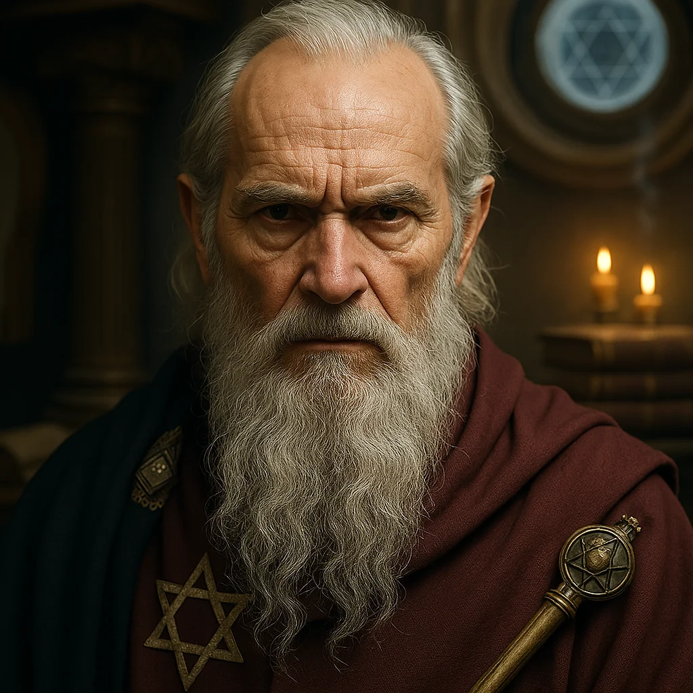                 |
| ------------------------------------ |
| Anan ex Miscellaneis, dit le Karaïte |

## Saverdun et ses environs 
* **Pierre de Saverdun**: jeune seigneur de Saverdun, il se présente comme l'allié de *Bellaquin* dont il avait toutefois secrètement juré la perte. En sous-main, il tentait d'orchestrer sa chute, et a envoyé son serviteur Ménard contacter le nouvel évêque de Toulouse, réputé d'une orthodoxie intransigeante, à cette fin. C'est dans ce contexte qu'il rencontre les personnages à l'automne 1201 au cours du scénario [Le Jeu de la Trahison et du Hasard](http://villamanlia.wikidot.com/trahison). Outre certains objets magiques (notamment un anneau à saphir bleu, probable réceptacle de sorts Mentem), qui lui viennent de sa mère Sybille, qui n'a pas terminé son apprentissage, il possède le Don. A sa demande, il a néanmoins été accepté (contre rémunération à convenir) comme apprenti d'Esperanza et a à ce titre rejoint l'Alliance de Villa Manlia à l'hiver 1202 au cours du scénario [Pacta sunt servanda](http://villamanlia.wikidot.com/pacta). A l'[hiver 1204](http://villamanlia.wikidot.com/chrono#hi1204), il épouse Esperanza qui devient Dame de Saverdun. Mais les choses se compliquent au [printemps 1207](http://villamanlia.wikidot.com/chrono#pr1207) lorsque, usant de la prérogative de sa Maison, Jérôme de Bonisagus revendique comme apprenti Pierre de Saverdun. Ce transfert d'autorité est entériné par le [Dernier Tribunal](http://villamanlia.wikidot.com/derniertrib) de l'hiver 1207. A l'[automne 1209](http://villamanlia.wikidot.com/chrono#au1209), Esparanza, toujours amoureuse de mari et ancien apprenti, s'arrange pour tomber enceinte des oeuvres de celui-ci. Saverdun participe au printemps 1210 au [Siège de Bellaquin](http://villamanlia.wikidot.com/siegebellaquin) et la chute de celle-ci. Pierre de Saverdun peut être décrit comme suit :  

> Le vaillant a l'enfourchure très grande,  
> Les hanches étroites, les côtés larges,  
> La poitrine forte et joliment moulée,  
> Les épaules vastes, le regard très clair,  
> La face hardie, les cheveux bouclés

Source : [La Chanson de Roland](http://lachansonderoland.d-t-x.com/), vers 3157-3161.

* **Ménard**: serviteur nain, bossu, hideux et malfaisant de Pierre de Saverdun (ancien serviteur de Sybille). Souffre-douleur favori de Sigfeín;  
* **Arnaud** et **Séverine de Saverdun**: demis-frère et soeur cadets de Pierre de Saverdun, issus d'un second lit, qu'il avait fait enfermer à la suite d'un différend peut-être orchestré concernant Guenièvre. Résidants désormais en Asturie sur les terres que constituaient la dot d'Esperanza;  
* **Guenièvre**: belle dryade aux cheveux des couleurs de la forêt, habitant un arbre situé au bas d'une cascade formant un bassin. Sous l'emprise d'un sort, elle avait été amenée à remettre son coeur à Pierre de Saverdun, qui lui avait promis de l'échanger contre le sien mais l'a en réalité conservé pour soumettre la créature de Féerie à sa volonté.

## Toulouse  
* **Foulques**, dit **Folquet** (en provençal): ancien trouvère de Marseille devenu abbé du Thoronet puis récemment désigné évêque de Toulouse, il s'avère d'une extrême intransigeance à l'égard de ce qui lui apparaît hétérodoxe. En particulier, il nourrit une défiance pour le comte Raimond-Roger de Foix, converti au catharisme, et ne ménage pas le comte Raymond VI de Toulouse, qu'il taxe de laxisme envers l'hérésie rampante;  
* **Raymond VI**: Comte de Toulouse.

## Val Negra  
Alliance d'Hiver tombée dans l'oubli, située au coeur d'un montagne à l'intérieure de laquelle règne une puissante aura magique de niveau 9!

* **Abaddon de Tytalus**: ce mage, maître des illusions, est responsable de la bibliothèque de Val Negra. Il se présente habituellement sous plusieurs apparences, dont un squelette parlant, à telle enseigne que nul ne sait précisément sous combien d'exemplaires il se déplace. Il est également le gardien de l'*Os Tenebrarum*, un artefact défiant les lois hermétiques se présentant sous la forme d'une grille aspirant toute énergie infernale à proximité;  
* **Astella de Merinita**: cette maga s'occupe du jardin magique de Val Negra, l'une de ses merveilles, où elle veille jalousement sur le bon état des plantes dont elle prend soin, et goûte très peu le mal infligé à celles-ci;  
* **~~Lumistus de Flambeau~~**: *Magister* de Scintillus, ce mage flambeau déjà âgé a une certaine propension à l'oubli, notamment en ce qui concerne le relevé du gant de son apprenti. Abaddon a récupéré ses centres dans une urne funéraire placée dans la Chambre des Illusions, où le fantôme de Lumistus, à moitié amnésique, poursuit son existence sous l'identité de "Flambeau" (ayant oublié jusqu'à son nom).  
* **Temsilius de Criamon**:  
* **~~Vancasitum de Flambeau~~**: ce mage extrêmement âgé, d'une puissance redoutable, ne paraît plus avoir toute sa tête, et est continuellement perdu dans ses pensées. Il a pour familier un vieil hibou un peu décati;  
* **Remus**: autocrate de l'extérieur;  
* **Romulus**: autocrate de l'intérieur.

## Villa Manlia  
* **Manlius** : esprit magique créé par une combustion spontanée de *vis*, dont la personnalité est marquée par celle du Mage pré-hermétique Manlius, auquel l'Alliance doit son nom

### Palais des Brumes  
Château noyé dans les brumes, situé dans une *regio* magique de niveau 10, laboratoire de Dame Aldona.

* **Dame Aldona** : entité magique immortelle, fascinée par le passage de la vie à la mort, faisant preuve d'un détachement clinique quant aux conséquences de ses expériences;  
* **Carolus de Jerbiton** : spécialiste Corpus, renommé pour ses potions de longévité, captif du Palais des Brumes où il demeure désormais sous forme d'un esprit magique.

## Autres  
* **Chevalier Guy de Turenne** : chasseur d'animaux magiques, agissant parfois pour le compte de Mages d'Hermès (par ex. Viscus de Criamon), originaire de la Corrèze (Limousin);  
* **Octave** : avocat itinérant rencontré à Saint-Pons;  
* **Peire Vidal**: ménestrel rencontré sur le chemin de Bellaquin. Habile musicien, il a perdu un être cher à la mémoire de qui il récite et chante;  
* **Rabbi Isaac** : Rabbi ayant délivré Esperanza de l'entité féerique qui l'habitait (dernier lieu de résidence connu : Carcassonne).

# Tribunal des Alpes

## Alliance du Nord Glacé  
* **Adrasteia de Tytalus** : une **Quaesitor** aux méthodes peu orthodoxes  
* **Katarina de Bjornaer** : hoplite d'Adrasteia  
* **Kentigern ex Miscellaneis** : hoplite d'Adrasteia avec ses chiens

## Alliance des Racines de la Connaissance  
* **Theobold de Tremere**

## Caverne des Ombres Tourmentées (*The Cave of Twisting Shadows*)  
Domus Magna Criamon (DMC), située dans le Tribunal des Hautes Alpes. 

* **Darius de Criamon** : pater de Muscaria, ses dernières recherches portent sur des nourritures et boissons aux propriétés magiques;  
* **Hera** : autocrate fantôme de la DMC;  
* **L'Oracle** : occupant le neuvième et dernier étage de la DMC, son origine, sa nature et même son existence font l'objet de débats au sein de la maison Criamon. Certains pensent qu'il s'agit d'une entité magique voir féerique très ancienne, d'autres voient en elle la réincarnation d'un mage revenu du Crépuscule pour guider la maison Criamon sur le chemin de l'Enigme. Enfin, certains soutiennent qu'il ne s'agit que d'une hallucination collective, tandis qu'une minorité lui prête une origine divine.  
* **Lucia de Criamon** : anciennement Prima La, Muscaria lui ayant succédé à cette fonction, disparue dans le Crépuscule (final?);  
* **Muscaria de Criamon** : filia Darius de Criamon, Prima de la maison Criamon. Assassinée rituellement en 1244  
* **Positim de Criamon** : prédécesseur de la Prima La;  
* **Regina de Bonisagus** : résidente;  
* **~~Viscus de Criamon~~** : adepte de l'haruspice, de préférence avec les entrailles d'animaux magiques (voir féeriques). Piétiné par un centaure après avoir été immobilisé par les Mages de Villa Manlia.
* **Priscilla de Jerbiton** : actuelle Prima de la Maison Criamon, choisie comme solution de compromis.

## *Societas Luporum* (Alliance des Loups)  
* **Magnus Balthus de Tremere** : fils cadet d'Esperanza  
* **Pietro Lombardino de Jerbiton**  
* **Virginia de Tremere** : ancienne apprentie de Theobald

## Valnastium  
* **Andru, Primus de Jerbiton et Praeco**  
* **Cato de Jerbiton** : Primus Quaesitor qui, surtout, ne veut pas devoir gérer le moindre problème et préfère se consacrer à sa collection de chérubins sculptés  
* **Constanza de Jerbiton** : Secunda Minor  
* **Ewelina de Jerbiton** : Secunda Major, actuellement dans le Tribunal de Transylavanie

# Tribunal d'Ibérie  

Selima de Flambeau, dansant pour Sigfein la danse du Jinn. En réalité, *La Décollation de Saint Jean-Baptiste et le Banquet d'Hérode*, par Fra Angelico, vers 1427-1428, représentant la danse des sept voiles que Salomé effectue pour obtenir du Roi Hérode la tête de Saint Jean-Baptiste. Source : Paris, [Louvre](http://cartelen.louvre.fr/cartelen/visite?srv=car_not_frame&idNotice=1216&langue=fr), R.F. 196.

## Barcelone: cour de Pierre II d'Aragon, dit le Catholique  
* **Balthus de Flambeau** : Mage imposant à la barbe noire et à la voix gutturale, ancien amant de Priscilla de Jerbiton, conseiller militaire de Pierre II d'Aragon;  
* **Selima de Flambeau** : sensuelle épouse de Balthus, ancienne sorcière ayant intégré l'Ordre d'Hermès après une féroce résistance, rivale amoureuse de Priscilla, qu'elle a failli vaincre lors d'une Guerre des Magiciens;  
* **Hispan** : évêque de Ségorbe et d'Albarracin, conseiller de Pierre II d'Aragon, bien disposé envers les Mages et l'Ordre d'Hermès dont il connaît l'existence;  
* **Maître Colomb** : notaire royal, ambassadeur de Pierre II d'Aragon.

## Alliance de Montrouge (*Ad Vim Per Veritatem*)  
* **Carlotta ex Miscellaneis** : survivante de l'Alliance, amie de Faustus  
* **Damianus de Jerbiton** : Mage sataniste à l'origine de la Peste Noire ayant frappé la région, tué par Faustus alors qu'il était en fuite  
* **Dedric de Verditius** : Mage doté d'une Déficience Magique Majeure (incapable d'utiliser la magie sans ses *foci*)  
* **Juan de Guernicus** : couard qui a préféré se terrer plutôt que d'affronter Damanius

# Tribunal du Levant

## Alliance du Scarabée  
L'Alliance du Scarabée se trouve hors des frontières administratives officielles du Tribunal, au sud d'Alexandrie  
* **Ionahan ben Salomon ex Miscellaneis** : homme âgé, affable mais exigeant. Il aime plus que tout mettre l'intelligence des autres (ainsi que la sienne) à l'épreuve. l se murmure que Ionahan ait autrefois eu beaucoup d'affection pour Sabah, une magicienne parallèle qui n'est autre que la défunte mère d'Esperanza  
* **Ibrahim ibn Sina al-Shirazi ex Miscellaneis** : disciple de Ionahan, jeune, doué et arrogant, c'est un farouche partisan du Kalam et de la théologie rationnelle. Il est persuadé que la philosophie peut venir à bout toutes les difficultés.  
* **Rebecca** : Servante de Ionahan aux yeux bleus comme une mer profonde. Rebecca est une jeune fille abandonnée que Ionahan a recueille. En réalité, Rebecca est un ange qui rêve de ramener les Mages d'Hermès sur le chemin de la foi. Fait contraire à la physique aristotélicienne, elle a été la cause d'une météorite tombée du Ciel, afin de prouver aux Mages d'Hermès que la volonté de Dieu défie toutes les lois humaines

# Tribunal de Normandie

## Albison  
Puissante Alliance du Tribunal de Normandie située près du Mont Saint Michel, dont dépent l'Alliance de Lariandre du Tribunal de Provence. Albison dépend elle même de Coeris, la Domus Magna Tremere située dans le Tribunal de Transylvanie. La gestion d'Albison est organisée autour d'un Primus, d'un Conseil restreint et d'un Conseil élargi, le Conseil restreint comprenant tous les conseillers du Primus et le Conseil élargi comprenant tous les chefs de clan, les conseillers étant choisis par le Primus parmi les membres du Conseil élargi. Albison est entre autres caractérisée par la présence de deux *Aegis*, le premier de niveau 15 s'étendant jusque dans les champs, le deuxième de niveau supérieur limité au château.

Pour ce qui suit, voir également [Les PNJ d'Albison](http://villamanlia.wikidot.com/pnjalbison).

* **Honduril de Tremere** : Primus d'Albison, parti depuis 1204 pour Coeris;  
* **Edelmir "le venteux" de Tremere** : membre du Conseil restreint, constamment entouré de vents suite à un Crépuscule, responsable des affaires internes;  
* **Stybat "l'implacable" de Tremere†** : membre du Conseil restreint, responsable des relations avec l'extérieur, assassiné en Arcadie par Kadwallen de Diedne;  
* **Fina de Tremere** : membre du Conseil restreint, dans le crépuscule depuis 1208, son retour est attendu pour 1215;  
* **Astragol de Tremere†** : ancien Conseiller décédé en 1207;  
* **Isvil de Tremere** : membre du Conseil élargi, pressenti comme le successeur d'Honduril, ou plutôt comme prochain Conseiller;  
* **Haribal de Tremere** : membre du Conseil élargi, maître en *certamen*;  
* **Mercus de Tremere** : autrefois dépêché à Lariandre pour y remettre bon ordre, aujourd'hui chef de clan f.f. en l'absence de Murbella, et donc responsable de Lariandre et membre du Conseil élargi;  
* **Asgard de Tremere** : membre du Conseil élargi, poussiéreux et maniéré, responsable de la bibliothèque, propension à tenir des registes sur tout et n'importe quoi;  
* **Diptos de Tremere** : membre du Conseil élargi, responsable des aspects logistiques; très bon ami de **Longar de Tremere**, le responsable de la caravane qui fait régulièrement le trajet entre Albison et ses alliances filles;  
* **Murbella de Tremere** (surnommée Murbac par Sigfeín): ressemble à une enfant de six ans; c’était une puissante magicienne à la recherche du secret de la jeunesse éternelle; se moquant d’elle, les êtres féériques la lui ont accordée – ils l’ont rajeunie jusqu’à ce qu’elle redevienne bébé ! Elle est donc maintenant une Mage enfermée dans un corps d’enfant, jusqu’à ce qu’elle grandisse à nouveau.  
* **Eslamar de Tremere** : membre du clan de Stybat, voix prépondérante du "club des femmes" en l'absence de Fina et Murbella;  
* **Sapiens de Bonisagus**: chercheur sur le CREO*, il consulte à Albison des ouvrages rédigés par Tremere lui-même sur cette "sixième technique". Pour avoir cet accès, il a permis la possibilité d'un abandon de la prérogative de Boniagus dans tout le tribunal de Normandie, ce qui engendre certaines moqueries de la part de jeunes Tremere;  
* **Isore de Mercere** : possède le Don, obèse et soupçonné d'alcoolisme, gère occasionnellement les toques rouges qui passent fréquemment à Albison;  
* **Jean "le petit" (ou "qui pleure")** : apprenti d'Edelmir de Tremere, amoureux de Marie;  
* **Jean "le grand" (ou "qui rit")** : ancien apprenti d'Astragol de Tremere, souhaite devenir l'apprenti d'Haribal de Tremere;  
* **Marie** : intendante du château d'Albison;  
* **Ludovic** : intendant du village d'Albison et fiancé de Marie.

## De Panne  
Ville côtière à la Mer du Nord.  
* ~~**Iain dit "Iain l'écossais"**~~

## Université Invisible  
Alliance située à Paris et dédiée à la recherche de la connaissance et à la magie expérimentale  
* ~~**Miranda de Bonisagus**~~ : Prima de l'Alliance. Vieille femme ridée aux cheveux gris (sa potion de longévité fonctionne mais avec un défaut : son âge apparent augmente malgré tout). Vers 1200, quand Proclus a découvert l'Université Invisible, il y a rencontré deux personnages-clef : Tossanus, un Mentemiste de son âge, et Miranda, plus âgée qu'eux (à l'époque d'une cinquantaine d'années, mais sa potion de longévité de l'époque fonctionnait et n'en laissait rien paraître). Miranda était en quelque sorte leur mentor. C'est elle qui les a mis sur la piste de l'Arche de Noé, grâce à une copie de l'*Histoire de l'Arménie* rédigée en grec, dont elle avait entamé une traduction en latin. Les trois Mages ont longuement débattu de la marche à suivre : Miranda s'intéressait à la question essentiellement comme à un sujet théorique; et puis, une relation affective s'est nouée avec Tossanus, ce dernier espérant ce faisant obtenir de plus grandes informations et lever les réserves de Miranda. Le résultat fut ambigu : car, si Tossanus obtint ce faisant de plus amples informations, plus le temps s'écoulait, et plus Miranda, s'attachant à Tossanus, retardait l'issue de la traduction et ses recherches, afin de retarder son départ qu'elle savait inévitable. Un beau jour, Tossanus convainquit Proclus de partir sans regarder en arrière, en dérobant le manuscrit (inachevé) de Miranda. Plus tard, Proclus fut pris de remord et fit rédiger une copie abrégée du manuscrit latin qu'il renvoya à Miranda en guise d'excuse. Elle se faisait appeler "Mira" par Tossanus. Tossanus lui a lancé un puissant sort Muto Mentem qui détruit de manière permanente son esprit  
* **Giulia de Jerbiton** : Mage qui mène des recherches sur le passé et le futur, et confond allègrement l'un et l'autre par l'effet du Crépuscule. Accusée à tort par Hectorus de l'agression subie par Miranda, mais acquittée grâce aux Mages de Villa Manlia.  
* **Tristan de Bonisagus** : jeune homme affable, disciple de Trianoma, rongé par l'ambition. Il espérait gagner en notoriété en étant admis à l'Université, mais se rend compte qu'il n'a pas la patience requise pour la recherche fondamentale. Aussi accepte-t-il avec plaisir le marché que lui offre Hectorus : inviter Faustus à l'Université pour y poursuivre les recherches de Proclus; l'espionner, et tout rapporter à Hectorus

## Wormhout  
Alliance du Tribunal de Normandie, sise dans une forêt en dehors de la [ville éponyme](https://en.wikipedia.org/wiki/Wormhout), près de Calais et De Panne.

* **Markus de Verditius**: *Primus* de l'Alliance de Wormhout;  
* **Vera de Bonisagus** : Petite femme mince aux cheveux blond grisonnants et yeux bleu. Réputée auprès des maisons Flambeau et Tytalus pour ses talents en Certamen et Guerre des Magiciens (inhabituel pour une Bonisagus);  
* **Iphimedeia de Guernicus**: Grande femme de constitution robuste, aux cheveux et yeux brun. Quaesitor respectée dans le Tribunal de Normandie et réputée pour son impartialité. Spécialiste de l'Intellego;  
* **Cornelius de Verditius**.

# Tribunal du Rhin

## Dankmar  
Alliance rivale de Durenmar, située dans la Forêt noire  
* **Schadrit ex Miscelaneis** : Mage difforme avec qui les Mages de Villa Manlia ont conclu un noir marché (ils ont échangé le coffre contenant les manuscrits de Bonisagus relatifs à la *lancea magica* contre une mystérieuse pomme de pin qu'ils ont plantée en secret à Durenmar à trois pas de la Tour de Bonisagus)

## Durenmar  
Domus Magna de Bonisagus  
* **Prima Murion de Bonisagus**  
* **Arcanus de Bonisagus†**  
* **Enthumos de Bonisagus** : jeune Mage enthousiaste qui mène des recherches sur l'extraction de la *vis*  
* **Serenita de Bonisagus** : Mage gravement affectée par le Crépuscule et à qui l'esprit de Trianoma a communiqué une part de sa folie  
* **Rheinart** : bibliothécaire édenté et véritable mémoire de Durenmar

## Autres  
* **~~Carolus de Bonisagus~~** : auteur de la *lancea magica*, invention magique basée sur une faille de la *parma magica* délibérément introduite par Bonisagus et Trianoma. Il s'est proclamé Rex de l'Ordre d'Hermès et a été éliminé par les Mages de Villa Manlia sur instructions de Murion.

# Tribunal de Rome

## Alliance de la tombe de Remus  
Alliance non reconnue par Magvillus, située sur la Via Appia menant à Rome dans une crypte abritant la tombe de Remus, l'un des rares sites magiques de la région (Aura Magique de 2).

* **Andrea de Jerbiton** : retorse Mage favorisant le Corpus, l'Imaginem et le Mentem;  
* **Ignatus de Flambeau** : d'intellligence plus que moyenne, adepte du double *pillum de feu*;  
* **Titus de Bonisagus**: spécialiste de l'Auram, a quelque peu perdu de ses facultés mentales lors de son dernier Crépuscule.

## Harco  
Domus Magna Mercere, sise dans le Tribunal Romain dans les collines du Piedmont.

* **Insatella de Mercere** : Prima de la maison Mercere et *Praeco* du Tribunal Romain;  
* **Sophia** : secrétaire de la Prima Insatella, serviable mais exhubérante.

## Magvillus  
Domus Magna Guernicus, située près de Naples dans le Tribunal Romain.

* **Dama de Guernicus**: *Quaesitor*, à la solde d'Isauricus, et donc membre de la faction des *optimates*, ayant atteint le rang d'édile;  
* **Hortensius de Guernicus**: *Quaesitor*, membre de la faction des *optimates*,  exerçant la fonction de préteur urbain;  
* **Horticus de Guernicus**: *Quaesitor*, responsable des jardins de Magvillus;  
* **Isauricus de Guernicus**: *Quaesitor*, propréteur, membre de la faction des *optimates*, ayant des vues sur un poste de *consul*;  
* **Quintillus de Guernicus**: *Quaesitor*, assuré d'obtenir un poste de *consul*, faisant preuve de neutralité entre les *optimates* et les *populares*;  
* **Sempronia de Guernicus**: *Quaesitor*, membre de la faction des *populares*, ayant des vues sur un poste de *consul*;  
* **Marcus Tiberius "Cicero" de Guernicus**: *Quaesitor*.

## Verdi  
*Domus Magna* Verditius.

* **Stouritus de Verditius**: Primus de la maison Verditius.  
* **Marduk de Verditius**: *Quaesitor* de la maison Verditius.

# Tribunal de Stonehedge

## Alliance de Blackthorne  
Seule Alliance du Tribunal où aboutissent les portails d'Harco.  
* **Gholia de Tremere**  
* **Iudicium de Guernicu** *Primus Quaesitor* du Tribunal

## Alliance de Cad Gadu  
*Domus Magna* de la Maison Ex Miscellaneis  
* **Davinia ex Miscellaneis** : ancienne du Tribunal de Novgorod qui a rejoint Doïsseteppe il y a plusieurs années déjà et y exerce une influence discrète mais certaine. Davinia est aussi une *flamen* et la première Augure de Doïseteppe. C’est elle qui est chargée d’étudier les mouvements des oiseaux pour décider si les présages sont propices à la tenue du Tribunal. Elle est dorénavant *Prima* de Cad Gadu et de la Maison Ex Miscellaneis. Porte un bracelet couleur nacre et un autre de couleur sang;  
* **Cybela ex Miscellaneis**: de la tradition des Sorcières de Thessalie, alliée des Mages de Villa Manlia contre Shedim  
* ~~**Ebroin ex Miscellaneis**: *Primus* faisant fonction, complice de Shedim~~
* **Gwhyr ex Miscellaneis**: de la tradition des Columbae  
* **Immanola ex Miscellaneis**: ancienne *Prima* faisant fonction, assise et immobile depuis plus d'une décennie par l'effet du Crépuscule  
* **Pralix ex Miscellaneis**: *Prima*, absente depuis plusieurs siècles  
* **Rhogar ex Miscellanei**: de la tradition de Damhadh-Duidsan, soupçonné d'être l'allié d'Ebroin et de Shedim

# Tribunal de Thèbes

## Favonius  
Alliance nautique à bord de la *Philomèle*  
* **Veracunda de Verditius** : Mage capitaine du navire, ayant pour familier un petit singe

## Michaelis Tabula  
Alliance située à Constantinople  
* **Alyates de Jerbiton**  
* **Petros de Jerbiton**  
* **Wilrich de Flambeau**

## Xylinitês  
Alliance située dans le Monastère de Christopoulos à Constantinople  
* **Artus de Criamon**  
* **Theodoret de Criamon**  
* **Trasaricus de Criamon**

## Divers  
* **Iphygenia de Bonisagus** : membre de la Garde de Prétorienne nourissant des soupçons sur Faustus et ayant décidé de l'éliminer sans l'aval de la Garde. En 1244, les personnages lui ont lavé le cerveau et supprimé ses soupçons sur Faustus... ce qui l'a plongée dans une sorte de folie et l'a conduite à attaquer Hectorus magiquement! Murion a tenté d'étouffer l'affaire.

# Tribunal de Transylvanie

## Coeris  
Domus Magna Tremere, située dans le Tribunal Transylvanien. 

* **Africanus de Tremere** : contact de Sempronia de Guernicus;  
* **Olympia de Tremere** : filia Africanus de Tremere, hautaine et arrogante;  
* **Alphonsius de Tremere** : <mark>[...]</mark>
* **Grimald de Tremere** : filius Edelmir de Tremere, responsable de l'accueil des visiteurs de Coeris, vaincu en *certamen* par Scintillus;

# Ordre d'Hermès en général  
* **Aestrius de Mercere**: Toque Rouge, assez âgé;  
* **Frêne de Mercere**: jeune Toque Rouge un peu intrépide et porté sur la boisson (qu'il ingurgite plus que de raison);  
* **Raspallion de Mercere**: Toque Rouge peu sympathique à la retraite auquel on fait parfois appel lorsqu'un collègue est indisponible;  
* **Margentius de Criamon**: mage (soupçonné pieux par la maison Guernicus) résidant en ermite à proximité du bassin de Saint-Pons, qu'il a désormais quitté pour le Tribunal Romain;  
* **Sarimarcus de Merinita†** : imposant Mage rencontré lors du Tribunal de 1207 ayant sollicité l'autorisation de Villa Manlia pour explorer les forêts féeriques des alentours. Transpercé d'une épée dans le dos lors d'un assaut sur le village Les Allemans alors qu'il participait à un rituel druidique de fertilité;  
* **Antonio de Verditius**: connu des vulgaires sous le nom d'Antonio de Verdi, auxquels il marchande des objets magiques, résidant dans un palais à Rome mais ayant son *sanctum* à Verdi en Sardaigne, la Domus Magna Verditius;  
* **Aequillus de Mercere**: cheval ailé richement équipé, Toque Rouge du Tribunal Romain.  
* **Katrina de Bjornaer** : Hoplite du Tribunal des Alpes;  
* **Athena Alpina de Guernicus†** : Princeps Quaesitor du Tribunal des Alpes, assassinée par les membres de la secte infernaliste de la Servante Ecarlate;  
* **Teleportus de Mercere** : un des rares membres de la maison Mercere ayant le Don, enfermé dans une enveloppe de crapaud, adepte de la pipe;  
* **Carolus de Bonisagus†** : ce Mage pérégrin ayant résidé successivement à Durenmar puis dans l'alliance de Robrum Monasterium, qu'il a défaite, s'était proclamé Roi de l'Ordre d'Hermès en exploitant la faille laissée dans la Parma Magica par Bonisagus. Eliminé par les mages de Villa Manlia, agissant à l'invitation de la Prima Murion de Bonisagus, à l'Eté 1228;  
* **Salomon de Guernicus**: *Quaesitor*.

# Arcadie  
* **Cernounos** : dieu gaulois de la fertilité, vengeur et belliqueux;  
* **Kadwallen de Diedne†** : Diedne paranoïaque vivant en Arcadie; tué par Olympia de Tremere avec l'aide des Mages de Villa Manlia;  
* **Monostatos** : conseiller nain de Zarastro, autrefois au service de la Reine de la Nuit à laquelle il voue toujours allégeance en secret;  
* **Prométhéa** : fille de la Reine de la Nuit, autrefois fiancée à Zarasto, désormais promise de Sigfein;  
* **Reine de la Nuit** : reine de la Cour de l'Ombre, connue pour maîtriser les rêves, assistée de 3 dames servantes (éclair, tonnerre et nuée);  
* **Scyapodes** :  
* **Sarastro** : roi de la Cour de Lumière.

# Island (prononcé *istlant*, littéralement "pays de glace")  
* **Vigdis Grimsdottir**:

[^1]: Clin d'oeil au roman de David & Leigh Eddings, *La Rédemption d'Althalus*, Pocket, 2001.